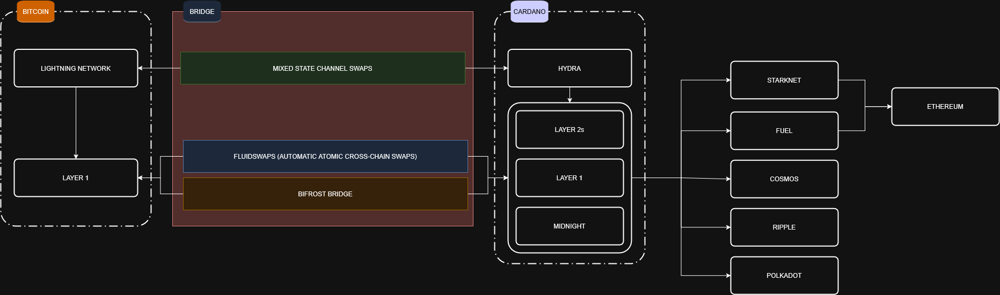
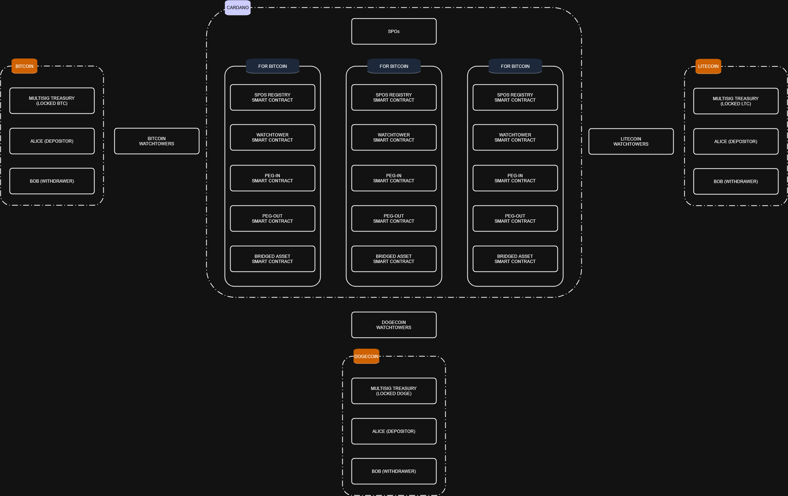

# Bifrost documentation

## Architecture overview

Bifrost is an optimistic bridge that leverages Cardano Stake Pools high decentralization level to secure the peg-ins and peg-outs from and to other UTxO blockchains like Bitcoin, Dogecoin and Litecoin.
Because of the limited scripting capabilities of these blockchains, in recent years different bridging alternatives have been proposed. The current most known alternatives are FROST signatures of a small set of external nodes (Stacks), BitVM optimistic behaviour with 1-of-n honesty assumption with limited availability (Cardinal, Citrea) and Watchtower multisignature behaviour (Rosen Bridge).

Bifrost takes inspiration from all these solutions, but this time Cardano is used as a core component to guarantee the security and uncensorability of the user’s actions.

It then becomes easier to connect Cardano, a UTXO blockchain with smart contracts, to other smart contract blockchains and Layer 2s, making Cardano the central component of a safe bridging process.



The Cardano SPOs collectively become the responsible custodians of bridged assets on the original blockchain. For example, SPOs keep and manage the locked BTC on the Bitcoin side, while its bridged version bBTC circulates freely on Cardano.

Bridge | Stacks Frost bridge | BitVM2 | Rosen Bridge | Bifrost |
--- | --- | --- | --- |--- |
Security assumption | Trust in small set of L2 nodes | At least 1 actor must honestly forget his private key | Trust in a set of nodes from a low marketcap blockchain | Weighted-majority of Cardano SPOs must behave honestly |
Peg-in & Peg-out Availability | L2 nodes must be collaborative | Pre-chosen fixed set of operators must be collaborative | Majority of guards must be collaborative | Weighted-majority of Cardano SPOs must be collaborative |
Peg-in & Peg-out Granularity | Any amount | Fixed static amounts | Any amount | Any amount |
Speed in good case | Minutes | Minutes | Minutes | 1 Week |
Speed in pessimistic case | Minutes | Weeks | Minutes | Weeks |
Costs | Low | Medium | Low | Low | Medium |

Bifrost has been built to ensure security and availability, not speed or low costs.
In fact, Bifrost operations may take up to 1 or more Cardano epochs (an epoch is currently equals to 5 days), as coordination and heavy operations must be executed in the correct order.
The peg-ins and peg-outs also have to compensate for the work of all actors involved in Bifrost.
Therefore Bifrost should be used to move big amounts of liquidity in and out of Cardano and not for intra-day retail/small business operations.
Once big amounts of liquidity have been bridged to Cardano, for this type of smaller and frequent peg-ins and peg-outs it is possible to safely use services like FluidToken FluidSwaps, cutting costs and execution time without sacrificing security.

The security of Bifrost is guaranteed by SPOs participation: for a strong and reliable bridge, most of the top SPOs by delegation must participate in the protocol.

## Components

Bifrost setup is made by the following components:

* **Cardano**: the destination blockchain where bridged assets can safely participate in DeFi activities.
* **Source blockchain**: the original blockchain that contains assets to bridge to Cardano, like Bitcoin, Dogecoin and Litecoin.
* **Depositors**: users that lock their assets on the source blockchain to mint them on Cardano.
* **Withdrawers**: users that burn their bridged assets on Cardano to unlock them on the proper source blockchain.
* **Cardano Stake Pool Operators (SPOs)**: Cardano nodes that have delegated stake by Cardano users and that participate in Cardano consensus, guaranteeing its security.
* **Multisig treasury**: a script address on the source blockchain that holds all the bridged assets and it’s protected by a multisignature that only SPOs together can use. Each SPO has a weight equal to its delegation and a specific threshold of SPOs signature must be reached to spend/move the multisig treasury.
* **Watchtowers**: an open and always dynamic set of actors who have visibility on both Cardano and the source blockchain. Their only duty is to compete to post the most truthful source blockchain chain of blocks. This allows Cardano to know what’s happening on the source blockchain. Anyone can become a Watchtower at any moment.

Bifrost logic is fully encapsulated in the following solutions:

* **SPOs program**: this code must run along with the usual SPO stack. It gives SPOs the ability to coordinate to sign Bitcoin transactions and the ability to see and interact with the needed Cardano smart contracts.
* **Watchtower program**: watchtowers run this software on top of source blockchain and Cardano nodes to be able to properly post the best chain of blocks to Cardano.
* Cardano smart contracts:
  * **spos_registry.ak**: SPOs that participate in Bifrost need to register here for the next upcoming epoch. The registry is a on-chain linked list ordered by SPOs edcs key and each node also contains the SPO secp key that will be used to sign source blockchain transactions.
  * **watchtower.ak**: The watchtowers (anyone) post the best chain of blocks here, other watchtowers eventually challenge it by posting a better version and the winner gets rewarded by the end of the availability window.
  * **peg_in.ak**: when a depositor wants to bridge his assets, he starts by minting a unique NFT and by locking it here. Burning this NFT plus the proof that the source blockchain locking transaction happened, allow the depositor to mint the bridged assets on Cardano
  * **peg_out.ak**: when a withdrawer wants to unlock the bridged assets on the proper source blockchain, he starts the peg-out process sending his bridged assets to this smart contract along with a freshly minted unique NFT in the same eUTxO. A proof that the source blockchain unlocking transaction happened, allows the withdrawer to burn this eUTxO and retrieve the min_utxo locked ADA.
  * **bridged_asset.ak**: At the end of peg-ins, it allows to mint the bridged version of the source blockchain assets; at the end of peg-outs it allows to burn these bridged assets.

## Components relationships

Watchtowers, who run the watchtower program, challenge each other to be the first to post the best source blockchain chain of valid blocks in the Watchtower smart contract. The winner for each chain is rewarded with some ADA, proportionally for each valid block posted.

Depositors, who want to peg-in, mint the proper NFT in peg_in.ak, send their source blockchain assets to the treasury address and wait for the epoch to end.

Withdrawers, who want to peg-out, mint the proper NFT, send it along their bridged assets to peg_out.ak and wait for the epoch to end.

SPOs, who register with their delegated stake to join the next epoch in spos_registry.ak, own both a unique edcs key and a secp key. The registration is accepted only if the SPO has a delegated stake bigger than a minimum threshold.

At the end of each epoch, the registered SPOs (that normally also include the old group) verify each other’s delegated stake to ensure honesty and participate in a ceremony to generate their new shared multisignature address.

The old SPOs group then transfers ownership of the source blockchain treasury to the new SPOs group executing a source blockchain transaction from the old SPOs Treasury address to the new one.

This transaction also aggregates all the peg-in transactions to always keep the treasury in one single UTxO.

This transaction also sends the correct amount of the treasury to the source blockchain addresses that have correctly requested a peg-out.

At this point the depositors can burn their peg_in.ak NFT and mint their bridged assets, while the withdrawers can burn their bridged assets locked and the NFT in the peg_out.ak to earn the min_utxo ADA attached to each eUTxO.

## User peg-in flow

Let's use Bitcoin as example.
A user who wants to move his BTC from Bitcoin to Cardano is called a depositor.
These are the steps to execute a correct peg-in:

* Check the status of Bifrost: if the bridge is correctly operational and we are not too near the end of the current Cardano epoch, the peg-in can be done.
* Retrieve the current Bitcoin Treasury Address that is controlled by the Cardano SPOs.
* On Cardano, mint a unique peg_in.ak NFT and send it to the peg_in.ak spend script, putting in the datum the current Bitcoin Treasury Address.
* On Bitcoin, send to the Bitcoin Treasury Address the amount of BTC to peg-in in a single Output adding in the transaction metadata the asset name of the peg_in.ak NFT.
* Wait for the watchtowers to post on Cardano the Bitcoin block that contains the Bitcoin transaction (at least 100 Bitcoin blocks must have passed, ~12  hours).
* Create a peg-in Bitcoin transaction inclusion proof using Binocular oracle and use it to complete the Cardano peg-in request, minting the correct amount of fBTC and burning the peg-in NFT.

## User peg-out flow

Let's use Bitcoin as example.
A user who wants to move his BTC from Cardano to Bitcoin is called a withdrawer.
These are the steps to execute a correct peg-out:

* Check the status of Bifrost: if the bridge is correctly operational and we are not too near the end of the current Cardano epoch, the peg-in can be done.
* Retrieve the current Bitcoin Treasury Address that is controlled by the Cardano SPOs.
* On Cardano, mint a unique peg_out.ak NFT and send it, along with the correct number of fBTC, to the peg_out.ak spend script, putting in the datum the current Bitcoin Treasury Address.
* Wait for the watchtowers to post the Treasury Movement transaction of the next Epoch, that includes the refunds for the withdrawers (at least 8 Bitcoin blocks must have passed). At this point, you have received your BTC on Bitcoin from the Bitcoin Treasury with a utxo that contains your peg_out.ak NFT AssetName in the transaction metadata.
* Create a peg-out Bitcoin transaction inclusion proof using Binocular oracle and use it to complete the Cardano peg-out request, burning the peg_out.ak NFT and the 30 fBTC.

## Guaranteeing censor-resistant peg-ins and peg-outs

The main axiom is: When the user uses any bridge, he is already fully trusting the source (ex. Bitcoin) and the destination (ex. Cardano). Every additional component that the bridge uses and that it can't be under direct control of the user is an additional trust assumption.

Bifrost is truly trustless only if it doesn't necessarily add new trust assumptions.
As long as the Cardano SPOs and the watchtowers are collaborative, each peg-in or peg-out is permissionless: no actor exists who can decide if the user is permitted to move his assets between the blockchains.

Therefore, the potential additional trust assumptions in Bifrost are the Cardano SPOs and the watchtowers:

* Even if the user becomes a Cardano SPO, he would be just a small part of the total weight-based set of SPOs. Luckily, the strong majority of the SPOs are always incentivized in behaving correctly and on time, like they do when they participate in block-production consensus on Cardano. In fact, the security of Bifrost directly impacts their revenue model: more assets moved with Bifrost imply more Cardano transactions and an increase of the ADA price caused by the bigger demand to execute these transactions. Cardano SPOs want the bridge to work well because their revenue stream strongly depends on it.
* Watchtowers are an "always open" set of nodes that challenge each other to post on Cardano the best chain of block from the source blockchains (ex. from Bitcoin). While the watchtowers earn rewards for doing this job, they could potentially collude and stop the posting of new blocks, halting the bridge for an unbounded timeframe. In these case the user that wants to peg-in or peg-out can spin up a watchtower himself and posting the source blockchains blocks starting from the latest confirmed ones. Because every user is able to become a watchtower any time, there will be now a safe challenge among them to post the correct chain of blocks, resuming the Bifrost operations even in case of collusion.

## Flow of Bitcoin over epochs, cerimonies

todo

## Flow of SPOs on Cardano

todo

## How to join Bifrost as SPO

todo

## Why Mithril is not necessary

todo

## Why Frost

todo

## Signature aggregation
Signature aggregation based on the FROST protocol requires: a) formation of a roster of Cardano SPOs, b) distributed key generation, and c) group signing.  We describe each in detail.

### Roster Formation

#### 1. Problem Statement

A subset of Cardano Stake Pool Operators (SPOs) will form a roster for a **FROST threshold signing group**. Prior to FROST DKG, participants must agree on a fixed membership set where:

- each SPO is uniquely identified by its pool_id,
- each SPO authorizes a long-term FROST participant identity key,
- membership is verifiable, replay-safe, and decentralized,
- the roster version is globally consistent.

This section specifies an **on-chain** mechanism to form and manage the roster using **datums**, **a participation token (one per SPO)**, and **script-enforced versioning**, while minimizing contention via **paged storage**.

#### 2. Roles and Keys

##### 2.1 SPO Identity (Cardano Layer)

- **`pool_id`**: unique stake pool identifier.
- **Cold key**: long-term signing key (from which pool_id is derived) is used only to attest identity and authorization.

##### 2.2 FROST Participant Identity (Pre-DKG)

- **`frost_id_pk` / `frost_id_sk`**: long-term Schnorr identity keypair.
- Self-generated by the SPO.
- Used for protocol authentication and proof-of-possession.

(Not to be confused with the “secret share” produced by DKG.)

#### 3. Roster Identity and Versioning

- **`roster_id`**: stable identifier naming the group purpose (e.g. "`btc-ada-bridge`").
- **`roster_version`**: integer identifying a frozen membership instance.

**Invariant**: `roster_version` remains stable while the roster is open and is bumped only at finalization.

#### 4. On-Chain Objects

##### 4.1 Roster State UTxO (Threaded State)

A single UTxO locked by a validator script and carrying a **thread token (NFT)** to ensure uniqueness. Datum fields include:
```json
{ roster_id
, roster_version
, phase :: Open | Frozen | Closed
, paging_params (N = 43)
, optional roster_hash (set at finalization)
}
```

##### 4.2 Membership Pages (Paged Storage)

To reduce contention, membership entries are stored across **N = 43 page UTxOs** at the same script address.

- Each page has a **page thread token**.
- Page datum:
```json
{ roster_id
, roster_version
, page_no :: 0..22
, entries :: [RosterEntry]
}
```

**Paging rule** (deterministic):
```json
page_no = pool_id mod N   where N = 43
```

**Capacity note**: With N = 43, the design comfortably accommodates ~1000 SPOs for this FROST implementation.  (Nothing special about 43, of course another value can be chosen.)

##### 4.3 Participation Token (One per SPO)

- **Minting Policy**: FrostParticipationPolicy
- **TokenName**: derived from `pool_id`
- Exactly **one token per SPO per roster version**.

The token is the on-chain badge of participation.

#### 5. Roster Entry and On-Chain Verification

##### 5.1 Roster Entry Datum

Each entry records the SPO → FROST binding:
```json
{ pool_id
, cold_vkey
, frost_id_pk
, cold_attestation_sig
, frost_pop_sig
}
```

##### 5.2 Canonical Messages and Domain Separation

- **Binding message M** (authorized by cold key):
```json
DOMAIN_SEP ||
network_id ||
pool_id ||
frost_id_pk ||
enc_pk ||
endpoint_info ||
roster_id ||
roster_version ||
valid_from_epoch ||
valid_until_epoch ||
nonce
```

*Note:*  a) `enc_pk` stands for a public key to be used for setting up encrypted channel to receive secret shares in *round 2* of FROST protocol.

- **Proof-of-possession message P** (signed by `frost_id_sk`):
```json
DOMAIN_SEP_POP ||
network_id ||
pool_id ||
frost_id_pk ||
roster_id ||
roster_version ||
nonce
```
*Note:*  both *binding message* and *proof-of-possession* are stored as **datum** using CBOR encoding with the minted participation token.

##### 5.3 On-Chain Checks (Validator / Policy)

Scripts must verify:

1. `pool_id == hash(cold_vkey)`.
2. `verifyEd25519Signature(cold_vkey, M, cold_attestation_sig)`.
3. `verifyEd25519Signature(frost_id_pk, P, frost_pop_sig)`.
4. Message fields match the current `(roster_id, roster_version)` and phase.
5. Domain separators are correct.

#### 6. Registration Tx (Registering an SPO)

A **registration tx** performs the following:

1. **Inputs**
   - Consumes **one membership page UTxO** with `page_no = pool_id mod 43`.
   - *Reads* (reference input or consumes, per design) the **roster state UTxO**.
2. **Mint**
   - Mints **exactly one participation token** with `TokenName = pool_id`.
3. **Outputs**
   - Recreates the **membership page UTxO** with the new roster entry appended.
   - Preserves the **roster state UTxO** unchanged:
      - same `roster_version`
      - `phase = Open`.
4. **Enforced Conditions**
   - Roster phase must be `Open`.
   - No existing entry for `pool_id` in that page.
   - Participation token minted matches the entry’s `pool_id`.

**Contention reduction**: only the targeted page UTxO is consumed; other pages remain untouched.

#### 7. Minting Policy and Version Enforcement

##### 7.1 Participation Minting Policy Rules

The minting policy enforces:
- **Context requirement**: any mint/burn must occur in a tx that references the roster state UTxO.
- **Open-phase minting**: participation tokens may be minted only if `phase = Open`.
- **Uniqueness**: exactly one token per `pool_id` per roster version.
- **No version drift**: minting a participation token must not change `roster_version`.

##### 7.2 Finalization and Version Bump

A *finalization tx*:

1. Consumes the **roster state UTxO**.
2. Verifies that no new registrations are occurring.
3. Computes and records a **canonical roster hash** (e.g., over all page contents).
4. Outputs a new roster state with:
   - `phase = Frozen`
   - `roster_version = roster_version + 1` (for the next cycle).

(Optionally, a **roster-version NFT** can be minted at finalization to anchor the frozen roster.)

#### 8. Canonical Ordering for FROST DKG

After finalization:

1. Collect all entries from the 43 pages for the frozen version.
2. Deterministically order participants (e.g., lexicographically by `frost_id_pk` bytes).
3. Assign indices `i = 1..n` by position.
4. Use these indices exclusively within FROST DKG and signing.

#### 9. Security and Trust Model

- **No trusted servers**: correctness derives from on-chain validation.
- **Replay resistance**: ensured by `(roster_id, roster_version, nonce)`.
- **Sybil resistance**: enforced by cold-key verification and one-token-per-pool rule.
- **Low contention**: achieved via paging (N = 43).
- **Operational safety**: cold keys are used sparingly; most activity is hot-key off-chain.

#### 10. Outcome

At completion:
- The chain contains a **verifiable**, **immutable roster** for a specific `(roster_id, roster_version)`.
- Each SPO’s participation is represented by a **unique on-chain token** and a **verified binding** to a FROST identity key.
 - The roster is ready for **FROST DKG** with deterministic participant indices.

### Distributed Key Generation (DKG)

#### Round 1

FROST protocol allows threshold signing with `t` out of `n` SPO approvals.  In what follows we summarize the steps to follow in Round 1 according to the FROST documentation [2], closely following their notation, and emphasizing special considerations relevant to SPO-based FROST groups.

1. Each SPO `P_i` in the roster constructs a *random* polynomial `f_i` of degree  `t-1` .
2. Every SPO in the roster computes a proof of knowledge `sigma_i` of the degree-zero coefficient of its polynomial `f_i` .
3. Each SPO `P_i` in the roster computes a public commitment `C_i =  [phi_{i0},...,phi_{i(t-1)}]`.  This is included as datum in UTxO containing the corresponding SPO’s participation token.
4. Each SPO `P_i` in the roster queries public commitment `C_l` and verifies proof of knowledge `sigma_l`, `l≠i` , *aborting on failure*.

#### Round 2

1. Each SPO `P_i` in the roster securely sends to each other participant `P_l` the secret share `(i, f_i(l))`.  The mechanism is as follows:
   - Each `P_i` publishes at its endpoint (recall that each SPO has shared `enc_pk` and `endpoint_info` in datum at the time of roster formation) a file/object per roster version and round, e.g.
   ```shell
   /roster/<roster_id>/<roster_version>/dkg/round1/from/<pool_id_i>.json
   ```
   - Payload is an array of “envelopes”, one per recipient SPO:
   ```json
   {
     "roster_id": "...",
     "roster_version": 7,
     "round": 1,
     "sender_pool_id": "...",
     "sender_frost_id_pk": "...",
     "envelopes": [
       {
	 "recipient_pool_id": "...",
	 "kem_ephemeral_pk": "...",
	 "ciphertext": "...",
	 "aad_commitment": "..."
       }
     ]
   }
   ```
   - For each recipient `P_l`: 
      - Sender `P_i` uses recipient’s `enc_pk_l`.
      - Uses HPKE-style envelope encryption:
         - Generate ephemeral keypair `(e_i, E_i)`.
         - Compute `ss = DH(e_i, enc_pk_l)`.
         - Derive `k = HKDF(ss, info = context)`.
         - Encrypt plaintext = encoding of `(l, f_i(l))` using AEAD with associated data, resulting in `ciphertext`.

   *Notes:*  a) `E_i` corresponds to “kem_ephemeral_pk” public key; b) `DH`stands for Diffie-Helman’s method to derive a shared secret; c) `HKDF` stands for “hybrid key derivation function” associated to a *key encapsulated mechanism* (KEM) allowing symmetric key derivation from asymmetric crypto; d) AEAD stands for “authenticated encryption with associated data”, stored as `aad_commitment` and typically including `DOMAIN_SEP`, `roster_id`, `roster_version`, `sender_pool_id`, `recipient_pool_id` and `round`.

   - Recipient P_l does: 
      - For each sender `P_i`:
         - Fetch `P_i`‘s round1 file.
         - Find envelope where `recipient_pool_id == pool_id_l`.
         - Derive `ss = DH(enc_sk_l, kem_ephemeral_pk)`.
         - Derive `k`, then AEAD-decrypt and recover `(l, f_i(l))`.

   *Note:*  an alternative approach that this sharing method can evolve to is to use “libp2p”.

2. Each `P_i` verifies their secret shares, *aborting if check fails*.
3. Each `P_i` calculates their long-lived private share `s_i`.
4. Each `P_i` calculates their public verification share `Y_i` and the group’s public key `Y`.

### Group signing

In what follows we summarize the *preprocess* and signing stages according to the FROST documentation [2], closely following their notation, and emphasizing special considerations relevant to SPO-based FROST groups.

#### Preprocess

Each SPO `P_i` in the roster performs this stage prior to signing.
1. Samples random single-use nonces `(d_{ij}, e_{ij})`.
2. Derives commitment shares `(D_{ij}, E_{ij})`.
3. Stores `((d_{ij}, D_{ij})`, `(e_{ij}, E_{ij}))` for later use in signing operations.
4. With `L_i` the list of `(D_{ij}, E_{ij})`, publishes `(i, L_i)` as datum attached to UTxO with participation token.

### Signing mechanism

Each SPO `P_i` in the subset participating in `signing` performs these steps.
1. Receives message `m` to be signed and queries from blockchain the list `B` of triads `(i, D_i, E_i)` corresponding to SPO’s in the subset.
2. Each `P_i` then computes the set of binding values, the group commitment `R` and the challenge.
3. Each `P_i` computes their response (signing share) `z_i` using their long-lived secret share `s_i`.
4. Each `P_i` verifies the validity of each response `z_i`, identifying and reporting misbehaving participants.  If a misbehaving participant exists, process is aborted; otherwise continue.
5. Each `P_i` can compute the group’s response (the sum of `z_i`‘s.), arriving to the same signature `sigma = (R, z)`, which they can publish along with message `m`.

## SPOs communication

The main algorithms have been chosen: eventual ZK proof algorithms needed, consensus among SPOs and communication among SPOs.

For ZK proofs we will use **Plonkup**; see [5].  We have a complete implementation of Plonkup, as can be seen in repositories [6] and [7].

## Watchtowers and Bitcoin State Verification (Lantr)

### Watchtower Architecture

Watchtowers are permissionless participants who maintain Bitcoin blockchain state on Cardano. They serve as the critical link between the Bitcoin and Cardano networks, ensuring that BiFrost has accurate, up-to-date information about the Bitcoin blockchain.

**Key Design Principles:**

* **Permissionless Participation**: Anyone can become a watchtower at any time without registration, bonding, or approval. This ensures the system cannot be censored or controlled by a small group.
* **Competitive Model**: Multiple watchtowers compete to submit the most accurate chain of blocks. If one watchtower submits invalid or stale data, others can immediately challenge with the correct chain.
* **Economic Incentives**: Watchtowers are rewarded for posting valid blocks, creating a natural incentive for honest and timely participation.

### Core Watchtower Responsibilities

1. **Monitor Bitcoin Network**: Watchtowers continuously track the Bitcoin blockchain for new blocks as they are mined.

2. **Submit Block Headers**: When new Bitcoin blocks are found, watchtowers submit the 80-byte block headers to the Binocular Oracle smart contract on Cardano. These headers contain all information needed to verify Bitcoin consensus rules.

3. **Compete for Accuracy**: Multiple watchtowers naturally compete to submit the most accurate chain. If a watchtower submits headers from an invalid or weaker fork, other watchtowers can challenge by submitting the correct chain with higher cumulative proof-of-work.

4. **Maintain Oracle Liveness**: Watchtowers ensure the Oracle never becomes stale by continuously updating it with the latest Bitcoin state. This is essential for timely peg-in and peg-out processing.

### BiFrost-Specific Watchtower Duties

Beyond maintaining general Bitcoin state, watchtowers perform specialized duties for the BiFrost bridge:

**Deposit Detection**

* Monitor the Treasury Taproot address for incoming Bitcoin transactions
* Match detected deposits to pending PegInRequest UTxOs on Cardano
* Track transaction confirmations as blocks are added

**Proof Submission for Peg-ins**

* Once a Bitcoin deposit transaction reaches the required confirmation threshold (100 Bitcoin blocks plus 200 minutes of challenge period), watchtowers construct Merkle proofs
* These proofs demonstrate: (1) the transaction exists in a specific block, and (2) that block is confirmed in the Binocular Oracle
* Submitting valid proofs triggers fBTC minting for the depositor

**Peg-out Monitoring**

TODO

**Anomaly Detection**

* Continuously verify that Treasury BTC balance matches or exceeds circulating fBTC supply
* Alert the system if invariants are violated
* Trigger failover mechanisms if SPO signing stalls or quorum is lost
* TODO

### Binocular Oracle

The Binocular Oracle is the on-chain component that stores and validates Bitcoin blockchain state on Cardano. It provides trustless verification without requiring trust in any external party. For complete technical details, see the [Binocular Whitepaper](https://github.com/lantr-io/binocular/blob/main/pdfs/Whitepaper.pdf) [1].

**Bitcoin Consensus Validation**
The Oracle validates all Bitcoin consensus rules directly on-chain:

* Proof-of-Work verification (block hash meets difficulty target)
* Difficulty adjustment validation (every 2016 blocks)
* Timestamp constraints (greater than median-time-past, less than 2 hours in future)
* Chain continuity (each block references valid parent)

**Fork Management**
The Oracle maintains a tree of competing Bitcoin forks and automatically selects the canonical chain based on cumulative chainwork (total proof-of-work). This mirrors exactly how Bitcoin Core selects the best chain, ensuring the Oracle always reflects Bitcoin's true state.

**Confirmation Tracking**
Blocks progress through multiple stages:

* Initially added to the forks tree when submitted
* Tracked for confirmation depth (distance from chain tip)
* Only blocks with 100+ confirmations are considered for finality

**Transaction Inclusion Proofs**
For BiFrost operations, the Oracle provides data for Watchtowers to construct proofs that:

* Prove a specific transaction exists within a confirmed block
* Prove the block is part of the confirmed chain
* Enable trustless verification of peg-in deposits and peg-out completions

### Challenge Period Mechanism

To prevent pre-computed attacks and ensure security, blocks are not immediately finalized when submitted:

1. **Submission**: A watchtower submits new Bitcoin block headers to the Oracle
2. **Challenge Window**: A 200-minute window opens during which any other watchtower can submit a competing fork with higher chainwork
3. **Resolution**: The Oracle automatically selects the chain with the highest cumulative proof-of-work
4. **Finalization**: After the challenge period expires and the block has 100+ confirmations, it becomes "confirmed" and can be used for peg-in proofs

This mechanism ensures that even if a malicious watchtower pre-computes a short fork, honest watchtowers have ample time to submit the correct chain.

### Security: 1-Honest-Watchtower Assumption

BiFrost's watchtower design relies on a minimal trust assumption: only one honest watchtower needs to exist for the system to function correctly.

**Why This Works:**

* If all active watchtowers collude to censor or submit invalid data, any user can spin up their own watchtower
* The permissionless design means no one can prevent new watchtowers from joining
* Honest watchtowers are economically incentivized to challenge invalid submissions

**Censorship Resistance:**

* A user wanting to peg-in or peg-out can always become a watchtower themselves
* They can then submit the necessary Bitcoin blocks and proofs for their own transactions
* This ensures BiFrost remains operational even in adversarial conditions

This 1-of-n honesty assumption is significantly weaker than typical bridge trust models that require trusting a majority or specific set of operators.

## References

[1] Nemish, Alexander. "Binocular: A Trustless Bitcoin Oracle for Cardano." 2025. <https://github.com/lantr-io/binocular/blob/main/pdfs/Whitepaper.pdf>

[2] Komlo, C. and Goldberg, I. "FROST: Flexible Round-Optimized Schnorr Threshold Signatures." RFC 9591, IETF, 2024. <https://datatracker.ietf.org/doc/rfc9591/>

[3] Wuille, P. et al. "BIP340: Schnorr Signatures for secp256k1." Bitcoin Improvement Proposal, 2020. <https://github.com/bitcoin/bips/blob/master/bip-0340.mediawiki>

[4] Wuille, P. et al. "BIP341: Taproot: SegWit version 1 spending rules." Bitcoin Improvement Proposal, 2020. <https://github.com/bitcoin/bips/blob/master/bip-0341.mediawiki>

[5] Pearson, Luke et. al., *Plonkup: Reconciling Plonk with plookup* (2022).

[6] *zkFold Symbolic* (github repository): https://github.com/zkFold/symbolic/tree/main/symbolic-base/src/ZkFold/Protocol/Plonkup

[7] *zkFold-Cardano* (github repository): https://github.com/zkFold/zkfold-cardano/tree/main/zkfold-cardano/src/ZkFold/Cardano
