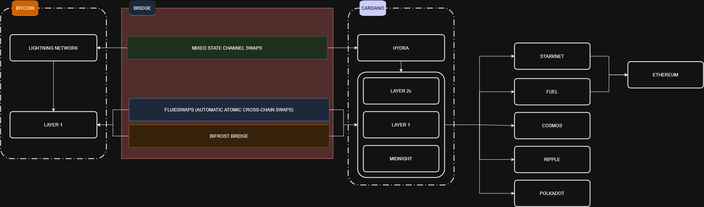
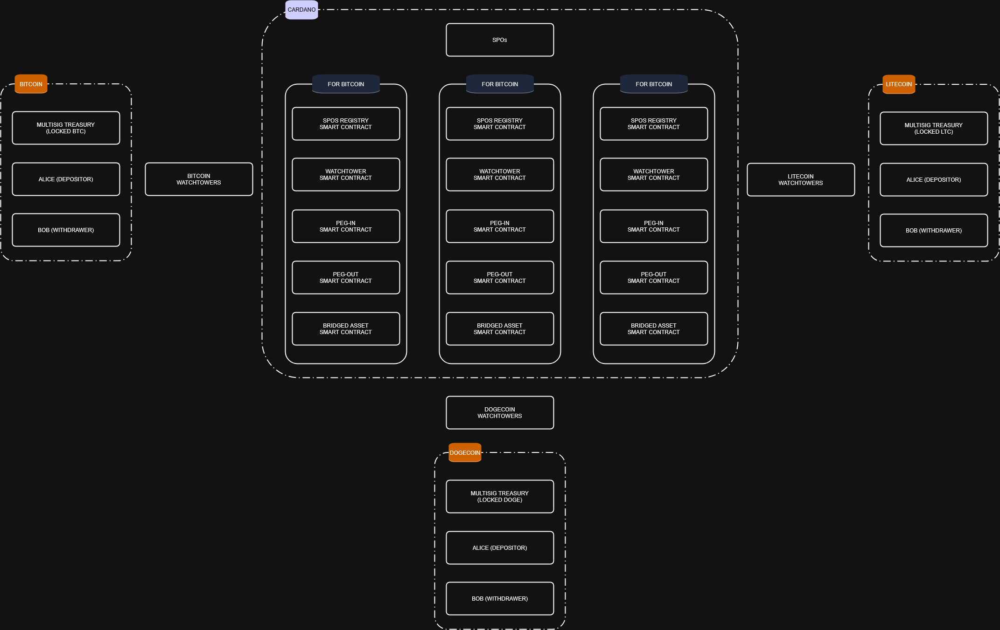
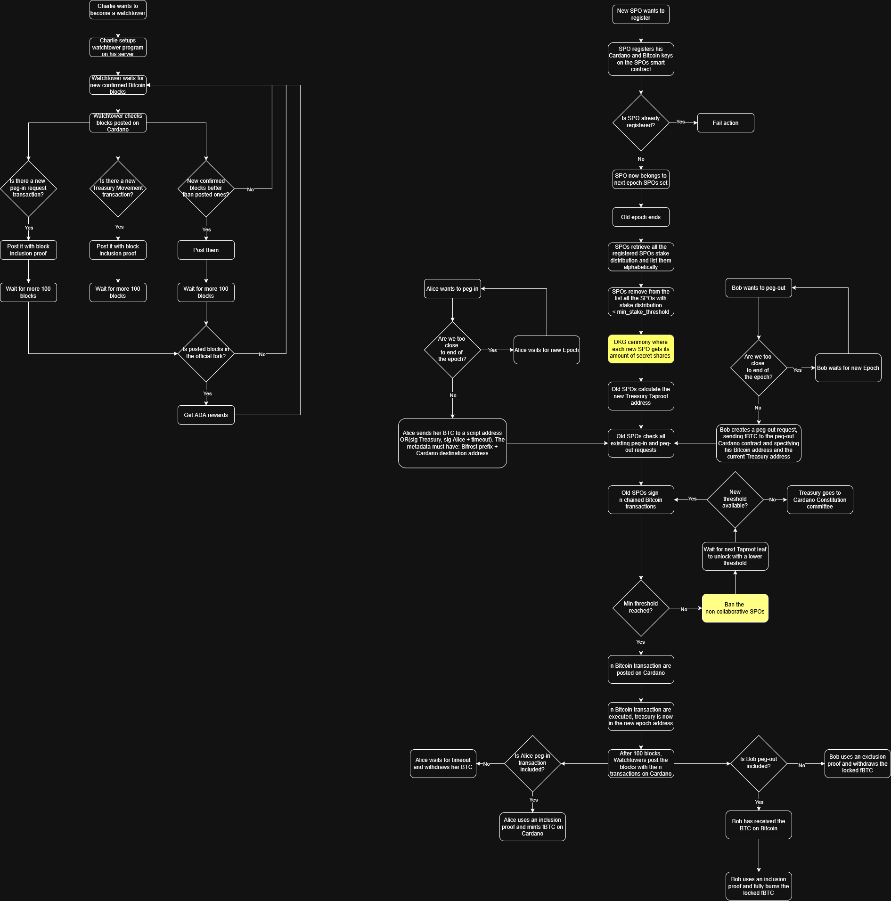
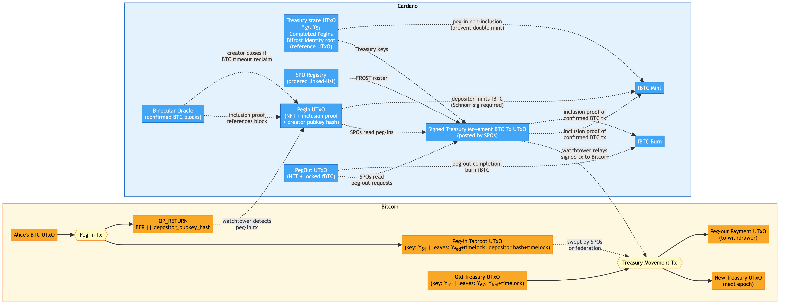
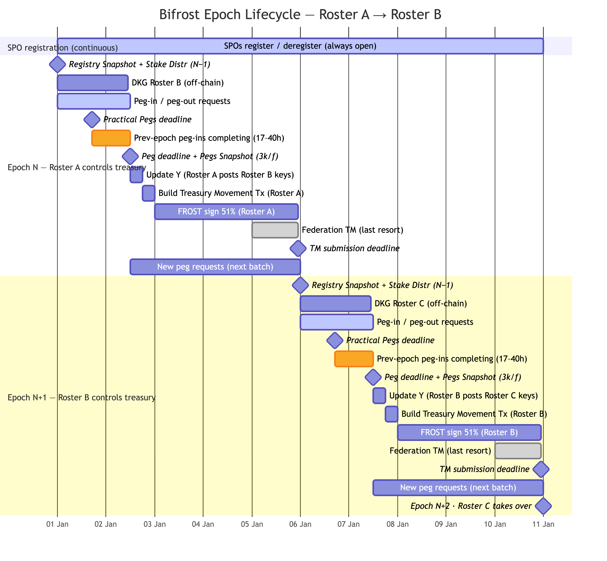
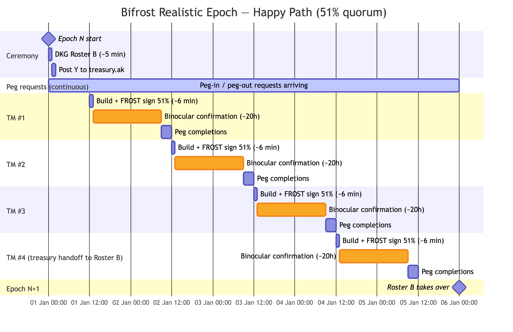

# Bifrost documentation

## Architecture overview

Bifrost is an optimistic bridge that leverages Cardano Stake Pools high decentralization level to secure the peg-ins and peg-outs from and to other UTxO blockchains like Bitcoin, Dogecoin and Litecoin.
Because of the limited scripting capabilities of these blockchains, in recent years different bridging alternatives have been proposed. The current most known alternatives are FROST signatures of a small set of external nodes (Stacks), BitVM optimistic behaviour with 1-of-n honesty assumption with limited availability (Cardinal, Citrea) and Watchtower multisignature behaviour (Rosen Bridge).

Bifrost takes inspiration from all these solutions, but this time Cardano is used as a core component to guarantee the security and uncensorability of the user’s actions.

It then becomes easier to connect Cardano, a UTXO blockchain with smart contracts, to other smart contract blockchains and Layer 2s, making Cardano the central component of a safe bridging process.



The Cardano SPOs collectively become the responsible custodians of bridged assets on the original blockchain. For example, SPOs keep and manage the locked BTC on the Bitcoin side, while its bridged version fBTC circulates freely on Cardano.

| Bridge                        | Stacks Frost bridge            | BitVM2                                                  | Rosen Bridge                                            | Bifrost                                                 |
| ----------------------------- | ------------------------------ | ------------------------------------------------------- | ------------------------------------------------------- | ------------------------------------------------------- |
| Security assumption           | Trust in small set of L2 nodes | At least 1 actor must honestly forget his private key   | Trust in a set of nodes from a low marketcap blockchain | Weighted-majority of Cardano SPOs must behave honestly  |
| Peg-in & Peg-out Availability | L2 nodes must be collaborative | Pre-chosen fixed set of operators must be collaborative | Majority of guards must be collaborative                | Weighted-majority of Cardano SPOs must be collaborative |
| Peg-in & Peg-out Granularity  | Any amount                     | Fixed static amounts                                    | Any amount                                              | Any amount                                              |
| Speed in good case            | Minutes                        | Minutes                                                 | Minutes                                                 | 1 Week                                                  |
| Speed in pessimistic case     | Minutes                        | Weeks                                                   | Minutes                                                 | Weeks                                                   |
| Costs                         | Low                            | Medium                                                  | Low                                                     | Medium                                                  |

Bifrost has been built to ensure security and availability, not speed or low costs.
In fact, Bifrost operations may take up to 1 or more Cardano epochs (an epoch is currently equals to 5 days), as coordination and heavy operations must be executed in the correct order.
The peg-ins and peg-outs also have to compensate for the work of all actors involved in Bifrost.
Therefore Bifrost should be used to move big amounts of liquidity in and out of Cardano and not for intra-day retail/small business operations.
Once big amounts of liquidity have been bridged to Cardano, for this type of smaller and frequent peg-ins and peg-outs it is possible to safely use services like FluidToken FluidSwaps, cutting costs and execution time without sacrificing security.

The security of Bifrost is guaranteed by SPOs participation: for a strong and reliable bridge, most of the top SPOs by delegation must participate in the protocol.

## Definitions and Abbreviations

This section collects the acronyms, protocol terms, on-chain validators, mathematical symbols, and named lifecycle labels used throughout the rest of the document. Sub-sections are alphabetized for quick lookup; cross-references point to the body sections where each concept is fully specified.

### Acronyms

* **ADA**: Cardano's native token.
* **BIP**: Bitcoin Improvement Proposal (BIP141, BIP340 [3], BIP341 [4] are referenced).
* **BTC**: Bitcoin.
* **CSV**: `OP_CHECKSEQUENCEVERIFY` (Bitcoin relative-timelock opcode).
* **DKG**: Distributed Key Generation.
* **ECDH**: Elliptic Curve Diffie–Hellman.
* **fBTC**: Bridged Bitcoin (Cardano-native token representing locked BTC).
* **FROST**: Flexible Round-Optimized Schnorr Threshold Signatures (RFC 9591 [2]).
* **HASH160**: RIPEMD160(SHA256(·)).
* **HKDF**: HMAC-based Key Derivation Function.
* **L2**: Layer 2.
* **MIN_ADA / min_utxo**: Minimum ADA required to keep a UTxO alive.
* **MPT**: Merkle Patricia Trie.
* **NFT**: Non-Fungible Token.
* **P2PKH**: Pay-to-Public-Key-Hash.
* **PoK**: Proof of Knowledge.
* **PoW**: Proof-of-Work.
* **RBF**: Replace-By-Fee.
* **SHA256**: Secure Hash Algorithm, 256-bit.
* **SPO**: Stake Pool Operator.
* **TM / TMTx**: Treasury Movement (Transaction).
* **UTxO**: Unspent Transaction Output.
* **ZK**: Zero-Knowledge.

### Protocol terms

* **Attempt counter**: 0-based retry index for a `(epoch, threshold-mode)` DKG instance or a `(epoch, txid, mode)` signing instance.
* **Banning (exponential timeout)**: temporary exclusion of an SPO from the active roster, with each successive ban doubling the exclusion duration (see §SPO Registration).
* **Bifrost identity key (`bifrost_id_pk` / `bifrost_id_sk`)**: long-term Secp256k1 keypair used for all Bifrost protocol operations after registration.
* **Bifrost Membership Token**: singleton NFT minted per `pool_id` as the on-chain badge of Bifrost participation.
* **Bifrost URL (`bifrost_url`)**: HTTP endpoint where an SPO publishes DKG and signing payloads.
* **Binocular Oracle**: on-chain Cardano contract that stores validated Bitcoin block headers and serves inclusion proofs (see [1]).
* **Canonical byte layout**: deterministic serialization of a payload's fields used as the message under signature for the `sign-the-hash` scheme.
* **Challenge–response (missing publication)**: optimistic mechanism for handling unproven Round 2 absences (see §Misbehavior Handling).
* **Cold key (`cold_vkey` / `cold_skey`)**: a pool's long-term Ed25519 keypair, used only for registration and revocation.
* **Completed peg-ins trie**: MPT in `treasury.ak` recording every minted peg-in to prevent double minting.
* **Confirmed (Binocular)**: a Bitcoin block that has 100+ confirmations and has cleared the 200-minute challenge window (see [1]).
* **Current roster**: the on-chain SPO set currently controlling the treasury and authorized to sign the next TM.
* **Depositor**: user who locks BTC on Bitcoin to mint fBTC on Cardano.
* **Eligible roster**: `registration_list \ active_ban_list` for the current epoch.
* **Epoch boundary**: Cardano epoch transition; the moment registration snapshots, stake distribution snapshots, and roster handoffs occur.
* **Equivocation**: two distinct signed payloads from the same SPO under the same `namespace_hash`.
* **FaultToken**: singleton NFT minted by `fault_verifier.ak` after a fault is established; consumed by `spos_registry.ak` to apply a ban or slash.
* **Federation / $Y_{federation}$**: pre-defined fallback signing entity used for emergency Treasury Movement signing.
* **Group public key ($Y$, $Y_{51}$, $Y_{67}$)**: FROST aggregate public keys produced by the DKG.
* **Identity-index linked-list**: on-chain ordered list keyed by `bifrost_id_pk` enforcing global uniqueness of active Bifrost identities.
* **Inclusion / Non-inclusion proof**: cryptographic proof that an item is (or is not) in a Merkle/MPT structure.
* **Internal key (Taproot)**: key used as the BIP341 [4] Taproot internal key ($Y_{51}$ for both Treasury and peg-in trees in Bifrost).
* **Invalid payload (fault)**: payload whose contents fail cryptographic verification; provable on-chain via Plonk ZK.
* **Key path / Script path**: the two BIP341 [4] Taproot spending paths.
* **Leader (TM submission)**: SPO selected (with timeout cascade) to post the signed TM to Cardano (see §Cardano submission and leader reward).
* **Live subset**: SPOs that published valid Round 1 payloads before the Round 1 deadline of an attempt.
* **Mode (`67` / `51` / federation)**: active threshold path used for the current TM signing attempt.
* **`namespace_hash`**: `blake2b_256(phase ‖ epoch ‖ threshold_or_mode ‖ attempt ‖ txid?)`, scoping a fault to a single protocol round.
* **New roster**: roster derived from registrations at the upcoming epoch boundary; takes control after treasury handoff.
* **PegInRequest**: UTxO at `peg_in.ak` carrying the raw Bitcoin peg-in transaction and an NFT, marking a confirmed deposit available for SPOs to sweep.
* **PegOut request**: UTxO at `peg_out.ak` locking fBTC plus MIN_ADA with a Bitcoin destination address in the datum.
* **`pool_id`**: `blake2b_224(cold_vkey)`; the canonical Cardano stake pool identifier.
* **Pull model**: communication model where SPOs poll each other's `bifrost_url` endpoints rather than push.
* **Registration bond**: slashable ADA escrowed in an SPO's registration linked-list node.
* **Registration linked-list**: on-chain ordered list keyed by `pool_id` of all currently registered Bifrost SPOs.
* **Roster handoff**: end-of-epoch transfer of treasury control from the old to the new roster, finalized by the last TM of the epoch.
* **Round 0 / Round 1 / Round 2**: DKG and FROST signing rounds (init / commitments / shares-or-partials).
* **Schnorr signature (BIP340 [3])**: 64-byte secp256k1 Schnorr signature scheme used throughout the protocol.
* **Sighash (BIP341 [4])**: per-input message digest signed under SIGHASH_ALL Taproot rules.
* **Sign-the-hash**: authentication scheme where the SPO signs `SHA256(canonical_bytes)`, enabling both off-chain and on-chain signature verification.
* **Signing cascade / Threshold failover**: sequential attempt order: 67% → 51% → federation.
* **Signing share ($s_i$)**: SPO's long-lived FROST private share.
* **Stability window**: Cardano `3k/f` window after which the pegs snapshot is taken for the current epoch's TM.
* **Tagged hash**: `SHA256(SHA256(tag) ‖ SHA256(tag) ‖ msg)`, per BIP340 [3] / BIP341 [4].
* **Taproot tree / Merkle root**: script tree structure committing alternative spending paths for a Taproot output.
* **Timeout cascade (leader)**: slot-indexed schedule under which subsequent SPOs become eligible to submit a TM.
* **Treasury**: Bitcoin Taproot UTxO holding all consolidated bridged BTC.
* **Treasury Info UTxO**: reference UTxO holding `prev_tm_txid` and other inter-TM state.
* **Treasury Movement (TM) Transaction**: Bitcoin transaction sweeping confirmed PegInRequests, fulfilling PegOuts, and moving the treasury to the next-epoch Treasury address.
* **Tweak / Tweaked key**: `Y + tagged_hash("TapTweak", Y ‖ merkle_root) · G`, per BIP341 [4].
* **Verification share ($Y_i = s_i · G$)**: public counterpart of an SPO's FROST signing share.
* **Watchtower**: permissionless actor that relays Bitcoin headers to Binocular, posts PegInRequests, and broadcasts signed TMs to Bitcoin.
* **Withdrawer**: user who burns fBTC on Cardano to receive BTC on Bitcoin.

### On-chain validators

Source code for all validators listed here is published in the Bifrost on-chain repository [5].

| Validator              | Role                                                                                                                    |
| ---------------------- | ----------------------------------------------------------------------------------------------------------------------- |
| `spos_registry.ak`     | Pool-scoped registration and ban linked-lists; consumes `FaultToken`s for slash/ban.                                    |
| `fault_verifier.ak`    | Verifies invalid-payload (Plonk ZK) and equivocation evidence; runs missing-publication challenges; mints `FaultToken`. |
| `peg_in.ak`            | Holds PegInRequest UTxOs created from confirmed Bitcoin deposits.                                                       |
| `peg_out.ak`           | Holds PegOut UTxOs from withdrawers; consumed once the TM is confirmed on Bitcoin.                                      |
| `treasury.ak`          | Stores current $Y_{67}$, $Y_{51}$, and the completed peg-ins MPT.                                                       |
| `treasury_movement.ak` | Stores SPO-signed Bitcoin TM transactions for watchtower relay; enforces leader-election rules.                         |
| `bridged_asset.ak`     | fBTC mint/burn policy; verifies TM-confirmed peg-in sweeps and Schnorr-signed depositor claims.                         |

### Mathematical notation

| Symbol                                 | Meaning                                                           |
| -------------------------------------- | ----------------------------------------------------------------- |
| $Y_{51}$, $Y_{67}$                     | FROST group public keys at the 51% and 67% thresholds             |
| $Y_{federation}$                       | Federation emergency public key                                   |
| $s_i$                                  | Participant $i$'s long-lived FROST signing share                  |
| $Y_i = s_i · G$                        | Participant $i$'s verification share                              |
| $f_i(x)$                               | Round 1 secret polynomial of degree $t-1$                         |
| $φ_{ij} = a_{ij} · G$                  | Public commitments to $f_i$'s coefficients                        |
| $σ_i$                                  | Schnorr proof of knowledge of $a_{i0}$                            |
| $(d_{ij}, e_{ij})$, $(D_{ij}, E_{ij})$ | Per-input FROST nonces and their commitments                      |
| $z_{i,j}$                              | Partial signature of participant $i$ for input $j$                |
| $R_j$, $σ_j = (R_j, z_j)$              | Group commitment and aggregated per-input signature               |
| $t$                                    | FROST threshold (computed per `(epoch, mode)` DKG)                |
| $G$                                    | secp256k1 generator point                                         |
| $Q_{treasury}$, $Q$                    | Tweaked Taproot output keys for the Treasury and peg-in addresses |

### Lifecycle labels

**Rollout phases** (see §Rollout Phases):

| Label                           | Meaning                                                                                                             |
| ------------------------------- | ------------------------------------------------------------------------------------------------------------------- |
| Phase 1 — Federation Launch     | Bridge runs with $Y_{federation}$ as the only signer; SPOs begin registering.                                       |
| Phase 2 — 51% SPO Participation | Once enough SPOs have completed DKG, $Y_{51}$ becomes the main-line key; federation is emergency-only.              |
| Phase 3 — 67% SPO Participation | Aspirational level at which $Y_{67}$ script-leaf signing becomes the preferred path for stronger on-chain security. |

**Per-epoch timeline phases** (see §Flow of Bitcoin over epochs, ceremonies):

| Label                  | Meaning                                                                                                    |
| ---------------------- | ---------------------------------------------------------------------------------------------------------- |
| Registry Snapshot      | Epoch-boundary snapshot of the registration linked-list.                                                   |
| Stake Distribution     | Epoch-boundary snapshot of delegated stake from the previous epoch.                                        |
| Pegs Snapshot          | Freezing of pending PegInRequest and PegOut UTxOs at the Cardano stability window for inclusion in the TM. |
| Update Y               | Publication of the new roster's $Y_{67}$ and $Y_{51}$ to `treasury.ak`.                                    |
| Build TM               | Deterministic construction of the unsigned Treasury Movement transaction by all SPOs.                      |
| FROST signing cascade  | Threshold-failover signing sequence (67% → 51% → federation).                                              |
| TM submission deadline | Latest slot at which the signed TM may be posted to `treasury_movement.ak`.                                |
| Treasury handoff       | Final TM of the epoch moving consolidated funds to the new roster's Taproot address.                       |

**Spending paths** (see §Spending paths and Treasury Movement variants):

| Label                     | Meaning                                                                                                  |
| ------------------------- | -------------------------------------------------------------------------------------------------------- |
| 67% quorum (aspirational) | Treasury spent via the $Y_{67}$ script leaf; peg-in inputs spent via $Y_{51}$ key path.                  |
| 51% quorum (main line)    | All inputs spent via the $Y_{51}$ key path — the cheapest spending path.                                 |
| Federation (emergency)    | All inputs spent via the $Y_{federation}$ script leaf with CSV timelock.                                 |
| Depositor refund          | After ~30 days (4320 blocks), the depositor reclaims a peg-in UTxO via the depositor refund script leaf. |

## Components


Bifrost setup is made by the following components:

* **Cardano**: the destination blockchain where bridged assets can safely participate in DeFi activities.
* **Source blockchain**: the original blockchain that contains assets to bridge to Cardano, like Bitcoin, Dogecoin and Litecoin.
* **Depositors**: users that lock their assets on the source blockchain to mint them on Cardano.
* **Withdrawers**: users that burn their bridged assets on Cardano to unlock them on the proper source blockchain.
* **Cardano Stake Pool Operators (SPOs)**: Cardano nodes that have delegated stake by Cardano users and that participate in Cardano consensus, guaranteeing its security.
* **Multisig treasury**: a script address on the source blockchain that holds all the bridged assets and it’s protected by a multisignature that only SPOs together can use. Each SPO has a weight equal to its delegation and a specific threshold of SPOs signature must be reached to spend/move the multisig treasury.
* **Watchtowers**: an open and always dynamic set of actors who have visibility on both Cardano and the source blockchain. They compete to post the most truthful source blockchain chain of blocks to the Binocular Oracle on Cardano. They also detect peg-in transactions on the source blockchain and post them as PegInRequest UTxOs on Cardano, and they relay SPO-signed Treasury Movement transactions from Cardano to the source blockchain. Anyone can become a Watchtower at any moment.

Bifrost logic is fully encapsulated in the following solutions:

* **SPOs program**: this code must run along with the usual SPO stack. It gives SPOs the ability to coordinate to sign Bitcoin transactions and the ability to see and interact with the needed Cardano smart contracts.
* **Watchtower program**: watchtowers run this software on top of source blockchain and Cardano nodes. It posts source blockchain block headers to the Binocular Oracle, detects peg-in transactions and posts PegInRequest UTxOs on Cardano, and relays SPO-signed Treasury Movement transactions to the source blockchain.
* Cardano smart contracts:
  * **spos_registry.ak**: SPOs that participate in Bifrost need to register here for the next upcoming epoch. The registry maintains pool-scoped registration and ban linked-lists on-chain. Registration entries are keyed by `pool_id = blake2b_224(cold_vkey)`, hold a slashable registration bond, and store the authorized `bifrost_id_pk` and `bifrost_url` used by the off-chain SPO protocol. The registry consumes verified fault records to apply bans and bond penalties.
  * **fault_verifier.ak**: verifies direct SPO fault evidence (invalid payloads and equivocation), manages missing-publication challenges for required Round 2 messages, and mints singleton `FaultToken` UTxOs carrying verified fault records. Other scripts, including `spos_registry.ak`, reference or consume those records instead of re-verifying the raw evidence.
  * **Binocular**: The watchtowers (anyone) post the best chain of blocks here, other watchtowers eventually challenge it by posting a better version and the winner gets rewarded by the end of the availability window.
  * **peg_in.ak**: watchtowers (or anyone) create PegInRequest UTxOs here by minting a PegInRequest NFT and providing a Binocular inclusion proof of the Bitcoin deposit transaction. The datum contains the raw Bitcoin peg-in transaction bytes. SPOs do not have direct access to Bitcoin chain state, so PegInRequest UTxOs serve as their trusted source of Bitcoin deposit data for constructing Treasury Movement transactions.
  * **peg_out.ak**: when a withdrawer wants to unlock the bridged assets on the proper source blockchain, he locks his bridged assets at this smart contract. The datum contains the source blockchain destination address where assets should be sent. SPOs read these UTxOs to include peg-out payments in the Treasury Movement transaction.
  * **treasury.ak**: stores the current Treasury FROST group public keys $Y_{67}$ and $Y_{51}$ and a Merkle Patricia Trie of completed peg-ins as a reference UTxO. The keys correspond to two FROST groups with thresholds ensuring any signing subset controls ≥67% and ≥51% of stake respectively. After each pair of DKGs, the current roster posts the new group public keys here, authenticated by a FROST group signature from the current roster. Depositors and validators read these to derive the current Treasury address. The completed peg-ins trie is updated each time fBTC is minted, preventing double minting. For the first epoch, the initial Treasury public keys are set during protocol bootstrap.
  * **treasury_movement.ak**: SPOs post signed source blockchain Treasury Movement transactions here. The datum contains the serialized signed transaction, the epoch number, and references to the PegInRequest and PegOut UTxOs it covers. Watchtowers monitor this contract and relay the signed transactions to the source blockchain.
  * **bridged_asset.ak**: minting and burning of bridged assets (e.g. fBTC). The depositor mints fBTC by spending the PegInRequest UTxO and providing: a Binocular inclusion proof of the confirmed Treasury Movement transaction, a reference to the corresponding `treasury_movement.ak` UTxO (to verify the confirmed transaction matches what SPOs signed and posted), a non-inclusion proof against the completed peg-ins Merkle Patricia Trie in `treasury.ak` (preventing double minting), their Bitcoin x-only public key, and a Schnorr signature proving ownership. The validator verifies the Binocular-confirmed txid matches the `treasury_movement.ak` datum (proving the confirmed transaction matches what was posted by the protocol's signing cascade), parses the raw TM transaction to verify the depositor's peg-in txid+vout appears as an input (proving the Treasury Movement actually swept the deposit), parses the raw peg-in transaction from the PegInRequest datum to extract the depositor_pubkey_hash from the OP_RETURN and the deposit amount, verifies HASH160(pubkey) matches the depositor_pubkey_hash, checks the signature via `verifySchnorrSecp256k1Signature`, verifies the peg-in is not already in the completed trie, and mints the correct amount of fBTC to whatever Cardano address the depositor specifies in the transaction outputs. The minting transaction also inserts the peg-in into the completed peg-ins trie in the Treasury UTxO. Anyone can burn fBTC for a peg-out by spending the PegOut UTxO and providing a Binocular inclusion proof of the Treasury Movement transaction that fulfilled the peg-out.

## Components relationships



Watchtowers, who run the watchtower program, challenge each other to be the first to post the best source blockchain chain of valid blocks in the Binocular Oracle smart contract. The winner for each chain is rewarded with some ADA, proportionally for each valid block posted.

Depositors, who want to peg-in, send their source blockchain assets to a unique Taproot address with an OP_RETURN metadata marker identifying the transaction as a Bifrost peg-in. They then create PegInRequest UTxOs on Cardano (peg_in.ak) by minting an NFT and providing an inclusion proof. The PegInRequest UTxO creation could be potentially delegated to automated services but fundamentally the depositors have full control of this process.

Withdrawers, who want to peg-out, lock their bridged assets (e.g. fBTC) at peg_out.ak, specifying their source blockchain destination address in the datum.

SPOs, who register with their delegated stake to join the next epoch in spos_registry.ak, are identified on-chain by their cold-key-derived `pool_id`, lock a slashable registration bond, and authorize a separate Bifrost Secp256k1 identity key for DKG and signing communication. The registration is accepted only if the SPO has a delegated stake bigger than a minimum threshold.

At the end of each epoch, the registered SPOs (that normally also include the old group) verify each other's delegated stake to ensure honesty and participate in a DKG ceremony to generate their new shared multisignature address.

The old SPOs group then constructs a Treasury Movement transaction on the source blockchain. All quorum levels construct the same **full** Treasury Movement transaction:

* Spends the current treasury UTxO, sending remaining funds to the new SPOs Treasury address.
* Collects (spends) all confirmed peg-in UTxOs, consolidating them into the treasury.
* Sends the correct amounts from the treasury to the source blockchain addresses that have correctly requested a peg-out.

The signing cascade tries higher quorum levels first for stronger security:

1. **67% quorum ($Y_{67}$, aspirational)**: SPOs sign via the $Y_{67}$ script leaf in the Treasury Taproot tree. This proves the strongest security threshold on Bitcoin.
2. **51% quorum ($Y_{51}$, main line)**: SPOs sign via the $Y_{51}$ key path — the cheapest spending path. This is the primary operating mode.
3. **Federation ($Y_{federation}$, emergency)**: if 51% mode becomes objectively impossible or its timeout expires before success, the federation signs via the $Y_{federation}$ script leaf with timelock.

If the resulting transaction would be too large, SPOs may split it into multiple transactions.

The SPOs sign this transaction using FROST group signing and post the serialized signed transaction to Cardano (treasury_movement.ak). Watchtowers monitor treasury_movement.ak, pick up the signed transaction, and broadcast it to the source blockchain network.

Once the Treasury Movement transaction is confirmed on the source blockchain, the bridging operations can be completed on Cardano:

* For peg-ins: the depositor spends the PegInRequest UTxO and provides a Binocular inclusion proof of the confirmed Treasury Movement transaction and a reference to the corresponding `treasury_movement.ak` UTxO — the validator verifies the confirmed txid matches the posted datum, proving the confirmed transaction matches what was posted by the protocol's signing cascade (not, e.g., a depositor timeout reclaim). The validator parses the raw TM transaction to verify the depositor's peg-in txid+vout appears as an input (proving the TM actually swept this deposit), and parses the raw peg-in transaction from the PegInRequest datum to extract the depositor_pubkey_hash and deposit amount. The depositor additionally provides a non-inclusion proof against the completed peg-ins Merkle Patricia Trie in the Treasury UTxO, their Bitcoin x-only public key, and a Schnorr signature proving ownership. This mints the corresponding fBTC to a Cardano address of the depositor's choice and inserts the peg-in into the completed peg-ins trie to prevent double minting.
* For peg-outs: anyone spends the PegOut UTxO and provides a Binocular inclusion proof of the Treasury Movement transaction that fulfilled the peg-out, burning the locked fBTC and retrieving the min_utxo ADA.

Peg-out completion is fully permissionless. Peg-in completion requires the depositor's action (Schnorr signature), which gives the depositor full control over the Cardano destination address.

### Cardano and Bitcoin transaction flow



## User peg-in flow

Let's use Bitcoin as example.
A user who wants to move his BTC from Bitcoin to Cardano is called a depositor.
These are the steps to execute a correct peg-in:

* Check the status of Bifrost: if the bridge is correctly operational and we are not too near the end of the current Cardano epoch, the peg-in can be done.
* Retrieve the current Treasury key $Y_{51}$ from `treasury.ak` on Cardano (published there after each DKG).
* On Bitcoin, send the amount of BTC to peg-in to a Taproot address derived from $Y_{51}$, the federation fallback script, and the depositor's timeout refund script (see **Taproot address construction** below). The address has three spending paths: the $Y_{51}$ key path (for SPO sweep — main line), a $Y_{federation}$ script leaf (for federation emergency sweep after timeout), and a script leaf allowing the depositor to reclaim after ~30 days. The transaction must include an OP_RETURN output containing: `"BFR" || depositor_pubkey_hash (20 bytes)` (23 bytes total). The `depositor_pubkey_hash` is HASH160 of the depositor's Bitcoin x-only public key and is needed by SPOs to reconstruct the Taproot address and compute the tweak for key-path signing.
* Wait for watchtowers to detect the Bitcoin transaction, post the corresponding Bitcoin block to the Binocular Oracle, and create a PegInRequest UTxO on Cardano (peg_in.ak) by minting a PegInRequest NFT and providing a transaction inclusion proof.
* Wait for the SPOs to include this peg-in in the Treasury Movement transaction at the next epoch boundary. The SPOs sign this transaction with FROST and post it to Cardano (treasury_movement.ak). Watchtowers then relay the signed transaction to Bitcoin.
* Once the Treasury Movement transaction is confirmed on Bitcoin, the depositor completes the peg-in on Cardano by spending the PegInRequest UTxO and providing: a Binocular inclusion proof of the confirmed Treasury Movement transaction, a reference to the corresponding `treasury_movement.ak` UTxO (the validator verifies the confirmed txid matches the posted datum, proving the confirmed transaction matches what was posted by the protocol's signing cascade), a non-inclusion proof against the completed peg-ins Merkle Patricia Trie in the Treasury UTxO (preventing double minting), their Bitcoin x-only public key, and a Schnorr signature proving ownership. The validator parses the raw TM transaction to verify the depositor's peg-in txid+vout appears as an input (confirming the Treasury Movement actually swept this deposit), and parses the raw peg-in transaction from the PegInRequest datum to extract the depositor_pubkey_hash and deposit amount (this is the only point where the peg-in transaction is parsed on-chain). This mints the correct amount of fBTC to whatever Cardano address the depositor chooses and inserts the peg-in into the completed peg-ins trie in the Treasury UTxO.
* If the peg-in was not included in the Treasury Movement transaction (e.g., it arrived too late in the epoch), it rolls over to the next epoch. If the Treasury key has rotated and the peg-in can no longer be swept, the depositor uses the ~30-day timeout spending path to reclaim their BTC and can retry with the new Treasury address.
* **PegInRequest closure**: A PegInRequest UTxO can be closed (NFT burned, min_utxo ADA reclaimed by the creator) under two conditions:
  * **After depositor timeout reclaim**: the creator provides a Binocular inclusion proof of a confirmed Bitcoin transaction that spends the peg-in txid+vout via the **depositor refund script leaf** (not the federation leaf, not the key path). The on-chain validator parses the Bitcoin transaction witness to verify it is a script-path spend using the depositor refund script specifically, not a key-path spend (which would be an SPO sweep) or a federation script-path spend (which would also be a legitimate sweep). This ensures closure cannot grief a depositor whose funds were legitimately swept by either SPOs or the federation.
  * **Duplicate PegInRequest**: the creator provides a **trie inclusion proof** showing the peg-in is already in the completed peg-ins Merkle Patricia Trie in the Treasury UTxO. This means fBTC was already minted via another PegInRequest for the same deposit, so this one is redundant.

### Taproot address construction

The Treasury address and peg-in addresses use different Taproot trees following BIP341 [4]. Both use $Y_{51}$ as the key-path internal key, making the 51% FROST threshold the primary ("main line") operating mode. The 67% threshold appears as a script leaf in the Treasury tree for aspirational stronger security, and the federation appears as a timelock-gated fallback in both trees.

#### Keys

- $Y_{67}$ and $Y_{51}$ are FROST group public keys produced by **separate DKGs** with thresholds ensuring any signing subset controls ≥67% and ≥51% of delegated stake respectively. Both are stored in `treasury.ak`.
- $Y_{federation}$ is a known protocol parameter — a public key controlled by a federation of trusted entities, used only as a last-resort spending path.

#### Treasury Taproot tree

The Treasury address (holding consolidated funds) uses $Y_{51}$ as the key-path internal key, with an aspirational stronger path and an emergency fallback:

| Path          | Key              | Condition     | Use case                                            |
| ------------- | ---------------- | ------------- | --------------------------------------------------- |
| Key path      | $Y_{51}$         | Immediate     | Normal operation (main line): full TM               |
| Script leaf 1 | $Y_{67}$         | Immediate     | Aspirational: full TM with strongest security proof |
| Script leaf 2 | $Y_{federation}$ | After timeout | Emergency fallback: full TM                         |

When 67% quorum is available, SPOs prefer $Y_{67}$ (script leaf 1) to prove the stronger security threshold on-chain on Bitcoin, even though it costs slightly more than the key path. When 67% is not available, they fall back to $Y_{51}$ key path (main line, cheapest).

Script leaf 1 ($Y_{67}$ aspirational):
```
<Y_67> OP_CHECKSIG
```

Script leaf 2 (federation rescue):
```
<timeout_federation> OP_CHECKSEQUENCEVERIFY OP_DROP <Y_federation> OP_CHECKSIG
```

Merkle tree (2 leaves):
```
     root
    /    \
  Y_67  Y_federation
```

Treasury output key: `Q_treasury = Y_51 + tagged_hash("TapTweak", Y_51 || merkle_root) · G`

This address changes each epoch after DKG, since $Y_{67}$ and $Y_{51}$ are regenerated.

When 67% quorum is available, SPOs spend the treasury via the $Y_{67}$ script leaf — proving the stronger security threshold on Bitcoin at a slightly higher cost. When only 51% quorum is available, SPOs use the $Y_{51}$ key path — a single 64-byte Schnorr signature with no script reveal, the cheapest spending path. In emergency (federation), the $Y_{federation}$ script path with timelock is used.

#### Peg-in Taproot tree

The peg-in address uses $Y_{51}$ as the key-path internal key (for SPO sweep — main line), with a federation emergency sweep leaf and a depositor refund leaf:

| Path          | Key              | Condition                    | Use case                   |
| ------------- | ---------------- | ---------------------------- | -------------------------- |
| Key path      | $Y_{51}$         | Immediate                    | SPO sweep (main line)      |
| Script leaf 1 | $Y_{federation}$ | After timeout                | Federation emergency sweep |
| Script leaf 2 | Depositor        | After ~30 days (4320 blocks) | Depositor self-refund      |

Script leaf 1 (federation emergency sweep):
```
<timeout_federation> OP_CHECKSEQUENCEVERIFY OP_DROP <Y_federation> OP_CHECKSIG
```

Script leaf 2 (depositor refund, P2PKH-style):
```
OP_DUP OP_HASH160 <depositor_pubkey_hash> OP_EQUALVERIFY OP_CHECKSIGVERIFY <4320> OP_CHECKSEQUENCEVERIFY
```

`depositor_pubkey_hash` is HASH160 of the depositor's Bitcoin x-only public key (20 bytes). 4320 blocks ≈ 30 days. At spend time, the depositor provides their full x-only pubkey in the witness; the script verifies the hash matches before checking the signature.

Merkle tree (2 leaves):
```
      root
     /    \
  Y_fed   depositor_refund
```

The peg-in output key $Q$ is:

`Q = Y_51 + tagged_hash("TapTweak", Y_51 || merkle_root) · G`

Where:

- $Y_{51}$ is the internal key (51% FROST group x-only public key, from `treasury.ak`).
- The script tree contains two leaves (federation sweep and depositor refund), so merkle_root is the hash of both leaf hashes.
- `leaf_hash = tagged_hash("TapLeaf", 0xc0 || compact_size(script_len) || script)`
- `tagged_hash(tag, msg) = SHA256(SHA256(tag) || SHA256(tag) || msg)`
- $G$ is the secp256k1 generator point.

The resulting Bitcoin address is `bc1p<bech32m(Q)>`.

**To reconstruct $Q$**, all components are available: $Y_{51}$ and $Y_{federation}$ from `treasury.ak` and the depositor's pubkey hash from the OP_RETURN (propagated via the PegInRequest datum). Both scripts are fully determined by these parameters — no secret information is needed.

#### Spending paths and Treasury Movement variants

All quorum levels construct **full** Treasury Movement transactions (sweeping peg-in UTxOs, fulfilling peg-outs, and moving the treasury). The signing cascade tries higher quorums first:

**Script path on Treasury, key path on peg-in inputs (67% quorum — aspirational):**

SPOs collect all confirmed PegInRequest and PegOut UTxOs from Cardano and construct a full Treasury Movement transaction. They spend the treasury UTxO via the $Y_{67}$ script leaf (revealing the script and control block) to prove the stronger 67% security threshold on Bitcoin. Peg-in UTxOs are spent via key path ($Y_{51}$) — a single 64-byte FROST Schnorr signature per peg-in input. To sign peg-in inputs, SPOs compute the tweaked private key: `d = y_51 + tagged_hash("TapTweak", Y_51 || merkle_root)`, where $y_{51}$ is the FROST group private key (held as shares). Computing the merkle_root requires the depositor's pubkey hash (for the refund leaf) and $Y_{federation}$ (for the federation leaf) — both available from the PegInRequest datum and protocol parameters.

**Key path on Treasury, key path on peg-in inputs (51% quorum — main line):**

If SPOs cannot collect enough partial signatures for the 67% threshold, they sign via the $Y_{51}$ key path on all inputs — the cheapest spending path. The same full Treasury Movement transaction (peg-ins + peg-outs + treasury move) is constructed.

**Script path on Treasury, script path on peg-in inputs (federation — emergency):**

If 51% mode becomes objectively impossible, or if it fails to complete before its timeout, the federation signs the same full Treasury Movement transaction using $Y_{federation}$ (script path with CSV timelock on all inputs).

**Script path on peg-in only (depositor refund):**

After ~30 days (4320 blocks), the depositor reveals the depositor refund script and control block to reclaim their BTC. This protects depositors if the bridge fails to process their peg-in (e.g., Treasury key rotated before sweep).

#### Taproot address verification

Plutus V3 does not expose secp256k1 point arithmetic builtins (only `verifySchnorrSecp256k1Signature` and `verifyEcdsaSecp256k1Signature`), so `peg_in.ak` **cannot** reconstruct $Q$ from $Y_{51}$, $Y_{federation}$, and the depositor's script on-chain.

Instead, Taproot address correctness is verified **off-chain by SPOs**: before including a peg-in in the Treasury Movement transaction, each SPO independently reconstructs the expected peg-in Taproot address from $Y_{51}$, $Y_{federation}$, and the depositor's pubkey hash (read from the PegInRequest datum), and verifies it matches the Bitcoin transaction output. SPOs will not sign a Treasury Movement transaction that spends UTxOs they cannot actually spend.

This design is safe because:

- **No fund risk**: if a PegInRequest references an incorrectly constructed Taproot address, SPOs simply skip it. The depositor reclaims via the timeout path.
- **No theft risk**: fBTC is only minted after the Treasury Movement transaction (which sweeps the peg-in) is confirmed on Bitcoin. A fake PegInRequest that SPOs skip will never lead to fBTC minting.
- **Griefing cost**: creating a fake PegInRequest costs the attacker the NFT minting fee and min_utxo ADA, with no benefit.

## User peg-out flow

Let's use Bitcoin as example.
A user who wants to move his BTC from Cardano to Bitcoin is called a withdrawer.
These are the steps to execute a correct peg-out:

* Check the status of Bifrost: if the bridge is correctly operational and we are not too near the end of the current Cardano epoch, the peg-out can be done.
* On Cardano, lock the correct amount of fBTC plus MIN_ADA at the peg_out.ak spend script, minting a unique NFT. The datum contains the Bitcoin destination address where BTC should be sent.
* Wait for the SPOs to include this peg-out in the Treasury Movement transaction at the next epoch boundary. The SPOs sign this transaction with FROST and post it to Cardano (treasury_movement.ak). Watchtowers then relay the signed transaction to Bitcoin. At this point, the withdrawer has received BTC at their specified Bitcoin address.
* Once the Treasury Movement transaction is confirmed on Bitcoin (100 Bitcoin blocks for Binocular confirmation), anyone can complete the peg-out on Cardano by providing a Binocular inclusion proof of the Treasury Movement transaction. This burns the locked fBTC and the peg-out NFT, returning the MIN_ADA to the withdrawer.
* If for unexpected reasons the Treasury Movement transaction did not include the peg-out payment, the withdrawer can use a Binocular exclusion proof to unlock their fBTC and try again in the next epoch.

## Guaranteeing censor-resistant peg-ins and peg-outs

The main axiom is: When the user uses any bridge, he is already fully trusting the source (ex. Bitcoin) and the destination (ex. Cardano). Every additional component that the bridge uses and that it can't be under direct control of the user is an additional trust assumption.

Bifrost is truly trustless only if it doesn't necessarily add new trust assumptions.
As long as the Cardano SPOs and the watchtowers are collaborative, each peg-in or peg-out is permissionless: no actor exists who can decide if the user is permitted to move his assets between the blockchains.

Therefore, the potential additional trust assumptions in Bifrost are the Cardano SPOs and the watchtowers:

* Even if the user becomes a Cardano SPO, he would be just a small part of the total weight-based set of SPOs. Luckily, the strong majority of the SPOs are always incentivized in behaving correctly and on time, like they do when they participate in block-production consensus on Cardano. In fact, the security of Bifrost directly impacts their revenue model: more assets moved with Bifrost imply more Cardano transactions and an increase of the ADA price caused by the bigger demand to execute these transactions. Cardano SPOs want the bridge to work well because their revenue stream strongly depends on it.
* Watchtowers are an "always open" set of nodes that challenge each other to post on Cardano the best chain of blocks from the source blockchains (ex. from Bitcoin), and also detect and post peg-in requests on Cardano. While the watchtowers earn rewards for doing this job, they could potentially collude and stop posting blocks or peg-in requests, halting the bridge for an unbounded timeframe. In this case the user who wants to peg-in or peg-out can spin up a watchtower himself and post the source blockchain blocks starting from the latest confirmed ones, and create their own PegInRequest UTxOs on Cardano. Because every user is able to become a watchtower at any time, there will be a safe challenge among them to post the correct chain of blocks, resuming the Bifrost operations even in case of collusion. The completion of peg-outs (burning fBTC) is fully permissionless: anyone can submit the required Binocular inclusion proofs to finalize. For peg-ins, the depositor completes the minting themselves by providing a Binocular inclusion proof and a Schnorr signature with their Bitcoin key, choosing their Cardano destination address at mint time. No third party can censor or redirect a depositor's fBTC.

## Rollout Phases

Bifrost supports a phased rollout from federated to fully decentralized operation:

**Phase 1 — Federation Launch**: The bridge launches with the federation as the only signing entity. SPOs begin registering. The federation key is the $Y_{federation}$ used in the Taproot fallback path. During this phase, all Treasury Movement transactions are signed via the federation script path with timelock.

**Phase 2 — 51% SPO Participation**: Once sufficient SPOs have registered and completed DKG, the 51% FROST threshold becomes operational. SPOs sign via key path ($Y_{51}$), and the federation becomes an emergency-only fallback. This is the "main line" operating mode — the protocol's primary steady-state.

**Phase 3 — 67% SPO Participation (aspirational)**: As more SPOs join, the bridge achieves the aspirational 67% participation level. This doesn't change the signing key (still $Y_{51}$ key path available) but provides stronger security: any signing subset now controls at least 67% of delegated stake, making attacks significantly more expensive. When 67% quorum is available, SPOs prefer to sign via the $Y_{67}$ script leaf to prove the stronger security threshold on-chain on Bitcoin.

## Flow of Bitcoin over epochs, ceremonies



The diagram above shows two consecutive Cardano epochs with roster handoff from Roster A to Roster B. SPO registration and deregistration is continuous — a registry snapshot is taken at each epoch boundary along with the stake distribution from epoch N−1 (which will become N−2 when the new roster operates). Within each epoch the following phases occur:

1. **Registry Snapshot + Stake Distribution** — at the epoch boundary, the candidate set is locked and stake weights are read from the previous epoch's distribution.
2. **Peg-in / peg-out requests open** — users submit bridging requests during the first ~36 hours of the epoch.
3. **DKG** (new roster, off-chain) — the incoming roster runs distributed key generation to produce group keys $Y_{67}$ and $Y_{51}$, running concurrently with the request window.
4. **Previous-epoch peg-in completion** — peg-ins from the prior epoch's Treasury Movement complete as Bitcoin confirmations arrive (17–40 hours after epoch start).
5. **Peg deadline + Pegs Snapshot** — at the Cardano stability window (3k/f), all bridging requests are frozen for inclusion in the Treasury Movement.
6. **Update Y** — the current roster publishes the new roster's group public keys to `treasury.ak`.
7. **Build Treasury Movement Tx** — the current roster constructs the Bitcoin transaction that sweeps peg-in UTxOs, fulfils peg-out payments, and moves the treasury to the new Taproot address.
8. **FROST signing cascade** — the current roster attempts threshold signing with overlapping quorum levels. 67% signing starts first; 51% mode opens once 67% becomes objectively impossible for the current TM or its timeout expires; federation opens once 51% becomes objectively impossible or its timeout expires. The first mode to succeed wins. All quorum levels construct the same full Treasury Movement transaction (peg-ins + peg-outs + treasury move).
9. **TM submission deadline** — the signed transaction must be posted to `treasury_movement.ak` before the epoch ends.
10. **New peg requests** — after the pegs snapshot, new requests accumulate for the next epoch's batch.

### Realistic epoch timeline (happy path)



The epoch lifecycle above shows generous time windows for the signing cascade (67% → 51% → federation). In the happy path, when 67% quorum is available, the epoch proceeds much faster:

- **DKG**: ~5 minutes (off-chain, SPOs communicate via `bifrost_url` endpoints).
- **FROST 67% signing**: ~1 minute per Treasury Movement transaction.
- **Multiple TM batches**: the roster processes peg requests in multiple batches throughout the epoch, each cycling through build → sign → broadcast → Bitcoin confirmation.

The bottleneck is Bitcoin confirmation: each Treasury Movement requires ~100 Bitcoin blocks (~16.7 hours) for Binocular to promote the containing block to `confirmed` state. With a 5-day Cardano epoch, 4–5 TM batches fit sequentially, each handling its own set of peg-in sweeps and peg-out fulfillments. The final TM of the epoch moves the treasury to the new roster's Taproot address.

## SPO Program

It's the program that Cardano SPOs must run and it allows signature aggregation. Being based on the FROST protocol requires:
1. registration of SPOs to participate in the protocol
2. formation of a roster of Cardano SPOs and distributed key generation (every epoch)
3. group signing.
We describe each in detail.

### SPO Registration

#### 1. Overview

Before participating in Bifrost, each SPO must complete a **one-time registration** that binds their Cardano pool identity to a long-term Bifrost identity key. This registration uses the SPO's cold key exactly once, after which all protocol operations use the Bifrost identity key. This design keeps cold keys offline except for initial registration and revocation.

#### 2. Keys

##### 2.1 SPO Identity (Cardano Layer)

- **`pool_id`**: unique stake pool identifier, derived as `pool_id = blake2b_224(cold_vkey)`.
- **`cold_vkey` / `cold_skey`**: long-term Ed25519 keypair. Used **only** for initial Bifrost registration and revocation. Must be kept on an air-gapped offline machine per Cardano security guidelines.

##### 2.2 Bifrost Identity

- **`bifrost_id_pk` / `bifrost_id_sk`**: long-term Secp256k1 identity keypair for Bifrost protocol operations.
- Self-generated by the SPO.
- Used for roster participation, DKG coordination, and encryption of DKG shares (via ECDH).

##### 2.3 Bifrost URL

- **`bifrost_url`**: endpoint URL where the SPO publishes DKG data and receives protocol messages.

#### 3. On-Chain Objects

##### 3.1 Bifrost Membership Token

- **Minting Policy**: `BifrostMembershipPolicy`
- **TokenName**: `pool_id`
- Exactly **one token per SPO** (enforced by minting policy).
- The token serves as the on-chain badge of Bifrost participation.

##### 3.2 Registration Linked-List

All registered SPOs are tracked using an **on-chain ordered linked-list**. Each node in the list represents a registered SPO and is stored as an individual UTxO at the registry script address. The list is ordered by `pool_id`, ensuring uniqueness and enabling efficient insertion and removal.

- **Node Value**: Bifrost Membership Token + slashable registration bond in ADA.
- **Node Datum**:
```json
{ key              :: ByteArray       -- pool_id (ordering key)
, next             :: ByteArray | Null -- key of the next node, or null for the tail
, data             ::
    { bifrost_id_pk :: ByteArray
    , bifrost_url   :: ByteArray
    }
}
```

The registration linked-list key is `pool_id`, not `bifrost_id_pk`. Registration, revocation, and banning are all pool-scoped operations, so the compact cold-key-derived identifier `pool_id = blake2b_224(cold_vkey)` is the canonical on-chain key. The authorized `bifrost_id_pk` is stored in the datum because it is the key actually used later by the off-chain DKG and signing protocol.

The ADA locked in the registration node is the SPO's **registration bond**. It remains locked while the SPO is registered, is returned on voluntary revocation except previously slashed amounts, and may be partially redistributed when a verified fault is consumed by the registry.

**Operations:**
- **Prepend/Insert**: A new node is inserted in sorted order by verifying it is correctly positioned between its neighbors. Corresponds to `ordered.prepend` in the on-chain code.
- **Remove**: A node is removed by relinking its neighbors. Corresponds to `ordered.remove` in the on-chain code.

**Spending Conditions**: Each node UTxO can be spent by either:
1. **Voluntary revocation**: via the cold-key-signed `bifrost-revoke` message, valid only at epoch boundary (enforced via Cardano validity intervals).
2. **Fault-based ban/slash**: by consuming a matching `FaultToken` UTxO minted by `fault_verifier.ak` for this `pool_id`.

The registry validator either checks the cold-key revocation authorization or verifies that a matching `FaultToken` and verifier UTxO are being consumed for the targeted `pool_id`.

The on-chain linked-list implementation uses the `aiken_design_patterns/linked_list/ordered` module [5].

##### 3.3 Bifrost Identity Index

Active Bifrost identity keys are tracked in a second **on-chain ordered linked-list** keyed by `bifrost_id_pk`. This list exists solely to enforce that no two active registrations can bind the same Bifrost identity key.

- **Node Value**: minimum deposit amount in ADA.
- **Node Datum**:
```json
{ key              :: ByteArray        -- bifrost_id_pk (ordering key)
, next             :: ByteArray | Null -- key of the next node, or null for the tail
, data             ::
    { pool_id :: ByteArray
    }
}
```

**Semantics:**
- At most one active identity-index entry exists per `bifrost_id_pk`.
- Every active registration node must have a matching identity-index node, and vice versa.
- The identity-index node is inserted and removed atomically with the corresponding registration node.

This preserves `pool_id` as the canonical on-chain membership identity while ensuring that active `bifrost_id_pk` values remain globally unique.

##### 3.4 Ban Linked-List

Temporary bans are tracked in a **separate on-chain ordered linked-list** at the same registry script. A ban entry does not replace or burn the Bifrost Membership Token; instead, off-chain roster derivation subtracts the active ban list from the registration list.

- **Node Value**: minimum deposit amount in ADA.
- **Node Datum**:
```json
{ key              :: ByteArray        -- pool_id (ordering key)
, next             :: ByteArray | Null -- key of the next node, or null for the tail
, data             ::
    { ban_counter     :: Int
    , ban_until_epoch :: Int
    }
}
```

**Semantics:**
- At most one active ban entry exists per `pool_id`.
- A ban is considered **active** for epoch `E` iff `ban_until_epoch > E`.
- Expired ban entries may remain on-chain temporarily; off-chain roster derivation must ignore them once `ban_until_epoch <= E`.
- `ban_counter` is monotonically increasing for each `pool_id` and determines the exponential timeout duration.

#### 4. Registration Message and Signatures

Registration must prove both:
- the pool's cold key authorizes the binding; and
- the registrant actually controls `bifrost_id_sk`.

Both the cold key and the Bifrost identity key sign the same message:

```
"bifrost-spo" || pool_id || bifrost_id_pk || bifrost_url
```

Where:
- `"bifrost-spo"` is a 10-byte ASCII domain separator.
- `pool_id` is the 28-byte stake pool identifier derived from `cold_vkey`.
- `bifrost_id_pk` is the 33-byte compressed Secp256k1 public key.
- `bifrost_url` is the variable-length URL encoded as UTF-8 bytes.

The registration transaction therefore carries:
- `cold_sig`: Ed25519 signature by `cold_skey` over the message above.
- `bifrost_sig`: BIP340 Schnorr signature by `bifrost_id_sk` over the same message.

#### 5. Registration Transaction

A **registration tx** performs the following:

1. **Redeemer**: contains `cold_vkey`, `cold_sig`, `bifrost_sig`, `registration_anchor_output_index`, and `identity_anchor_output_index`.
2. **Inputs**:
   - Anchor node UTxO from the registration linked-list (the node after which the new registration node will be inserted).
   - Anchor node UTxO from the identity-index linked-list (the node after which the new identity-index node will be inserted).
3. **Mint**: exactly one Bifrost Membership Token with `TokenName = pool_id`.
4. **Outputs**:
   - New registration linked-list node UTxO at registry script address with:
     - Bifrost Membership Token + registration bond in ADA
     - Datum containing `bifrost_id_pk`, `bifrost_url`, and linked-list pointers (correctly ordered between neighbors)
   - Updated registration anchor node UTxO with its `next` pointer updated to reference the new registration node
   - New identity-index node UTxO keyed by `bifrost_id_pk` and storing `pool_id`
   - Updated identity-index anchor node UTxO with its `next` pointer updated to reference the new identity-index node

#### 6. On-Chain Verification

The minting policy verifies:

1. `pool_id == blake2b_224(cold_vkey)` — proves the cold key owns this pool.
2. `verifyEd25519Signature(cold_vkey, "bifrost-spo" || pool_id || bifrost_id_pk || bifrost_url, cold_sig)` — proves the cold key authorized this Bifrost identity binding.
3. `verifySchnorrSecp256k1Signature(bifrost_id_pk, SHA256("bifrost-spo" || pool_id || bifrost_id_pk || bifrost_url), bifrost_sig)` — proves the registrant actually controls `bifrost_id_sk`.
4. Exactly one token minted with `TokenName = pool_id`.
5. Registration output datum matches the signed message content.
6. **Registration linked-list ordering**: verifies the new registration node is correctly positioned between its neighbors, preventing duplicate `pool_id` registration.
7. **Registration linked-list state transition**: verifies the registration anchor node's `next` pointer is correctly updated to reference the new registration node.
8. **Identity-index ordering**: verifies the new identity-index node is correctly positioned between its neighbors, preventing duplicate active `bifrost_id_pk`.
9. **Identity-index state transition**: verifies the identity-index anchor node's `next` pointer is correctly updated to reference the new identity-index node.

#### 7. Revocation

An SPO's membership can end through voluntary revocation or fault-based banning.

##### 7.1 Voluntary Revocation

The SPO's cold key signs an explicit revocation message:

```
"bifrost-revoke" || pool_id
```

Where:
- `"bifrost-revoke"` is a 14-byte ASCII domain separator.
- `pool_id` is the 28-byte pool identifier.

**Transaction**:
1. **Redeemer**: contains `cold_vkey`, `cold_sig`, `removed_node_input_index`, and `anchor_node_input_index`.
2. **Validity interval**: must fall within the epoch boundary window.
3. Spends the registration node and the matching identity-index node.
4. Burns the Bifrost Membership Token and returns the remaining unslashed registration bond to an SPO-controlled output.
5. Removes the registration node from the registration linked-list by updating the anchor node's `next` pointer to skip the removed node.
6. Removes the matching identity-index node keyed by `bifrost_id_pk`.

**On-chain verification**:
1. `pool_id == blake2b_224(cold_vkey)` — proves the cold key owns this pool.
2. `verifyEd25519Signature(cold_vkey, "bifrost-revoke" || pool_id, cold_sig)` — proves cold key authorized revocation.
3. **Validity interval**: transaction validity falls within the epoch boundary window.
4. Exactly one token burned with `TokenName = pool_id`.
5. **Registration linked-list removal**: verifies the anchor node's `next` pointer is correctly updated to skip the removed registration node, maintaining list ordering.
6. **Identity-index removal**: verifies the matching `bifrost_id_pk` index node is also removed.

After exit, the SPO may re-register with a new Bifrost identity.

##### 7.2 Banning (Exponential Timeout)

The protocol supports **temporary banning** of SPOs who misbehave during DKG or signing rounds. A banned SPO retains their Membership Token and stays in the registration linked-list, but is excluded from participating in roster formation for a time-limited period through the separate ban linked-list. The registration bond in the registration node is slashable and funds protocol penalties and challenge-response rewards.

**Exponential timeout**: Each successive ban doubles the exclusion duration. If the previous `ban_counter` is `c`, the next one is `c + 1`, and the new exclusion duration is `2^c` epochs. Therefore the first ban lasts 1 epoch, the second 2 epochs, the third 4 epochs, and so on.

**Active roster derivation**: For epoch `E`, the off-chain SPO program computes:

`eligible_roster(E) = registration_list(E) \ active_ban_list(E)`

where `active_ban_list(E)` contains all `pool_id`s whose ban entry satisfies `ban_until_epoch > E`.

**Fault verification is separated from banning**: `fault_verifier.ak` is the only place that verifies raw misbehavior evidence or resolves missing-publication challenges. When a fault is established, it mints exactly one singleton `FaultToken` and creates a verifier UTxO carrying:

```json
{ kind              :: InvalidPayload | Equivocation | MissingPublicationTimeout
, accused_pool_id   :: ByteArray
, namespace_hash    :: ByteArray
, challenger_pool_id :: ByteArray | Null
}
```

`namespace_hash` is the hash of the protocol namespace in which the fault occurred:

```
blake2b_256(phase || epoch || threshold_or_mode || attempt || txid?)
```

For DKG namespaces, `txid` is omitted. Other scripts reference or spend this verifier UTxO instead of replaying the original proof or challenge evidence.

**Ban transaction format**: the ban/slash transaction is permissionless and:
1. Spends a `FaultToken` verifier UTxO whose `accused_pool_id` matches the targeted registration.
2. References the accused SPO's registration node to bind the fault to an existing `pool_id` and to access the locked registration bond.
3. Spends the appropriate anchor node of the ban linked-list, plus the existing ban node for this `pool_id` if one already exists.
4. Inserts or updates the ban node with the incremented `ban_counter` and `ban_until_epoch = current_epoch + 2^(ban_counter - 1)`.
5. Deducts a protocol-defined penalty from the accused registration bond.
6. If `FaultToken.kind == MissingPublicationTimeout`, pays the challenger reward from the slashed bond to `challenger_pool_id`. Challenge opening and successful-response subsidies are handled entirely inside `fault_verifier.ak`.
7. Leaves the Membership Token intact and returns the remaining bond to the updated registration node.

**Ban expiry**: Once the ban period elapses, the SPO automatically becomes eligible for roster participation again without needing to re-register.

#### 8. Security Properties

- **Cold key minimization**: The cold key is used only twice—once for registration, once for revocation (if needed). All other protocol operations use `bifrost_id_sk`.
- **Bifrost key proof-of-possession**: Registration proves that the registrant actually controls `bifrost_id_sk`, not just that the pool authorized the public key.
- **Air-gapped signing**: Both registration and revocation messages can be constructed offline and signed on an air-gapped machine.
- **Sybil resistance**: One membership token per `pool_id` enforced by minting policy.
- **Unique active Bifrost identities**: The identity-index linked-list prevents two active registrations from sharing the same `bifrost_id_pk`.
- **Slashable registration bond**: every registered SPO escrows ADA that can fund verified penalties and missing-publication challenge rewards.
- **Separated fault verification**: `fault_verifier.ak` checks raw evidence once and mints a reusable `FaultToken`; the registry only applies ban and bond updates.
- **No expiration**: Membership tokens remain valid indefinitely until explicitly revoked.


### Distributed Key Generation (DKG)

#### 1. Overview

The FROST Distributed Key Generation (DKG) process runs **entirely off-chain** using SPOs' `bifrost_url` endpoints. Two separate DKGs are run each epoch, producing group public keys $Y_{67}$ and $Y_{51}$ with thresholds ensuring any signing subset controls ≥67% and ≥51% of delegated stake respectively. Each DKG also produces individual signing shares $s_i$ for each participant. Upon successful completion, the **current roster** constructs and signs a Treasury Movement transaction that moves the treasury to the new Taproot address derived from $Y_{51}$, $Y_{67}$, and $Y_{federation}$ (see **Taproot address construction**), and posts the signed transaction to Cardano at `treasury_movement.ak` for watchtowers to relay to the source blockchain. No DKG result is posted on Cardano.

**Prerequisite**: SPOs must complete SPO Registration (see previous section) before participating in DKG.

#### 2. Epoch Binding

Each DKG instance is bound to a Cardano epoch. The candidate set is determined by the on-chain registration and ban linked-lists at the end of the previous epoch, ensuring all SPOs have the same view of registered and temporarily excluded participants.

#### 3. Threshold Calculation

The threshold `t` is computed to guarantee that **any** subset of `t` signers controls stake above the security threshold. Since the worst case is the `t` SPOs with the smallest stakes, we define:

```
t = min { k : combined_stake(bottom k SPOs by stake) > security_threshold }
```

Where:
- `security_threshold` is a protocol parameter (e.g., 51% of total delegated stake among Bifrost SPOs).
- SPOs are ranked by their delegated stake at the epoch boundary.
- `t` is the minimum number of SPOs such that even the weakest `t` SPOs exceed the threshold.

This ensures that **any** subset of `t` signers collectively controls sufficient stake to authorize bridge operations, regardless of which specific SPOs participate in a signing session.

For a fixed `(epoch, threshold-mode)` DKG instance, the resulting threshold `t` is **frozen for all attempts**. Retries may exclude or ban participants, but they do not recompute `t`; the instance simply fails once fewer than `t` eligible participants remain.

#### 4. Candidate Set and Ordering

##### 4.1 Candidate Enumeration

All SPOs with valid Bifrost Membership Tokens that are present in the registration linked-list and not present in the active ban linked-list are candidates for the DKG.

##### 4.2 Canonical Ordering

Candidates are ordered **lexicographically by `bifrost_id_pk`** (32-byte comparison). Each participant is assigned an index $i = 1..n$ based on their position in this ordering.

This is separate from the on-chain registration linked-list ordering. The linked-list is keyed by `pool_id` because membership and bans are pool-scoped; once the active registrations are read from Cardano, the off-chain SPO protocol re-sorts them by the bound `bifrost_id_pk` values to obtain the canonical FROST participant ordering.

##### 4.3 Candidate Information

For each candidate $P_i$, the following information is retrieved:
- `pool_id` — from Membership UTxO.
- `bifrost_id_pk` — from Membership UTxO datum.
- `bifrost_url` — from Membership UTxO datum.
- `delegated_stake` — queried from Cardano ledger state.
- `ban_until_epoch` — from the ban linked-list, if a matching active entry exists.

#### 5. Round 0: Initialization

Each SPO $P_i$ performs the following initialization steps:

1. Determine the current epoch.
2. Retrieve the registration and ban linked-list states from the end of the previous epoch.
3. Enumerate all registered SPOs from the registration list and subtract the active ban list.
4. Query delegated stake for each candidate.
5. Compute threshold $t$ as described in Section 3.
6. Order candidates lexicographically by `bifrost_id_pk` and assign indices.
7. Verify own participation (own `pool_id` is in the candidate set).

Each DKG retry within the same epoch is identified by a 0-based **attempt counter**. A DKG attempt is therefore uniquely identified by the tuple `(epoch, threshold, attempt)`. Every retry uses the same threshold `t` computed in Step 5 above, but must generate fresh polynomials, fresh proofs of knowledge, and fresh encrypted shares; data from one attempt must never be reused in another attempt.

#### 6. Round 1: Commitments and Proofs of Knowledge

Each SPO $P_i$ performs the following steps per FROST specification [2]:

1. Construct a random polynomial $f_i(x)$ of degree $t-1$ over the Secp256k1 scalar field.
2. Compute proof of knowledge $σ_i$ of the degree-zero coefficient $a_{i0}$.
3. Compute public commitment $C_i = [φ_{i0}, ..., φ_{i(t-1)}]$ where $φ_{ij} = a_{ij} · G$.

##### 6.1 Round 1 Payload

Each $P_i$ publishes their Round 1 data at:

```
<bifrost_url>/dkg/<epoch>/<threshold>/<attempt>/round1/<pool_id>.json
```

Where `<threshold>` is `67` or `51` (the two DKGs run concurrently), and `<attempt>` is the 0-based retry counter for that threshold in the current epoch.

**Payload structure**:

```json
{
  "commitment": ["<hex, 33 bytes>", ...],
  "sigma_i": "<hex, 64 bytes>",
  "signature": "<hex, 64 bytes>"
}
```

Where:
- `commitment` is an array of $t$ compressed Secp256k1 points (33 bytes each).
- `sigma_i` is the Schnorr proof of knowledge (challenge || response, 64 bytes).
- `signature` is a BIP340 Schnorr signature over `SHA256(canonical_bytes)` using `bifrost_id_sk`.

**Canonical byte layout** (for authentication and on-chain misbehavior proofs):

```
"bifrost-dkg-r1" || epoch (8B BE) || threshold (8B BE, 67 or 51) || attempt (8B BE) || pool_id (28B)
  || φ_{i0} (33B) || ... || φ_{i(t-1)} (33B) || σ_i (64B)
```

JSON is for transport; the signature covers `SHA256(canonical_bytes)`.

##### 6.2 Round 1 Verification

Each $P_i$ fetches every Round 1 payload that was published before the common Round 1 deadline and verifies that $σ_i$ is a valid proof of knowledge for $φ_{l0}$.

If an SPO does not publish Round 1 before the deadline, it simply does not enter the attempt's live subset and is not punished for that fact alone.

If a published Round 1 payload is invalid, or if two distinct signed Round 1 payloads for the same sender and namespace are observed, the process proceeds to **Misbehavior Handling** (Section 9).

#### 7. Round 2: Secret Share Distribution

Each SPO $P_i$ computes and distributes secret shares to all other participants.

##### 7.1 Share Computation

For each participant $P_l$ (where $l ≠ i$), compute the secret share $(l, f_i(l))$.

##### 7.2 Share Encryption

For each recipient $P_l$:

1. Generate ephemeral Secp256k1 keypair $(e_i, E_i)$.
2. Compute shared secret: `ss = ECDH(e_i, bifrost_id_pk_l)`.
3. Derive symmetric key: `k = HKDF(ss, info = "bifrost-dkg-share")`.
4. Encrypt share: `ciphertext = f_i(l) XOR k` (32 bytes).

The share is a 32-byte Secp256k1 scalar, encrypted with the derived key.

##### 7.3 Round 2 Payload

Each $P_i$ publishes their Round 2 data at:

```
<bifrost_url>/dkg/<epoch>/<threshold>/<attempt>/round2/<pool_id>.json
```

Where `<threshold>` is `67` or `51` (the two DKGs run concurrently), and `<attempt>` is the same retry counter as in Round 1.

**Payload structure**:

```json
{
  "shares": [
    {
      "recipient_pool_id": "<hex, 28 bytes>",
      "ephemeral_pk": "<hex, 33 bytes>",
      "ciphertext": "<hex, 32 bytes>"
    }
  ],
  "signature": "<hex, 64 bytes>"
}
```

Where:
- `recipient_pool_id` identifies the intended recipient.
- `ephemeral_pk` is the compressed Secp256k1 ephemeral public key $E_i$.
- `ciphertext` is the XOR-encrypted share.
- The `shares` array contains one entry per other participant in the current attempt's live subset.
- `signature` is a BIP340 Schnorr signature over `SHA256(canonical_bytes)` using `bifrost_id_sk`.

**Canonical byte layout** (for authentication and on-chain misbehavior proofs):

```
"bifrost-dkg-r2" || epoch (8B BE) || threshold (8B BE, 67 or 51) || attempt (8B BE) || pool_id (28B)
  || [recipient_pool_id (28B) || ephemeral_pk (33B) || ciphertext (32B)] × m
```

Shares are ordered by `recipient_pool_id` (lexicographic) for determinism. Here `m` is the number of other participants in the current attempt's live subset. JSON is for transport; the signature covers `SHA256(canonical_bytes)`. Because the full encrypted-share vector is published as one public payload, publishing Round 2 at all makes the sender's whole Round 2 state retrievable by every SPO.

##### 7.4 Round 2 Decryption and Verification

Each recipient $P_l$:

1. Fetch Round 2 payload from each sender $P_i$.
2. Find the entry where `recipient_pool_id == pool_id_l`.
3. Compute shared secret: `ss = ECDH(bifrost_id_sk_l, ephemeral_pk)`.
4. Derive key `k = HKDF(ss, info = "bifrost-dkg-share")` and decrypt: `f_i(l) = ciphertext XOR k`.
5. Verify the share against sender's Round 1 commitment:

   $f_i(l) · G = \sum_{j=0}^{t-1} (l^j · φ_{ij})$

If a sender that was present in the attempt's live subset fails to publish any Round 2 payload by the Round 2 deadline, any eligible SPO may open a missing-publication challenge (Section 9.3).

If verification fails for any share from $P_i$, or if two distinct signed Round 2 payloads for the same sender and namespace are observed, the process proceeds to **Misbehavior Handling** (Section 9).

#### 8. Finalization

Upon successful verification of all shares, each $P_i$:

1. Computes their long-lived private signing share by summing the shares received from every sender in the current attempt's live subset: $s_i = \sum_{l \in L} f_l(i)$

2. Computes their public verification share: $Y_i = s_i · G$

3. Computes the group public key from the same live subset: $Y = \sum_{l \in L} φ_{l0}$

All participants arrive at the same group public key $Y$.

The above steps are run **twice** — once with a threshold $t_{67}$ (producing $Y_{67}$) and once with $t_{51}$ (producing $Y_{51}$). The two DKGs can run concurrently with the same candidate set.

4. Derives the Bitcoin Treasury Taproot address from $Y_{51}$, $Y_{67}$, and $Y_{federation}$ (see **Taproot address construction**).

5. The **current roster** publishes the new group public keys $Y_{67}$ and $Y_{51}$ on Cardano at `treasury.ak`, authenticated by a FROST group signature from the current roster. This makes the new Treasury address publicly verifiable on-chain, allowing depositors to look up the correct Treasury keys and derive the Treasury and peg-in Taproot addresses.

#### 9. Misbehavior Handling

Fault handling is split by round and evidence type:

- **Round 1 non-publication** is not punishable; the SPO simply does not join that attempt's live subset.
- **Round 1 invalidity** and **Round 1 equivocation** are directly punishable.
- **Round 2 invalidity** and **Round 2 equivocation** are directly punishable.
- **Round 2 missing publication** is handled through challenge-response rather than a direct absence proof.

##### 9.1 `fault_verifier.ak` and `FaultToken`

Misbehavior verification is separated from registry updates. `fault_verifier.ak` verifies direct evidence or manages missing-publication challenges. When a fault is established it mints exactly one singleton `FaultToken` and creates a verifier UTxO:

```json
{ kind               :: InvalidPayload | Equivocation | MissingPublicationTimeout
, accused_pool_id    :: ByteArray
, namespace_hash     :: ByteArray
, challenger_pool_id :: ByteArray | Null
}
```

`namespace_hash = blake2b_256(phase || epoch || threshold_or_mode || attempt || txid?)`, where `txid` is omitted for DKG namespaces. Other scripts spend or reference this UTxO rather than re-verifying the raw evidence.

##### 9.2 Direct fault proofs

Direct proofs are permissionless and do not require roster consensus.

**Invalid payload proofs** use Plonk ZK proofs. The sign-the-hash scheme (see **Authentication**) enables this: the accused SPO's signed `message_hash` binds them to specific protocol data, and a ZK circuit proves that data is cryptographically invalid without revealing the full payload on-chain.

**Invalid payload types and what the ZK circuit proves:**

- **DKG Round 1 — invalid proof of knowledge**: the circuit verifies that $σ_i$ is not a valid Schnorr proof for $φ_{i0}$.
- **DKG Round 2 — share inconsistent with commitment**: the circuit verifies that $f_i(l) · G ≠ \sum l^j · φ_{ij}$, i.e., the decrypted share does not match the Round 1 commitment polynomial.
- **FROST signing — invalid partial signature**: the circuit verifies that $z_i$ is inconsistent with the nonce commitment and group parameters.

**Invalid payload proof structure:**

1. The prover submits `message_hash` (32B) + accused SPO signature (64B) + Plonk proof (~1–2 KB) + public inputs.
2. `fault_verifier.ak` verifies the signature via `verifySchnorrSecp256k1Signature(bifrost_id_pk, message_hash, signature)`.
3. `fault_verifier.ak` verifies the Plonk proof.
4. The ZK circuit proves that the signed payload hashing to `message_hash` contains the specific invalidity.
5. On success, `fault_verifier.ak` mints `FaultToken(kind = InvalidPayload, ...)`.

**Size**: ~2 KB total on-chain data (message hash + signature + Plonk proof + public inputs), which fits comfortably in a 16 KB Cardano transaction. The Plonk verifier cost is constant regardless of circuit complexity, since the verification algorithm is the same for all circuit sizes.

**Equivocation proofs** are direct and do not use ZK. The prover submits two distinct signed payloads from the same accused SPO for the same namespace. `fault_verifier.ak` verifies:

1. both payloads belong to the same `namespace_hash`;
2. both signatures verify under the accused SPO's `bifrost_id_pk`; and
3. the two canonical payload hashes are different.

On success, `fault_verifier.ak` mints `FaultToken(kind = Equivocation, ...)`.

##### 9.3 Missing Round 2 publication challenge

Because direct absence proofs are too large to verify on Cardano, missing-publication is handled optimistically through challenge-response.

- This mechanism applies only to `dkg_r2` and `sign_r2`.
- Missing `dkg_r1` or `sign_r1` only excludes the SPO from the attempt; it does not create a challenge.
- At most one active challenge exists per `(namespace_hash, accused_pool_id)`.

Opening a challenge creates a UTxO at `fault_verifier.ak` with datum:

```json
{ namespace_hash         :: ByteArray
, phase                  :: dkg_r2 | sign_r2
, epoch                  :: Int
, threshold_or_mode      :: Int
, attempt                :: Int
, txid                   :: ByteArray | Null
, accused_pool_id        :: ByteArray
, challenger_pool_id     :: ByteArray
, response_deadline_slot :: Int
, response_subsidy       :: Int
, challenge_collateral   :: Int
}
```

`namespace_hash` is computed from the namespace fields above and is included explicitly so the response path can sign and verify a single canonical identifier. `response_deadline_slot` is derived as `challenge_open_slot + challenge_window_slots`, where `challenge_window_slots` is a protocol parameter chosen to fit within the broader DKG/signing timelines.

The challenger pays the challenge transaction fee and escrows `response_subsidy + challenge_collateral` in the challenge UTxO.

Any SPO may answer the challenge by proving that they were able to pull the accused payload:

1. submit the accused's signed payload for the challenged namespace;
2. submit a witness signature over `SHA256("bifrost-challenge-response" || namespace_hash || accused_pool_id || payload_hash)`, where `payload_hash = SHA256(canonical_payload_bytes)`; and
3. let `fault_verifier.ak` verify both the accused payload signature and the witness signature.

If a valid response is posted before `response_deadline_slot`, the challenge closes without minting a `FaultToken`, the responder receives the `response_subsidy`, and the challenger forfeits `challenge_collateral`. The challenger is **not** banned.

If no valid response is posted before `response_deadline_slot`, anyone may finalize the challenge. `fault_verifier.ak` mints `FaultToken(kind = MissingPublicationTimeout, ...)`, returns the unused `response_subsidy` and `challenge_collateral` to the challenger, and the later registry ban/slash transaction may additionally reward the challenger from the accused SPO's registration bond.

Challenge resolution does not block other retries or later fallback modes.

##### 9.4 DKG Restart

After a DKG failure, two cases are distinguished:

1. **Direct fault**: an invalid or equivocated Round 1/2 payload is proven at `fault_verifier.ak`, a `FaultToken` is minted, and the accused SPO can then be banned at `spos_registry.ak`.
2. **Round 2 missing publication**: an eligible challenger opens a missing-publication challenge. If it times out unanswered, `fault_verifier.ak` mints `FaultToken(kind = MissingPublicationTimeout, ...)`, after which the accused SPO can be banned.
3. **Round 1 non-publication**: the peer simply does not join that attempt's live subset and no ban is posted automatically.

After a ban/slash transaction is confirmed on Cardano, or after a timeout-only abort:

1. The attempt counter is incremented.
2. Banned SPOs are excluded from the candidate set for this epoch's DKG.
3. The threshold $t$ for this `(epoch, threshold-mode)` DKG instance remains unchanged.
4. DKG restarts from Round 0 using fresh randomness and the new `(epoch, threshold, attempt)` namespace if at least `t` eligible participants remain; otherwise that threshold-mode instance fails for the epoch.

**Note**: Banning temporarily excludes the SPO with an exponentially increasing timeout, allowing them to rejoin after the ban expires.

#### 10. Treasury Handoff

Upon successful DKG completion and publication of the new Treasury public keys $Y_{67}$ and $Y_{51}$ to `treasury.ak`:

1. The **new roster** derives the Bitcoin Treasury Taproot address from $Y_{51}$, $Y_{67}$, and $Y_{federation}$ (see **Taproot address construction**).
2. The **current roster** reads all confirmed PegInRequest UTxOs and pending PegOut UTxOs from Cardano.
3. The **current roster** attempts to construct and sign a full Treasury Movement transaction (peg-ins + peg-outs + treasury move to new address) using the tiered signing process (see **Spending paths and Treasury Movement variants**):
   - First, attempt to collect 67% partial signatures ($Y_{67}$) — proves the stronger security threshold on Bitcoin (script path on treasury).
   - If 67% quorum is not reached, attempt to collect 51% partial signatures ($Y_{51}$) — main line, cheapest (key path on all inputs).
   - If 51% mode becomes objectively impossible, or if it fails to complete before its timeout, the federation signs using $Y_{federation}$ (script path with timelock).
   - If the resulting transaction would be too large, it is split into multiple transactions.
4. The signed transaction is posted to Cardano at `treasury_movement.ak`.
5. Watchtowers pick up the signed transaction from Cardano and broadcast it to the Bitcoin network.

Once the Treasury Movement transaction is confirmed on Bitcoin, the epoch transition is complete. The new roster now controls the treasury. Anyone can then complete pending peg-outs on Cardano using Binocular inclusion proofs. Pending peg-ins can also be completed — all quorum levels sweep peg-in UTxOs.

#### 11. Security Properties

- **Off-chain execution**: No DKG data is posted on Cardano; only the signed Treasury Movement transaction (posted to `treasury_movement.ak`) and the resulting source blockchain transaction are publicly visible.
- **Threshold security**: Any $t$ signers control stake above the security threshold.
- **Misbehavior accountability**: Fraudulent SPOs can be identified and excluded.
- **Objective exclusions**: bans and slashing are applied only by consuming verified `FaultToken` records, so exclusions are driven by objective evidence rather than discretionary roster approval.
- **Replay resistance**: Each DKG is bound to a unique epoch number.
- **Single curve**: Using Secp256k1 throughout eliminates curve conversion complexity.

### Group signing

In what follows we summarize the *preprocess* and signing stages according to the FROST documentation [2], closely following their notation, and emphasizing special considerations relevant to SPO-based FROST groups.

#### Per-input signing

A Treasury Movement transaction has multiple inputs — one treasury UTxO plus $k$ peg-in UTxOs — and **each input requires a separate FROST signing round**. This is because:

- **Different sighash per input**: BIP341 sighash commits to the input index, so each input has a distinct 32-byte message to sign.
- **Different tweaked key per input**: each input has a different Taproot tree (the treasury tree differs from peg-in trees, and each peg-in tree differs because `depositor_pubkey_hash` varies), producing a different tweak and therefore a different effective signing key.

With `SIGHASH_ALL` (default for Taproot), each signature commits to all inputs and all outputs, but a per-input signature is still required. For a TM transaction with $k+1$ inputs, SPOs run $k+1$ parallel FROST signing rounds.

All SPOs agree on input ordering deterministically (treasury input first, then peg-in inputs ordered by txid+vout lexicographically), so nonce commitments and partial signatures are published as arrays indexed by input position.

#### Deterministic TM construction

All SPOs independently construct the same Treasury Movement (TM) transaction from shared state, with no coordinator. If any field differs between SPOs, signing will fail (different `txid` → mismatched nonce commitments). The rules below fully determine every byte of the unsigned transaction.

**Shared state reference.** Every SPO reads the same Cardano confirmed state:

- Confirmed **PegInRequest** UTxOs — each contains the raw Bitcoin peg-in transaction from which the SPO extracts the Bitcoin txid+vout being swept.
- Pending **PegOut** UTxOs — each specifies a destination Bitcoin address (as `scriptPubKey` bytes) and an amount.
- The current **treasury Bitcoin UTxO** (txid+vout), known from the previous TM's change output or from protocol bootstrap.

**Transaction version and locktime.**

- Version: **2** (required for `OP_CHECKSEQUENCEVERIFY` in Taproot scripts).
- Locktime: **0**.

**Inputs (deterministic ordering).**

- Input 0: the current treasury UTxO (txid+vout from shared state).
- Inputs 1..$k$: peg-in UTxOs, ordered lexicographically by (txid ‖ vout). Comparison is byte-by-byte, left-to-right; txid is 32 bytes, vout is encoded as 4 bytes little-endian.
- Sequence number for every input: `0xFFFFFFFD` (enables RBF and satisfies `OP_CHECKSEQUENCEVERIFY`).

**Outputs (deterministic ordering).**

- Outputs 0..$m−1$: peg-out payments, ordered lexicographically by raw `scriptPubKey` bytes. Each output pays the requested amount minus the protocol fee (see below).
- Output $m$ (last): treasury change — remaining balance sent to the Treasury Taproot address.
  - For intermediate TMs within the epoch: the current roster's Treasury address.
  - For the **final TM of the epoch**: the new roster's Treasury address (derived from the new DKG group key).

**Amounts and fees.**

- Fee rate: `fee_rate_sat_per_vb` is a protocol parameter stored in the Config UTxO on Cardano, updated by governance.
- Bitcoin miner fee: `fee = tx_vsize × fee_rate_sat_per_vb` (integer division, rounded up). The transaction vsize is deterministic since all SPOs build the same transaction.
- Per-peg-out protocol fee: a fixed fee (protocol parameter) deducted from each peg-out output, covering the miner fee share and protocol operating costs.
- Each peg-out output: amount from the PegOut UTxO datum minus the per-peg-out protocol fee.
- Treasury change: sum of all input values − sum of peg-out output values − Bitcoin miner fee.

**Witness (empty at construction time).**

The transaction is constructed unsigned — every input carries an empty witness. The `txid` is computed from the non-witness serialization (per BIP141). Witnesses are populated after FROST signing completes.

**Multiple TMs per epoch.**

The roster may process **multiple TM transactions** within an epoch, each cycling through build → sign → broadcast → Bitcoin confirmation (see **Realistic epoch timeline**). Peg-ins and peg-outs are processed FIFO — each TM includes the oldest pending requests first, so earlier depositors and withdrawers are served before later ones. Each TM's treasury input is the previous TM's treasury change output. The final TM of the epoch sends the treasury change to the new roster's Taproot address.

Each signing retry is identified by the tuple `(epoch, txid, mode, attempt)` where:
- `mode ∈ {67, 51}` selects the active SPO threshold path;
- `attempt` is a 0-based retry counter within that mode for this TM; and
- every retry requires **fresh nonce commitments**. A signer must never reuse FROST nonces across different `(epoch, txid, mode, attempt)` tuples, even if the unsigned Bitcoin transaction is unchanged.

Each SPO publishes its constructed TM at:

```
<bifrost_url>/sign/<epoch>/tm.json
```

```json
{
  "raw_tx": "<hex>",
  "txid": "<hex, 32 bytes>"
}
```

The `txid` (Bitcoin transaction hash, computed from the unsigned transaction's non-witness data) uniquely identifies the TM being signed and is used as the key in FROST signing URLs. Other SPOs fetch this endpoint to verify they agree on the transaction before signing.

#### Preprocess

Each SPO $P_i$ in the roster performs this stage prior to signing.
1. For each input $j = 0..k$, samples random single-use nonces $(d_{ij}, e_{ij})$.
2. Derives commitment shares $(D_{ij}, E_{ij})$ for each input.
3. Stores $((d_{ij}, D_{ij}), (e_{ij}, E_{ij}))$ for later use in signing operations.
4. Publishes nonce commitments at `<bifrost_url>/sign/<epoch>/<txid>/<mode>/<attempt>/round1/<pool_id>.json`.

**Payload structure**:

```json
{
  "nonce_commitments": [
    { "D": "<hex, 33 bytes>", "E": "<hex, 33 bytes>" }
  ],
  "signature": "<hex, 64 bytes>"
}
```

Where:
- `nonce_commitments` is an array of $(D_{ij}, E_{ij})$ pairs (compressed Secp256k1 points), one per input, ordered by input index.
- `signature` is a BIP340 Schnorr signature over `SHA256(canonical_bytes)` using `bifrost_id_sk`.

**Canonical byte layout**:

```
"bifrost-sign-r1" || epoch (8B BE) || txid (32B) || mode (8B BE, 67 or 51) || attempt (8B BE) || pool_id (28B)
  || D_{i,0} (33B) || E_{i,0} (33B) || D_{i,1} (33B) || E_{i,1} (33B) || ...
```

Nonce pairs are concatenated in input-index order. JSON is for transport; the signature covers `SHA256(canonical_bytes)`.

### Signing mechanism

Each SPO $P_i$ in the subset participating in signing performs these steps **for each input** $j = 0..k$:
1. Fetches nonce commitments from peers' HTTP endpoints (`<bifrost_url>/sign/<epoch>/<txid>/<mode>/<attempt>/round1/<pool_id>.json`) to assemble the list $B_j$ of triads $(i, D_{i,j}, E_{i,j})$ corresponding to SPOs in the subset.
2. Computes the BIP341 sighash $m_j$ for input $j$ (which commits to all inputs and outputs via `SIGHASH_ALL`, but is unique per input due to the input index).
3. Computes the set of binding values, the group commitment $R_j$ and the challenge for input $j$.
4. Computes their response (signing share) $z_{i,j}$ using their long-lived secret share $s_i$ and the per-input tweaked key.

After computing all $z_{i,j}$:
5. Each $P_i$ publishes their partial signatures at `<bifrost_url>/sign/<epoch>/<txid>/<mode>/<attempt>/round2/<pool_id>.json`.
6. Each $P_i$ fetches partial signatures from peers and classifies any observed fault:
   - missing Round 2 payload from a member of the live subset -> open a missing-publication challenge;
   - two different signed Round 2 payloads for the same peer and namespace -> submit an equivocation proof;
   - cryptographically invalid partial signature -> submit an invalid-payload proof.
7. If no fault is observed, continue.
8. Each $P_i$ can compute the group's response for each input (the sum of $z_{i,j}$'s), arriving to the same per-input signature $σ_j = (R_j, z_j)$, completing the fully signed transaction.

**Round 2 payload structure**:

```json
{
  "partial_signatures": [
    { "sighash": "<hex, 32 bytes>", "z_i": "<hex, 32 bytes>" }
  ],
  "signature": "<hex, 64 bytes>"
}
```

Where:
- `partial_signatures` is an array ordered by input index, one entry per TM transaction input.
- `sighash` is the BIP341 sighash for this input.
- `z_i` is the partial signature for this input (32-byte scalar).
- `signature` is a BIP340 Schnorr signature over `SHA256(canonical_bytes)` using `bifrost_id_sk`.

**Canonical byte layout**:

```
"bifrost-sign-r2" || epoch (8B BE) || txid (32B) || mode (8B BE, 67 or 51) || attempt (8B BE) || pool_id (28B)
  || [sighash_j (32B) || z_{i,j} (32B)] × (k+1)
```

Entries are concatenated in input-index order. JSON is for transport; the signature covers `SHA256(canonical_bytes)`.

### Threshold failover

The current roster always starts with the strongest available SPO threshold. Lower-threshold modes open once the higher-threshold mode is either objectively impossible for the current TM or has failed to complete by its timeout.

For a given TM and mode (`67` or `51`), all honest SPOs derive the same attempt state:

1. Start from the **current roster** stored on-chain for the active treasury.
2. Remove any SPOs with an active on-chain ban entry.
3. Wait until the Round 1 deadline and collect every valid Round 1 payload published in the current `(epoch, txid, mode, attempt)` namespace.
4. Define the **live subset** as the SPOs that published valid Round 1 payloads before the deadline.
5. If the delegated stake of the live subset is below the active mode threshold, abort the attempt.
6. Otherwise continue with exactly that live subset into Round 2.
7. If a member of the live subset fails to publish Round 2 by the deadline, any eligible SPO may open a missing-publication challenge. The attempt aborts.
8. If a Round 2 payload is invalid or equivocates, any eligible SPO may submit direct fault evidence to `fault_verifier.ak`. The attempt aborts.
9. If all Round 2 payloads are present and valid, the mode succeeds.
10. Same-mode retries use `attempt + 1`. They do not wait for open challenges to resolve.

**Mode downgrade rules:**
- **67% mode** opens first and uses the $Y_{67}$ treasury path.
- **51% mode** opens as soon as 67% mode becomes objectively impossible for the current TM, or when the 67% mode timeout expires, whichever comes first.
- **67% impossibility** is detected deterministically from the replicated attempt state, for example when the live subset stake at Round 1 is already below 67%, or when confirmed bans/direct faults leave too little remaining eligible stake for any future 67% retry.
- **Federation mode** opens as soon as 51% mode becomes objectively impossible for the current TM, or when the 51% mode timeout expires, whichever comes first.
- **51% impossibility** is detected deterministically from the replicated attempt state, for example when the live subset stake at Round 1 is already below 51%, or when the remaining unbanned roster stake is known to be below the 51% threshold.

Federation mode does not use the SPO HTTP endpoints. It is an on-chain and Bitcoin-level emergency fallback after the SPO communication protocol has been exhausted for the current TM.

### Cardano submission and leader reward

After FROST signing completes, a single SPO must submit the result on Cardano — posting the signed TM to `treasury_movement.ak` and updating keys in the Treasury UTxO after DKG. The submitting SPO (the **leader**) is rewarded for this service. A deterministic leader election with timeout cascade ensures fairness, unpredictability, and liveness.

**Leader selection.** The roster is sorted by `pool_id` (lexicographic). The primary leader is selected using the previous TM's Bitcoin txid as entropy (unpredictable before the previous TM is mined, available to all SPOs and verifiable on-chain via the Treasury Info reference input):

`leader_index = hash("bifrost-leader" || prev_tm_txid || tm_sequence) mod roster_size`

where `prev_tm_txid` is read from the Treasury Info UTxO and `tm_sequence` is the sequence number of the current TM within the epoch (0-indexed). For key publication after DKG, `tm_sequence` is replaced by the literal `"dkg"`.

**Timeout cascade.** If the primary leader does not submit within $T$ slots (protocol parameter, e.g. 60 slots ≈ 1 minute), the next SPO in roster order becomes eligible. After another $T$ slots the next one, and so on (wrapping around). Concretely, SPO at roster index $i$ becomes eligible at slot:

`eligible_slot[i] = signing_complete_slot + ((i - leader_index) mod roster_size) × T`

where `signing_complete_slot` is the slot at which FROST signing finished (deterministic: the slot when the last required round-2 payload became available). Each SPO monitors the chain — if a predecessor has already submitted, it does nothing.

**On-chain verification.** The `treasury_movement.ak` validator enforces leader legitimacy:

1. Reads `prev_tm_txid` from the Treasury Info reference input.
2. Computes `leader_index` using the formula above.
3. Looks up the expected `pool_id` in the roster (via the on-chain linked-list).
4. Verifies the submitter's `pool_id` matches, or — if the transaction validity interval start exceeds the leader's eligibility window — allows the next eligible SPO per the timeout cascade.
5. Records the leader's `pool_id` in the `treasury_movement.ak` output datum.

**Leader reward.** When a depositor mints fBTC (spending a PegInRequest UTxO and referencing the `treasury_movement.ak` UTxO), the `bridged_asset.ak` minting policy enforces that one output pays a reward (protocol parameter) to the leader identified in the `treasury_movement.ak` datum. This distributes the cost of Cardano transaction fees across all minting transactions that benefit from the TM, and incentivizes timely submission.

**Example.** A roster of 5 SPOs (sorted by pool_id: $A, B, C, D, E$). The previous TM's Bitcoin txid hashes to leader index 3, so $D$ is the primary submitter. With $T = 60$ slots and signing completing at slot 1000:

- Slot 1000: $D$ submits, posts TM to `treasury_movement.ak` with `leader = D`.
- Slot 1060: if $D$ hasn't submitted, $E$ becomes eligible.
- Slot 1120: $A$, then slot 1180: $B$, then slot 1240: $C$.

Later, when depositors mint fBTC referencing this TM, each minting transaction includes an output paying the reward to $D$.

**Applies to both:**
- **TM submission**: posting the signed Bitcoin transaction to `treasury_movement.ak`.
- **Key publication**: posting new DKG group keys $Y_{67}$ and $Y_{51}$ to `treasury.ak` after DKG completes.

## SPOs communication

SPO programs communicate peer-to-peer over HTTP. Each SPO runs a lightweight HTTP server at the `bifrost_url` registered in the on-chain linked-list. Since every SPO's URL is publicly readable on Cardano, no separate discovery mechanism is needed — each SPO enumerates the registry to obtain the full set of peer endpoints.

### On-chain state used by the SPO program

Every honest SPO derives its local protocol state from Cardano first, then uses HTTP only to exchange the off-chain payloads for the current attempt. The required on-chain reads are:

* the **registration linked-list**, to determine all registered Bifrost SPOs;
* the **ban linked-list**, to determine which `pool_id`s are temporarily excluded and until which epoch;
* the **active `fault_verifier.ak` UTxOs**, to observe open missing-publication challenges and already-minted `FaultToken` records;
* the **Treasury state** in `treasury.ak`, to learn the current treasury keys, the current roster authority, and the latest accepted handoff state;
* the **pending PegInRequest and PegOut UTxOs**, to deterministically build the next Treasury Movement transaction; and
* the **latest `treasury_movement.ak` outputs**, to determine whether a TM has already been posted by another eligible leader.

The SPO program must classify peers as:

* **registered**: present in the registration linked-list;
* **banned**: present in the registration linked-list and with an active ban entry for the current epoch;
* **eligible**: registered and not currently banned; and
* **current roster member**: part of the on-chain roster that currently controls the treasury for signing and treasury handoff.

### Pull model

Communication follows a **replicated pull model**: each namespace defines one public payload per sender at a well-known URL path, and every SPO polls every other SPO's endpoint to fetch the same bytes. There is no coordinator, no push notifications, and no peer-specific delivery path. In particular, DKG Round 2 publishes the full encrypted-share vector as one public blob, so if a sender publishes Round 2 at all, any SPO can retrieve the same payload.

URL path conventions (`<threshold>` is `67` or `51` — two DKGs run concurrently):

* **DKG Round 1**: `<bifrost_url>/dkg/<epoch>/<threshold>/<attempt>/round1/<pool_id>.json`
* **DKG Round 2**: `<bifrost_url>/dkg/<epoch>/<threshold>/<attempt>/round2/<pool_id>.json`
* **TM proposal**: `<bifrost_url>/sign/<epoch>/tm.json` (current TM transaction and txid)
* **FROST signing**: `<bifrost_url>/sign/<epoch>/<txid>/<mode>/<attempt>/round1/<pool_id>.json` (nonce commitments), `.../round2/<pool_id>.json` (partial signatures)

Each SPO writes its own payload locally, then polls all other SPOs' endpoints with retries until it has collected all required payloads or a timeout is reached. Any signed payload fetched from HTTP can later be reused on-chain as direct fault evidence or as the response to a missing-publication challenge.

### Authentication

Every payload published by an SPO is authenticated with a **sign-the-hash** scheme: each message type defines a deterministic **canonical byte layout** (a fixed concatenation of the message fields), and the SPO signs `SHA256(canonical_bytes)` with `bifrost_id_sk` using BIP340 Schnorr [3].

**JSON is transport only.** JSON carries the structured fields plus the 64-byte signature. The receiver reconstructs the canonical bytes from the JSON fields, computes `SHA256(canonical_bytes)`, and verifies the signature via `bifrost_id_pk` (read from the on-chain registry).

**Why sign-the-hash instead of signing JSON?** The signature must be verifiable both off-chain (SPO-to-SPO) and on-chain (misbehavior proofs via Cardano validators). Cardano validators cannot parse JSON but can verify `verifySchnorrSecp256k1Signature(bifrost_id_pk, message_hash, signature)` where `message_hash = SHA256(canonical_bytes)`. The canonical byte layout for each message type is defined in the DKG and signing sections below.

This prevents impersonation — an attacker who compromises a `bifrost_url` DNS record or HTTP server cannot produce valid payloads without the corresponding `bifrost_id_sk`.

### Failure handling

Failures are handled deterministically so that all honest SPOs converge on the same live subset and the same retry schedule.

**Round 1 non-publication**:
- If an SPO fails to publish a valid signed Round 1 payload before the deadline, that SPO is excluded from the **current attempt's live subset**.
- Missing Round 1 publication does **not** create a challenge and does **not** immediately create an on-chain ban.

**Round 2 missing publication**:
- If an SPO that is already in the live subset fails to publish a valid signed Round 2 payload before the deadline, any eligible SPO may open a missing-publication challenge at `fault_verifier.ak`.
- A valid response closes the challenge and only penalizes the challenger economically.
- An unanswered challenge mints `FaultToken(kind = MissingPublicationTimeout, ...)`, after which the registry may ban/slash the accused SPO.
- Open challenges do **not** block retries or fallback-mode transitions.

**Direct faults**:
- If an SPO publishes a payload with a valid transport signature but invalid cryptographic contents, or publishes two distinct signed payloads for the same namespace, any eligible SPO may submit direct fault evidence to `fault_verifier.ak`.
- Once the resulting `FaultToken` is consumed by the registry and the ban is confirmed, the next attempt starts with the updated active ban list.

**Deterministic subset selection**:
- For DKG, the eligible set comes from `registration_list \ active_ban_list` at the current epoch boundary.
- For TM signing, the eligible set comes from the current on-chain roster minus any active ban entries.
- In every attempt, the live subset is the set of SPOs that published valid Round 1 payloads before the common deadline.
- For a fixed DKG `(epoch, threshold-mode)`, the threshold `t` is constant across attempts.
- If the live subset does not meet the active threshold, the attempt fails and the protocol either retries with `attempt + 1` or downgrades to the next mode (`67 -> 51 -> federation`) as soon as the current mode is objectively impossible, with the mode timeout acting only as a backstop.

## Watchtowers

### Watchtower Architecture

Watchtowers are permissionless participants who maintain Bitcoin blockchain state on Cardano. They serve as the critical link between the Bitcoin and Cardano networks, ensuring that Bifrost has accurate, up-to-date information about the Bitcoin blockchain.
Watchtowers use Binocular, a technology stack previously created and now improved on Bifrost.

**Key Design Principles:**

* **Permissionless Participation**: Anyone can become a watchtower at any time without registration, bonding, or approval. This ensures the system cannot be censored or controlled by a small group.
* **Competitive Model**: Multiple watchtowers compete to submit the most accurate chain of blocks. If one watchtower submits invalid or stale data, others can immediately challenge with the correct chain.
* **Economic Incentives**: Watchtowers are rewarded for posting valid blocks, creating a natural incentive for honest and timely participation.

### Core Watchtower Responsibilities

1. **Monitor Bitcoin Network**: Watchtowers continuously track the Bitcoin blockchain for new blocks as they are mined.

2. **Submit Block Headers**: When new Bitcoin blocks are found, watchtowers submit the 80-byte block headers to Binocular Oracle smart contract on Cardano. These headers contain all information needed to verify Bitcoin consensus rules.

3. **Compete for Accuracy**: Multiple watchtowers naturally compete to submit the most accurate chain. If a watchtower submits headers from an invalid or weaker fork, other watchtowers can challenge by submitting the correct chain with higher cumulative proof-of-work.

4. **Maintain Oracle Liveness**: Watchtowers ensure the Oracle never becomes stale by continuously updating it with the latest Bitcoin state. This is essential for timely peg-in and peg-out processing.

### Bifrost-Specific Watchtower Duties

Beyond maintaining general Bitcoin state, watchtowers perform specialized duties for the Bifrost bridge. The architecture has the following key constraints: SPO programs have access to Cardano chain state but not to Bitcoin chain state; watchtowers have access to Bitcoin chain state but not to SPO programs or SPO private keys. Cardano serves as the shared data layer between both parties.

**Peg-in Detection and Posting**

* Monitor the Bitcoin network for peg-in transactions by scanning for OP_RETURN outputs with the `"BFR"` prefix.
* Each peg-in transaction sends BTC to a unique Taproot address ($Y_{51}$ key path for SPO sweep, $Y_{federation}$ script leaf for federation emergency sweep, or depositor timeout script leaf for self-refund; see **Taproot address construction**) and includes an OP_RETURN output: `"BFR" || depositor_pubkey_hash (20 bytes)` (23 bytes total). The depositor_pubkey_hash is HASH160 of the depositor's Bitcoin x-only public key and is needed by SPOs to reconstruct the Taproot tweak for key-path signing. Because each peg-in goes to a unique Taproot address (derived from the depositor's pubkey hash), watchtowers cannot track peg-ins by address alone — the OP_RETURN metadata is what makes them identifiable.
* Once a peg-in transaction reaches the required confirmation threshold (100 Bitcoin blocks plus 200 minutes of Binocular challenge period), watchtowers create a PegInRequest UTxO on Cardano (peg_in.ak) by:
  * Minting a PegInRequest NFT.
  * Providing a transaction inclusion proof consisting of: the raw Bitcoin transaction data, a Merkle proof linking the transaction to the block's Merkle root, and an inclusion proof of the confirmed block in the Binocular Oracle.
  * Setting the datum with: the raw Bitcoin peg-in transaction bytes and the creator's Cardano pubkey hash (for PegInRequest closure authorization).
* The on-chain `peg_in.ak` validator verifies the Binocular inclusion proof and confirmation depth (100 Bitcoin blocks + challenge period) but does not parse the Bitcoin transaction. SPO programs parse the raw transaction off-chain to extract deposit data (txid, vout, amount, depositor pubkey hash from OP_RETURN, Taproot output key $Q$) and validate it before including the peg-in in the Treasury Movement transaction. The raw peg-in transaction is parsed on-chain only at mint time (by `bridged_asset.ak`) to extract the depositor_pubkey_hash and deposit amount. Taproot address correctness is **not** verified on-chain (Plutus V3 lacks secp256k1 point arithmetic builtins); instead, SPOs verify off-chain (see **Taproot address verification**).

**Treasury Movement Relay**

* Monitor Cardano's treasury_movement.ak for new signed Bitcoin transactions posted by SPOs.
* Pick up the serialized signed Bitcoin transaction from the UTxO datum.
* Broadcast the transaction to the Bitcoin network.
* This is a permissionless action: any watchtower (or any user) can relay the transaction.

**Peg-out Completion (Optional)**

* Once the Treasury Movement transaction is confirmed on Bitcoin, watchtowers can complete peg-outs on Cardano by providing Binocular inclusion proofs. However, this is not exclusive to watchtowers — anyone can perform peg-out completion with the right proofs, ensuring censorship resistance.
* For peg-out completion: provide a Binocular inclusion proof showing the Treasury Movement transaction paid the correct amount to the correct Bitcoin address, burn the locked fBTC and the peg-out NFT, and return the MIN_ADA to the withdrawer.
* Peg-in completion (minting fBTC) is performed by the depositor directly, not by watchtowers — the depositor must provide their Bitcoin x-only public key and a Schnorr signature to authorize minting to their chosen Cardano address (see **bridged_asset.ak**).

**Anomaly Detection**

* Continuously verify that Treasury BTC balance matches or exceeds circulating fBTC supply.
* Alert the system if invariants are violated.
* Trigger failover mechanisms if SPO signing stalls or quorum is lost.

### Binocular Oracle

The Binocular Oracle is the on-chain component that stores and validates Bitcoin blockchain state on Cardano. It provides trustless verification without requiring trust in any external party. For complete technical details, see the [Binocular Whitepaper](https://github.com/lantr-io/binocular/blob/main/pdfs/Whitepaper.pdf) [1].

**Bitcoin Consensus Validation**
The Oracle validates all Bitcoin consensus rules directly on-chain:

* Proof-of-Work verification (block hash meets difficulty target)
* Difficulty adjustment validation (every 2016 blocks)
* Timestamp constraints (greater than median-time-past, less than 2 hours in future)
* Chain continuity (each block references valid parent)

**Fork Management**
The Oracle maintains a tree of competing Bitcoin forks and automatically selects the canonical chain based on cumulative chainwork (total proof-of-work). This mirrors exactly how Bitcoin Core selects the best chain, ensuring the Oracle always reflects Bitcoin's true state.

**Confirmation Tracking**
Blocks progress through multiple stages:

* Initially added to the forks tree when submitted
* Tracked for confirmation depth (distance from chain tip)
* Only blocks with 100+ confirmations are considered for finality

**Transaction Inclusion Proofs**
For Bifrost operations, the Oracle provides data for Watchtowers to construct proofs that:

* Prove a specific transaction exists within a confirmed block
* Prove the block is part of the confirmed chain
* Enable trustless verification of peg-in deposits and peg-out completions

### Challenge Period Mechanism

To prevent pre-computed attacks and ensure security, blocks are not immediately finalized when submitted:

1. **Submission**: A watchtower submits new Bitcoin block headers to the Oracle
2. **Challenge Window**: A 200-minute window opens during which any other watchtower can submit a competing fork with higher chainwork
3. **Resolution**: The Oracle automatically selects the chain with the highest cumulative proof-of-work
4. **Finalization**: After the challenge period expires and the block has 100+ confirmations, it becomes "confirmed" and can be used for peg-in proofs

This mechanism ensures that even if a malicious watchtower pre-computes a short fork, honest watchtowers have ample time to submit the correct chain.

### Security: 1-Honest-Watchtower Assumption

Bifrost's watchtower design relies on a minimal trust assumption: only one honest watchtower needs to exist for the system to function correctly.

**Why This Works:**

* If all active watchtowers collude to censor or submit invalid data, any user can spin up their own watchtower
* The permissionless design means no one can prevent new watchtowers from joining
* Honest watchtowers are economically incentivized to challenge invalid submissions

**Censorship Resistance:**

* A user wanting to peg-in or peg-out can always become a watchtower themselves
* They can then submit the necessary Bitcoin blocks and proofs for their own transactions
* This ensures Bifrost remains operational even in adversarial conditions

## References

[1] Nemish, Alexander. "Binocular: A Trustless Bitcoin Oracle for Cardano." 2025. <https://github.com/lantr-io/binocular/blob/main/pdfs/Whitepaper.pdf>

[2] Komlo, C. and Goldberg, I. "FROST: Flexible Round-Optimized Schnorr Threshold Signatures." RFC 9591, IETF, 2024. <https://datatracker.ietf.org/doc/rfc9591/>

[3] Wuille, P. et al. "BIP340: Schnorr Signatures for secp256k1." Bitcoin Improvement Proposal, 2020. <https://github.com/bitcoin/bips/blob/master/bip-0340.mediawiki>

[4] Wuille, P. et al. "BIP341: Taproot: SegWit version 1 spending rules." Bitcoin Improvement Proposal, 2020. <https://github.com/bitcoin/bips/blob/master/bip-0341.mediawiki>

[5] *Bifrost On-Chain Validators* (Aiken): https://github.com/FluidTokens/ft-bifrost-bridge/tree/main/onchain/validators
