# Bifrost documentation

## Architecture overview

Bifrost is an optimistic bridge that leverages Cardano Stake Pools high decentralization level to secure the peg-ins and peg-outs from and to other UTxO blockchains like Bitcoin, Dogecoin and Litecoin.
Because of the limited scripting capabilities of these blockchains, in recent years different bridging alternatives have been proposed. The current most known alternatives are FROST signatures of a small set of external nodes (Stacks), BitVM optimistic behaviour with 1-of-n honesty assumption with limited availability (Cardinal, Citrea) and Watchtower multisignature behaviour (Rosen Bridge).

Bifrost takes inspiration from all these solutions, but this time Cardano is used as a core component to guarantee the security and uncensorability of the user’s actions.

It then becomes easier to connect Cardano, a UTXO blockchain with smart contracts, to other smart contract blockchains and Layer 2s, making Cardano the central component of a safe bridging process.


The Cardano SPOs collectively become the responsible custodians of bridged assets on the original blockchain. For example, SPOs keep and manage the locked BTC on the Bitcoin side, while its bridged version fBTC circulates freely on Cardano.

| Bridge                        | Stacks Frost bridge            | BitVM2                                                  | Rosen Bridge                                            | Bifrost                                                 |
| ----------------------------- | ------------------------------ | ------------------------------------------------------- | ------------------------------------------------------- | ------------------------------------------------------- |
| Security assumption           | Trust in small set of L2 nodes | At least 1 actor must honestly forget his private key   | Trust in a set of nodes from a low marketcap blockchain | Weighted-majority of Cardano SPOs must behave honestly  |
| Peg-in & Peg-out Availability | L2 nodes must be collaborative | Pre-chosen fixed set of operators must be collaborative | Majority of guards must be collaborative                | Weighted-majority of Cardano SPOs must be collaborative |
| Peg-in & Peg-out Granularity  | Any amount                     | Fixed static amounts                                    | Any amount                                              | Any amount                                              |
| Speed in good case            | Minutes                        | Minutes                                                 | Minutes                                                 | 1 Week                                                  |
| Speed in pessimistic case     | Minutes                        | Weeks                                                   | Minutes                                                 | Weeks                                                   |
| Costs                         | Low                            | Medium                                                  | Low                                                     | Medium                                                  |

Bifrost has been built to ensure security and availability, not speed or low costs.
In fact, Bifrost operations may take up to 1 or more Cardano epochs (an epoch is currently equals to 5 days), as coordination and heavy operations must be executed in the correct order.
The peg-ins and peg-outs also have to compensate for the work of all actors involved in Bifrost.
Therefore Bifrost should be used to move big amounts of liquidity in and out of Cardano and not for intra-day retail/small business operations.
Once big amounts of liquidity have been bridged to Cardano, for this type of smaller and frequent peg-ins and peg-outs it is possible to safely use services like FluidToken FluidSwaps, cutting costs and execution time without sacrificing security.

The security of Bifrost is guaranteed by SPOs participation: for a strong and reliable bridge, most of the top SPOs by delegation must participate in the protocol.

<!-- (e), ratified 2026-07-15: this document is the normative source of truth; scope defined. -->
## Scope and normativity

**Normativity.** This document is the normative specification of the Bifrost protocol. Where an
implementation and this document disagree, **this document wins**, and the divergence is a
tracked contract/implementation change request (the *implementation status* notes throughout
record the currently known divergences).

**In scope** — the consensus and interoperability surface: everything two independent
implementations must agree on to interoperate, and everything a user needs to verify the
protocol's trust claims. Concretely: on-chain validator checks, datum and redeemer layouts,
Bitcoin transaction shapes and address derivation, canonical byte layouts and signing messages,
the deterministic construction and skip rules, the protocol schedule, and the flows.

**Out of scope — with named owners** (an out-of-scope statement in this document must always
point to the document that owns the topic): participant internals. The SPO program's
implementation (heimdall documentation), the watchtower and oracle internals (the Binocular
whitepaper [1]), and the federation's internal signing procedure (the federation's operational
documentation). Each must satisfy the interfaces defined here.

**Per-instance data.** Parameter values, deployed policy ids and script hashes, the genesis
treasury outpoint, and the **federation charter** are not protocol content — but every instance
MUST publish them. The federation charter's minimum contents: the number of federation entities,
the internal signing threshold, and the custody/accountability claims for the key behind
$Y_{federation}$ (see §Federation).

## Definitions and Abbreviations

This section collects the acronyms, protocol terms, on-chain validators, mathematical symbols, and named lifecycle labels used throughout the rest of the document. Sub-sections are alphabetized for quick lookup; cross-references point to the body sections where each concept is fully specified.

### Acronyms

* **ADA**: Cardano's native token.
* **BIP**: Bitcoin Improvement Proposal (BIP141, BIP340 [3], BIP341 [4] are referenced).
* **BIP-322**: Bitcoin's generic signed-message standard; the "simple" variant reconstructs a virtual Taproot key-path spend over the message — used for depositor completion authorization because any standard wallet can produce it.
* **BTC**: Bitcoin.
* **CSV**: `OP_CHECKSEQUENCEVERIFY` (Bitcoin relative-timelock opcode).
* **DKG**: Distributed Key Generation.
* **ECDH**: Elliptic Curve Diffie–Hellman.
* **fBTC**: Bridged Bitcoin — the Cardano-native token representing locked BTC. Asset name `"fBTC"` under the bridged-token policy (Config #0–1); **1 token = 1 satoshi** (all protocol amounts are integer satoshis; display decimals are off-chain wallet metadata). Each source chain gets its own policy — i.e., its own bridge instance.
* **FROST**: Flexible Round-Optimized Schnorr Threshold Signatures (RFC 9591 [2]).
* **HASH160**: RIPEMD160(SHA256(·)).
* **Poseidon**: ZK-friendly algebraic hash, used for payload self-commitments and the Round-2 share KDF (cheap inside ZK circuits, never computed on-chain).
* **L2**: Layer 2.
* **MIN_ADA / min_utxo**: Minimum ADA required to keep a UTxO alive.
* **MPT**: Merkle Patricia Trie.
* **NFT**: Non-Fungible Token.
* **P2PKH**: Pay-to-Public-Key-Hash.
* **PoK**: Proof of Knowledge.
* **PoW**: Proof-of-Work.
* **RBF**: Replace-By-Fee.
* **SHA256**: Secure Hash Algorithm, 256-bit.
* **SPO**: Stake Pool Operator.
* **TM / TMTx**: Treasury Movement (Transaction).
* **UTxO**: Unspent Transaction Output.
* **ZK**: Zero-Knowledge.

### Protocol terms

* **Attempt counter**: 0-based retry index for a `(epoch, threshold-mode)` DKG instance or a `(epoch, txid, mode)` signing instance.
* **AuthorizationMethod (`owner_auth`)**: the on-chain authority type used by PegInDatum/PegOutDatum. Variants (implemented `bifrost/types/general.ak`): `CardanoSignature{hash}` — the tx must be signed by that payment key; `CardanoSpendScript{hash}` / `CardanoWithdrawScript{hash}` / `CardanoMintScript{hash}` — the tx must execute that script for the matching purpose; `CardanoTokenOwnership{policy_id, asset_name}` — an input must hold that token. Satisfying `owner_auth` means meeting the variant's condition in the authorizing transaction.
* **Banning (exponential timeout)**: temporary exclusion of an SPO from the active roster, with each successive ban doubling the exclusion duration (see §SPO Registration).
* **Bifrost identity key (`bifrost_id_pk` / `bifrost_id_sk`)**: long-term Secp256k1 keypair used for all Bifrost protocol operations after registration.
* **Bifrost identity root (`bifrost_identity_root`)**: MPT root in `treasury.ak` over active `bifrost_id_pk -> pool_id` bindings.
* **Bifrost Membership Token**: singleton NFT minted per `pool_id` under `spos_registry.ak` as the on-chain badge of Bifrost participation.
* **Bifrost URL (`bifrost_url`)**: HTTP endpoint where an SPO publishes DKG and signing payloads.
* **Binocular Oracle**: on-chain Cardano contract that stores validated Bitcoin block headers and serves inclusion proofs (see [1]).
* **Canonical byte layout**: deterministic serialization of a payload's fields used as the message under signature for the `sign-the-hash` scheme.
* **Cold key (`cold_vkey` / `cold_skey`)**: a pool's long-term Ed25519 keypair, used only for registration and revocation.
* **Completed peg-ins trie**: NFT-authenticated singleton UTxO holding an MPF root recording every minted peg-in to prevent double minting (kept outside `treasury.ak` for contention isolation — permissionless mints must not serialize against SPO state updates).
* **Completed peg-outs tree**: NFT-authenticated singleton UTxO holding a Merkle Patricia Forestry root recording every completed peg-out (keyed by the PegOut UTxO's Cardano outpoint), making completions once-only.
* **Config UTxO**: NFT-authenticated, **immutable and never-spent** UTxO at `config.ak` holding the instance's wiring (cross-referenced script hashes, token identities, the genesis treasury outpoint); read as a reference input by the other validators (see §Config UTxO).
* **Operational parameters UTxO**: NFT-authenticated singleton holding the tunable protocol values (fee rate, per-peg-out fee floor, minimums), updated by group-signed roster transactions; read by **no on-chain validator**, so updates invalidate no in-flight transactions (see §Operational parameters UTxO).
* **Confirmed (Binocular)**: a Bitcoin block that has 100+ confirmations and has cleared the 200-minute challenge window (see [1]).
* **Current roster**: the on-chain SPO set currently controlling the treasury and authorized to sign the next TM.
* **Depositor**: user who locks BTC on Bitcoin to mint fBTC on Cardano.
* **Eligible roster**: `registration_list \ active_ban_list` for the relevant protocol time.
* **Epoch boundary**: Cardano epoch transition; the moment registration snapshots, stake distribution snapshots, and roster handoffs occur.
* **Equivocation**: two distinct signed payloads from the same SPO under the same `namespace_hash`.
* **FaultProof token**: singleton NFT minted by an authorized fault verifier policy after a direct fault is established. Its token name is `blake2b_256(pool_id || evidence_hash)`, and `spo_bans.ak` consumes it to apply a ban.
* **Federation / $Y_{federation}$**: pre-defined fallback signing entity used for emergency Treasury Movement signing.
* **Group public key ($Y$, $Y_{51}$)**: FROST aggregate public key produced by the DKG.
* **Inclusion / Non-inclusion proof**: cryptographic proof that an item is (or is not) in a Merkle/MPT structure.
* **Internal key (Taproot)**: key used as the BIP341 [4] Taproot internal key ($Y_{51}$ for both Treasury and peg-in trees in Bifrost).
* **Invalid payload (fault)**: payload whose contents fail cryptographic verification; provable on-chain via Halo2 ZK.
* **Key path / Script path**: the two BIP341 [4] Taproot spending paths.
* **Leader (TM submission)**: SPO selected (with timeout cascade) to post the signed TM to Cardano (see §Cardano submission and leader reward).
* **Live subset**: SPOs that published valid Round 1 payloads before the Round 1 deadline of an attempt.
* **Mode (`51` / federation)**: active threshold path used for the current TM signing attempt.
* **`namespace_hash`**: `blake2b_256(phase ‖ epoch ‖ threshold_or_mode ‖ attempt ‖ txid?)`, scoping a fault to a single protocol round.
* **New roster**: roster derived from registrations at the upcoming epoch boundary; takes control after treasury handoff.
* **PegInRequest**: UTxO at `peg_in.ak` carrying the raw Bitcoin peg-in transaction and an NFT, marking a confirmed deposit available for SPOs to sweep.
* **PegOut request**: UTxO at `peg_out.ak` locking fBTC plus MIN_ADA with a Bitcoin destination address in the datum.
* **`pool_id`**: `blake2b_224(cold_vkey)`; the canonical Cardano stake pool identifier.
* **Pull model**: communication model where SPOs poll each other's `bifrost_url` endpoints rather than push.
* **Registration linked-list**: on-chain ordered list keyed by `pool_id` of all currently registered Bifrost SPOs.
* **Roster handoff**: end-of-epoch transfer of treasury control from the old to the new roster, finalized by the last TM of the epoch.
* **Round 0 / Round 1 / Round 2**: DKG and FROST signing rounds (init / commitments / shares-or-partials).
* **Schnorr signature (BIP340 [3])**: 64-byte secp256k1 Schnorr signature scheme used throughout the protocol.
* **Sighash (BIP341 [4])**: per-input message digest signed under SIGHASH_ALL Taproot rules.
* **Sign-the-hash**: authentication scheme where the SPO signs `SHA256(canonical_bytes)`, enabling both off-chain and on-chain signature verification.
* **Signing cascade / Threshold failover**: sequential attempt order: 51% → federation.
* **Signing share ($s_i$)**: SPO's long-lived FROST private share.
* **Stability window**: Cardano `3k/f` window after which the pegs snapshot is taken for the current epoch's TM.
* **Tagged hash**: `SHA256(SHA256(tag) ‖ SHA256(tag) ‖ msg)`, per BIP340 [3] / BIP341 [4].
* **Taproot tree / Merkle root**: script tree structure committing alternative spending paths for a Taproot output.
* **Timeout cascade (leader)**: slot-indexed schedule under which subsequent SPOs become eligible to submit a TM.
* **Treasury**: Bitcoin Taproot UTxO holding all consolidated bridged BTC.
* **TM chain**: the sequence of Confirmed TM records, each proving its treasury input is either the genesis outpoint (Config #18) or output 0 of the previous Confirmed record. The current treasury outpoint is the chain's tip, derived off-chain — there is no mutable on-chain pointer register (see *Post signed TM*).
* **Treasury Movement (TM) Transaction**: Bitcoin transaction sweeping confirmed PegInRequests, fulfilling PegOuts, and moving the treasury to the next-epoch Treasury address.
* **Treasury state UTxO**: the NFT-authenticated reference UTxO at `treasury.ak` storing the current treasury group keys and the Bifrost identity root (the completed peg-ins/outs trees live in their own singletons — see *Completed peg-ins trie* / *Completed peg-outs tree*).
* **Tweak / Tweaked key**: `Y + tagged_hash("TapTweak", Y ‖ merkle_root) · G`, per BIP341 [4].
* **Verification share ($Y_i = s_i · G$)**: public counterpart of an SPO's FROST signing share.
* **Watchtower**: permissionless actor that relays Bitcoin headers to Binocular, posts PegInRequests, and broadcasts signed TMs to Bitcoin.
* **Withdrawer**: user who burns fBTC on Cardano to receive BTC on Bitcoin.

### On-chain validators

Source code for all validators listed here is published in the Bifrost on-chain repository [5].

| Validator              | Role                                                                                                                                              |
| ------------------------------------------------------------ | ----------------------------------------------------------------------------------------- |
| `spos_registry.ak`     | Pool-scoped registration linked-list.                                                                                                             |
| `spo_bans.ak`          | Pool-scoped temporary and permanent ban linked-list; consumes authorized `FaultProof` tokens to apply bans.                                       |
| `fault_verifier.ak`    | Mock verifier policy for direct-fault records. Production uses separate authorized policies for Round 1, Round 2, and equivocation faults.          |
| `peg_in.ak`            | Holds PegInRequest UTxOs created from confirmed Bitcoin deposits.                                                                                 |
| `peg_out.ak`           | Holds PegOut UTxOs from withdrawers; consumed once the TM is confirmed on Bitcoin.                                                                |
| `completed-peg-outs-merkle-tree.ak` | NFT-authenticated singleton holding the MPF root of completed peg-outs (keyed by PegOut UTxO outpoint); spent and recreated on every completion. |
| `treasury.ak`          | Stores the Treasury state UTxO: the current treasury group keys ($Y_{51}$, $Y_{federation}$) and the Bifrost identity root.                       |
| `completed-peg-ins-merkle-tree.ak` | NFT-authenticated singleton holding the MPF root of completed peg-ins (keyed by `peg_in_utxo_id`); spent and recreated on every fBTC mint. |
| `treasury_movement.ak` | Stores SPO-signed Bitcoin TM transactions for watchtower relay; enforces leader-election rules.                                                   |
| `bridged_asset.ak`     | fBTC mint/burn policy; verifies TM-confirmed peg-in sweeps and Schnorr-signed depositor claims.                                                   |
| `config.ak`            | One-shot Config NFT + Config UTxO: immutable instance wiring (script hashes, token identities, genesis treasury outpoint), read by all other validators as a reference input; never spent. |
| operational params validator | One-shot params NFT + Operational parameters UTxO: the tunable values (fee rate, fee floor, minimums); spend authorized by the treasury group key; read by no on-chain validator. |

<!-- G35: the complete token inventory. -->
### Token inventory

| Token | Policy | Asset name | Minted / burned by | Purpose |
|---|---|---|---|---|
| Config NFT | `config.ak` (one-shot) | mint parameter (deployed: `BIFCFG`) | bootstrap / never | instance identity + wiring |
| Operational params NFT | params validator (one-shot) | mint parameter | bootstrap / never | tunables singleton |
| Treasury state NFT | treasury bootstrap policy (K1) | `sha256(serialiseData(consumed outpoint))` | K1 / never | SPO-state singleton |
| Registration-list root | `spos_registry.ak` | `reg-root` | bootstrap / never | registration list anchor |
| Bifrost Membership Token | `spos_registry.ak` | `pool_id` | register / deregister | one per registered pool |
| Ban-list root | `spo_bans.ak` | `ban-root` | bootstrap / never | ban list anchor |
| Ban node token | `spo_bans.ak` | `ban/ ‖ pool_id` | first ban / never | one per banned pool |
| `FaultProof` | authorized fault-verifier policies | `blake2b_256(pool_id ‖ evidence_hash)` | fault proof / ban application | evidence-bound fault record |
| PegInRequest NFT | `peg_in.ak` | hash of the mint's consumed `input_ref` — unique per request | create / complete-or-close | request identity |
| Completed-peg-ins NFT | cpi tree policy (one-shot) | mint parameter | bootstrap / never | cpi MPF root singleton |
| Completed-peg-outs NFT | cpo tree policy (one-shot) | mint parameter | bootstrap / never | cpo MPF root singleton |
| TM NFT | TM record policy | unique per record | post / never (records are permanent) | Unconfirmed → Confirmed identity |
| fBTC | `bridged_asset.ak` | `"fBTC"` | complete peg-in / complete peg-out | the bridged asset — 1 token = 1 satoshi |

No peg-out token exists — creating a peg-out request mints nothing (see *Create PegOut request*).

### Mathematical notation

| Symbol                                 | Meaning                                                           |
| -------------------------------------- | ----------------------------------------------------------------- |
| $Y_{51}$                               | FROST group public key at the 51% threshold                       |
| $Y_{federation}$                       | Federation emergency public key                                   |
| $s_i$                                  | Participant $i$'s long-lived FROST signing share                  |
| $Y_i = s_i · G$                        | Participant $i$'s verification share                              |
| $f_i(x)$                               | Round 1 secret polynomial of degree $t-1$                         |
| $φ_{ij} = a_{ij} · G$                  | Public commitments to $f_i$'s coefficients                        |
| $σ_i$                                  | Schnorr proof of knowledge of $a_{i0}$                            |
| $(d_{ij}, e_{ij})$, $(D_{ij}, E_{ij})$ | Per-input FROST nonces and their commitments                      |
| $z_{i,j}$                              | Partial signature of participant $i$ for input $j$                |
| $R_j$, $σ_j = (R_j, z_j)$              | Group commitment and aggregated per-input signature               |
| $t$                                    | FROST threshold (fixed for a given `(epoch, mode)` DKG)           |
| $G$                                    | secp256k1 generator point                                         |
| $Q_{treasury}$, $Q$                    | Tweaked Taproot output keys for the Treasury and peg-in addresses |

### Lifecycle labels

**Rollout phases** (see §Rollout Phases):

| Label                           | Meaning                                                                                                             |
| ------------------------------- | ------------------------------------------------------------------------------------------------------------------- |
| Phase 1 — Federation Launch     | Bridge runs with $Y_{federation}$ as the only signer; SPOs begin registering.                                       |
| Phase 2 — 51% SPO Participation | Once enough SPOs have completed DKG, $Y_{51}$ becomes the main-line key; federation is emergency-only.             |

**Per-epoch timeline phases** (see §Flow of Bitcoin over epochs, ceremonies):

| Label                  | Meaning                                                                                                    |
| ---------------------- | ---------------------------------------------------------------------------------------------------------- |
| Registry Snapshot      | Epoch-boundary snapshot of the registration linked-list.                                                    |
| Stake Distribution     | Epoch-boundary snapshot of delegated stake from the previous epoch.                                         |
| Pegs Snapshot          | Freezing of pending PegInRequest and PegOut UTxOs at the Cardano stability window for inclusion in the TM. |
| Update Y               | Publication of the new roster's $Y_{51}$ to `treasury.ak`.                                                  |
| Build TM               | Deterministic construction of the unsigned Treasury Movement transaction by all SPOs.                       |
| Signing cascade        | Threshold-failover signing sequence (51% → federation).                                                     |
| TM submission deadline | Latest slot at which the signed TM may be posted to `treasury_movement.ak`.                                 |
| Treasury handoff       | Final TM of the epoch moving consolidated funds to the new roster's Taproot address.                        |

**Spending paths** (see §Spending paths and Treasury Movement variants):

| Label                     | Meaning                                                                                                  |
| ------------------------- | -------------------------------------------------------------------------------------------------------- |
| 51% quorum (main line)    | All inputs spent via the $Y_{51}$ key path — the cheapest spending path.                                            |
| Federation (emergency)    | All inputs spent via the $Y_{federation}$ script leaf with CSV timelock.                                 |
| Depositor refund          | After ~30 days (4320 blocks), the depositor reclaims a peg-in UTxO via the depositor refund script leaf.            |

## Components


Bifrost setup is made by the following components:

* **Cardano**: the destination blockchain where bridged assets can safely participate in DeFi activities.
* **Source blockchain**: the original blockchain that contains assets to bridge to Cardano, like Bitcoin, Dogecoin and Litecoin.
* **Depositors**: users that lock their assets on the source blockchain to mint them on Cardano.
* **Withdrawers**: users that burn their bridged assets on Cardano to unlock them on the proper source blockchain.
* **Cardano Stake Pool Operators (SPOs)**: Cardano nodes that have delegated stake by Cardano users and that participate in Cardano consensus, guaranteeing its security.
* **Multisig treasury**: a script address on the source blockchain that holds all the bridged assets and it’s protected by a multisignature that only SPOs together can use. Each SPO has a weight equal to its delegation and a specific threshold of SPOs signature must be reached to spend/move the multisig treasury.
* **Watchtowers**: an open and always dynamic set of actors who have visibility on both Cardano and the source blockchain. They compete to post the most truthful source blockchain chain of blocks to the Binocular Oracle on Cardano. They also detect peg-in transactions on the source blockchain and post them as PegInRequest UTxOs on Cardano, and they relay SPO-signed Treasury Movement transactions from Cardano to the source blockchain. Anyone can become a Watchtower at any moment.

Bifrost logic is fully encapsulated in the following solutions:

* **SPOs program**: this code must run along with the usual SPO stack. It gives SPOs the ability to coordinate to sign Bitcoin transactions and the ability to see and interact with the needed Cardano smart contracts.
* **Watchtower program**: watchtowers run this software on top of source blockchain and Cardano nodes. It posts source blockchain block headers to the Binocular Oracle, detects peg-in transactions and posts PegInRequest UTxOs on Cardano, and relays SPO-signed Treasury Movement transactions to the source blockchain.
* Cardano smart contracts:
  * **config.ak**: mints the one-shot Config NFT and holds the Config UTxO — the immutable spine of the instance, recording every cross-referenced script hash, token identity, and the genesis treasury outpoint (see §Config UTxO). All other validators locate their peers by reading it as a reference input; it is never spent. The tunable values live in the separate **Operational parameters UTxO** (group-signed updates, read by no on-chain validator — see §Operational parameters UTxO).
  * **spos_registry.ak**: SPOs that participate in Bifrost need to register here for the next upcoming epoch. The registry maintains the pool-scoped registration linked-list on-chain. Registration entries are keyed by `pool_id = blake2b_224(cold_vkey)` and store the authorized `bifrost_id_pk` and `bifrost_url` used by the off-chain SPO protocol.
  * **spo_bans.ak**: maintains the pool-scoped ban linked-list on-chain. It consumes verified direct-fault tokens from an allow-list of fault verifier policies and applies time-based ban updates.
  * **fault_verifier.ak**: mock verifier policy for direct SPO fault evidence. Production uses separate verifier policies for DKG Round 1 faults, DKG Round 2 faults, and equivocation faults. Other scripts, including `spo_bans.ak`, consume the resulting tokens instead of re-verifying the raw evidence.
  * **Binocular**: The watchtowers (anyone) post the best chain of blocks here, other watchtowers eventually challenge it by posting a better version and the winner gets rewarded by the end of the availability window.
  * **peg_in.ak**: watchtowers (or anyone) create PegInRequest UTxOs here by minting a PegInRequest NFT and providing a Binocular inclusion proof of the Bitcoin deposit transaction. The datum contains the raw Bitcoin peg-in transaction bytes. SPOs do not have direct access to Bitcoin chain state, so PegInRequest UTxOs serve as their trusted source of Bitcoin deposit data for constructing Treasury Movement transactions.
  * **peg_out.ak**: when a withdrawer wants to unlock the bridged assets on the proper source blockchain, he locks his bridged assets at this smart contract. The datum contains the source blockchain destination address where assets should be sent and the source-chain treasury outpoint the paying Treasury Movement must spend (pinning the peg-out to exactly one possible TM). SPOs read these UTxOs to include peg-out payments in the Treasury Movement transaction.
  * **treasury.ak**: stores the Treasury state UTxO. It carries the currently available Treasury FROST group public keys (for the 51% mode after DKG completes), the federation fallback key $Y_{federation}$, and a Merkle Patricia Trie root for active Bifrost identity bindings `bifrost_id_pk -> pool_id`. Depositors and validators read the current Treasury keys to derive valid spend/mint paths; registration and revocation transactions update the Bifrost-identity trie root to preserve global uniqueness of active Bifrost keys. The completed peg-ins and completed peg-outs trees live in **separate** NFT-authenticated singletons (see below) — deliberately, for contention isolation: fBTC mints and peg-out completions are frequent and permissionless, and co-locating their tries with the SPO state would serialize every mint against registrations, key rotations, and TM confirmations. For the first epoch, the initial Treasury public keys and trie roots are set during protocol bootstrap.
  * **treasury_movement.ak**: signed source blockchain Treasury Movement transactions are posted here (permissionlessly — see *Post signed TM*). The `Unconfirmed` datum contains the serialized signed transaction plus `epoch`, `tm_sequence`, and the poster's reward identity; the swept peg-in and fulfilled peg-out sets are **implicit in the transaction bytes** and are parsed out at the Confirm step. Watchtowers monitor this contract and relay the signed transactions to the source blockchain.
  * **bridged_asset.ak**: minting and burning of bridged assets (e.g. fBTC). The depositor mints fBTC by spending the PegInRequest UTxO and providing: a Binocular inclusion proof of the confirmed Treasury Movement transaction, a reference to the corresponding `treasury_movement.ak` UTxO (to verify the confirmed transaction matches what SPOs signed and posted), a non-inclusion proof against the completed peg-ins Merkle Patricia Trie in `treasury.ak` (preventing double minting), and a **BIP-322** signature (from the Taproot address whose output key is the beacon's `Q_auth`) proving ownership. The validator verifies the Binocular-confirmed txid matches the `treasury_movement.ak` datum (proving the confirmed transaction matches what was posted by the protocol's signing cascade), parses the raw TM transaction to verify the depositor's peg-in txid+vout appears as an input (proving the Treasury Movement actually swept the deposit), verifies the depositor's BIP-322 signature against the `Q_auth` recorded in the PegInDatum (bound to the deposit's beacon at mint time), verifies the peg-in is not already in the completed trie, and mints the correct amount of fBTC to whatever Cardano address the depositor specifies in the transaction outputs. The minting transaction also inserts the peg-in into the completed-peg-ins tree. The withdrawer (authorized by the PegOut datum's `owner_auth`) burns the locked fBTC by spending the PegOut UTxO, providing the raw Treasury Movement transaction with a Binocular inclusion proof of its confirmation; the validator verifies the TM spends the treasury outpoint named in the datum and pays the destination, and records the completion in the completed-peg-outs tree.

## Components relationships


Watchtowers, who run the watchtower program, challenge each other to be the first to post the best source blockchain chain of valid blocks in the Binocular Oracle smart contract. The winner for each chain is rewarded with some ADA, proportionally for each valid block posted (oracle reward funding and amounts are defined by Binocular [1], which is normative for oracle economics).

Depositors, who want to peg-in, send their source blockchain assets to a unique Taproot address with an OP_RETURN metadata marker identifying the transaction as a Bifrost peg-in. They then create PegInRequest UTxOs on Cardano (peg_in.ak) by minting an NFT and providing an inclusion proof. The PegInRequest UTxO creation could be potentially delegated to automated services but fundamentally the depositors have full control of this process.

Withdrawers, who want to peg-out, lock their bridged assets (e.g. fBTC) at peg_out.ak, specifying their source blockchain destination address in the datum.

SPOs, who register with their delegated stake to join the next epoch in spos_registry.ak, are identified on-chain by their cold-key-derived `pool_id` and authorize a separate Bifrost Secp256k1 identity key for DKG and signing communication. Registration itself is **stake-blind** (a validator cannot read the stake distribution); the `min_stake` filter (Operational parameters UTxO) is applied off-chain at each epoch's candidate enumeration, so an under-staked registrant simply never enters a candidate set — and becomes eligible automatically once its stake grows, with no re-registration.

At the end of each epoch, the registered SPOs (that normally also include the old group) verify each other's delegated stake to ensure honesty and participate in a DKG ceremony to generate their new shared multisignature address.

The old SPOs group then constructs a Treasury Movement transaction on the source blockchain. All quorum levels target the same **full** peg-in/peg-out batch and treasury move:

* Spends the current treasury UTxO, sending remaining funds to the new SPOs Treasury address.
* Collects (spends) all confirmed peg-in UTxOs, consolidating them into the treasury.
* Sends the correct amounts from the treasury to the source blockchain addresses that have correctly requested a peg-out.

The signing cascade tries the SPO threshold first, then falls back to the federation:

1. **51% quorum ($Y_{51}$, main line)**: SPOs sign via the $Y_{51}$ key path — the cheapest spending path. This is the primary operating mode.
2. **Federation ($Y_{federation}$, emergency)**: if the 51% mode does not yield a usable signature within its bounded setup and signing phases, the federation signs via the $Y_{federation}$ script leaf with timelock.

> **Why a single 51% threshold.** An earlier design had a 67% tier above the 51% one (two DKGs
> per epoch, an extra script leaf in every tree). It was removed because a cascade's safety
> equals its **weakest available path**: an adversary holding 51% of stake can always make the
> higher tier "fail to sign" (withholding participation is indistinguishable from ordinary
> liveness failure and unpunishable) and then spend via the 51% path — so the effective theft
> threshold was 51% with or without the higher tier. Moreover, 51% of delegated stake is already
> the host chain's trust floor: all bridge authority (registry, bans, Config, Treasury state)
> lives on Cardano, whose consensus assumes an honest stake majority — no signing threshold can
> make the bridge safer than the L1 it reads its state from. The 67% tier bought no security and
> cost two DKG ceremonies per epoch, larger control blocks, and a slower emergency path.

If the resulting transaction would be too large, SPOs may split it into multiple transactions.

In the 51% mode, the SPOs sign this transaction using FROST group signing and post the serialized signed transaction to Cardano (treasury_movement.ak). In the federation mode, the federation signs via the $Y_{federation}$ script path with timelock and the resulting signed transaction is posted to Cardano the same way. Watchtowers monitor treasury_movement.ak, pick up the signed transaction, and broadcast it to the source blockchain network.

Once the Treasury Movement transaction is confirmed on the source blockchain, the bridging operations can be completed on Cardano:

* For peg-ins: the depositor spends the PegInRequest UTxO and provides a Binocular inclusion proof of the confirmed Treasury Movement transaction and a reference to the corresponding `treasury_movement.ak` UTxO — the validator verifies the confirmed txid matches the posted datum, proving the confirmed transaction matches what was posted by the protocol's signing cascade (not, e.g., a depositor timeout reclaim). The validator parses the raw TM transaction to verify the depositor's peg-in txid+vout appears as an input (proving the TM actually swept this deposit), and parses the raw peg-in transaction from the PegInRequest datum to check the deposit data. The depositor additionally provides a non-inclusion proof against the completed-peg-ins tree (its own NFT-authenticated singleton UTxO) and a **BIP-322** signature under the beacon's `Q_auth`, proving ownership. This mints the corresponding fBTC to a Cardano address of the depositor's choice and inserts the peg-in into the completed peg-ins trie to prevent double minting.
* For peg-outs: the withdrawer (per `owner_auth`) spends the PegOut UTxO, providing the raw Treasury Movement transaction and a Binocular inclusion proof of its confirmation — the validator verifies the TM spends the treasury outpoint named in the PegOut datum and pays the destination the net amount, records the completion in the completed-peg-outs tree, burns the locked fBTC, and returns the min_utxo ADA.

Peg-out completion is authorized by the peg-out's `owner_auth` — but the withdrawer needs no completion to be paid: the BTC payout happens when the TM confirms on Bitcoin; completion only burns the fBTC and reclaims the MIN_ADA. Peg-in completion requires the depositor's action (signature), which gives the depositor full control over the Cardano destination address.

### Cardano and Bitcoin transaction flow


<!-- G2: new section — the Config UTxO was previously mentioned once and never specified. The
     wiring fields document the implemented config.ak ConfigDatum; the parameters section and the
     governance spend branch are the normative additions (contract change request: the deployed
     config.ak has spend = False and no fee fields). -->
## Config UTxO

The **Config UTxO** is the spine of a bridge instance: a single NFT-authenticated UTxO at
`config.ak` whose datum records every cross-referenced script hash and token identity — the
instance's **wiring**. Every validator that needs another contract's identity reads this UTxO as
a **reference input** — each script is parameterized only by `(config_nft_policy_id,
config_nft_asset_name)` and locates everything else through the datum.

The Config UTxO is **fully immutable and is never spent** (`config.ak` `spend = False`). This is
load-bearing, not incidental: a Cardano transaction that references a UTxO is invalidated the
moment that UTxO is spent, so a mutable Config would knock out every in-flight
Config-referencing transaction (completions, cancels, TM posts…) at each update. The tunable
values live in a separate singleton — the **Operational parameters UTxO** (next section) — which
**no on-chain validator reads**, so updating it invalidates nothing.

**The Config NFT.** Minted exactly once by `config.ak`'s one-shot mint branch, parameterized by
`(tx0, index0, config_asset_name)`: the mint transaction must consume the outpoint `(tx0,
index0)`, mint exactly one token named `config_asset_name`, and pay it to the `config.ak` script
address carrying the initial `ConfigDatum`. Because the config NFT policy id is baked into every
downstream script (including the fBTC policy), **the Config NFT is the identity of the bridge
instance**: a different Config UTxO implies a different fBTC policy — a new, non-fungible
instance.

**ConfigDatum.** Every field is an *identity* (a script hash or a `(policy id, asset name)`
pair) or an instance constant — all **immutable** for the instance's life. Tunable values
(fees, minimums) are *not* here; they live in the Operational parameters UTxO, whose own identity
is wiring (#19–20 below):

| # | Field | Type | Description |
|---|-------|------|-------------|
| 0–1 | `bridged_token_policy_id` / `..._asset_name` | PolicyId / AssetName | **immutable** — fBTC (bridged asset) identity |
| 2–3 | `source_chain_merkle_tree_policy_id` / `..._asset_name` | PolicyId / AssetName | **immutable** — source-chain state tree identity |
| 4–5 | `block_header_merkle_tree_policy_id` / `..._asset_name` | PolicyId / AssetName | **immutable** — block-header tree identity |
| 6–7 | `completed_peg_ins_merkle_tree_policy_id` / `..._asset_name` | PolicyId / AssetName | **immutable** — completed-peg-ins tree identity |
| 8–9 | `completed_peg_outs_merkle_tree_policy_id` / `..._asset_name` | PolicyId / AssetName | **immutable** — completed-peg-outs tree identity |
| 10 | `peg_in_withdraw_script_hash` | ByteArray (script hash) | **immutable** — peg-in spend logic (withdraw-script pattern) |
| 11 | `peg_out_withdraw_script_hash` | ByteArray (script hash) | **immutable** — peg-out spend logic (withdraw-script pattern) |
| 12 | `legit_treasury_movement_and_peg_in_spent_verifier_script_hash` | ByteArray (script hash) | **immutable** — peg-in close verifier |
| 13 | `legit_treasury_movement_and_peg_out_produced_verifier_script_hash` | ByteArray (script hash) | **immutable** — peg-out completion verifier (see §Complete peg-out) |
| 14 | `legit_treasury_movement_and_peg_out_not_produced_verifier_script_hash` | ByteArray (script hash) | **immutable** — peg-out cancel verifier |
| 15–16 | `treasury_nft_policy_id` / `..._asset_name` | PolicyId / AssetName | **immutable** — Treasury state UTxO identity |
| 17 | `min_stake` | Int (lovelace) | **vestigial** — kept for positional compatibility with the deployed datum; the authoritative `min_stake` lives in the Operational parameters UTxO |
| 18 | `genesis_treasury_utxo_id` | ByteArray (36 B: txid ‖ vout LE) | the bridge's initial Bitcoin treasury outpoint; anchor of the **TM chain** (the first-movement branch of the TM linkage check, see *Post signed TM*). Must exist on Bitcoin before the Config mint. |
| 19–20 | `operational_params_nft_policy_id` / `..._asset_name` | PolicyId / AssetName | identity of the Operational parameters UTxO (next section) |

Fields 18–20 are appended after the implemented datum's last field (`min_stake`, #17), so the
positions of all existing fields are preserved.

**Reading the Config (how a value is retrieved).** The Config UTxO carries the config NFT and an
**inline datum**. The NFT is the authenticity mark: anyone can send a UTxO with an arbitrary datum
to the `config.ak` address, but exactly one UTxO in existence holds the NFT (one-shot mint) — a
reader trusts a datum only if the UTxO's value contains the NFT.

* **On-chain**: a transaction lists the Config UTxO as a **reference input** — read without being
  spent, so there is no contention and any number of transactions can read it in the same block.
  The consuming validator is parameterized by `(config_nft_policy_id, config_nft_asset_name)`; it
  locates the reference input whose value holds exactly that NFT (typically via an index passed in
  the redeemer) and decodes the inline datum **positionally** — a Plutus datum is a `Constr`, so
  field *n* in the table above is element *n*. Example: `peg_out.ak` reads fields 11 (its
  withdraw script) and 13 (the completion verifier).
* **Off-chain**: query the ledger for the UTxO holding the asset `(config_nft_policy_id,
  config_nft_asset_name)` (any chain indexer resolves an NFT to its UTxO), read its inline datum,
  decode `ConfigDatum`. Since the Config is never spent, the read is stable forever.

> **Implementation status.** The deployed `config.ak` (`spend = False`, datum fields #0–17)
> matches this section's design — the immutability is now normative, not a limitation. Remaining
> contract-CR deltas: append fields #18–20, and treat the deployed #17 `min_stake` as vestigial
> (the Operational parameters UTxO is authoritative). The third verifier field is mirrored as
> `pegInCloseVerifierScriptHash` in the binocular Scalus types — the Aiken name above is
> normative.

<!-- G2 (revised 2026-07-15): the updatable values moved out of the Config into their own
     singleton after the interleaving analysis — (i) spending a referenced UTxO invalidates every
     in-flight referencing tx; (ii) an on-chain-read mutable fee races historical payments (the
     per_pegout_fee update could brick completion AND open a cancel double-pay). Fix: Config
     fully immutable; per_pegout_fee pinned per PegOutDatum; the four tunables below read by no
     on-chain validator. -->
## Operational parameters UTxO

The **Operational parameters UTxO** is the second singleton of an instance: an NFT-authenticated
UTxO holding the tunable protocol values. Its defining property: **no on-chain validator ever
reads it** (one narrow exception: the TM-post linkage check validates the pinned `leader_reward` — an SPO-operational transaction, cheap to rebuild; user-facing transactions never reference it) — every value is either an off-chain consensus anchor, a pinned-copy source, or a floor enforced by the deterministic skip rule — so updating it **invalidates no in-flight user transaction** and can happen
as often as the Bitcoin fee market requires.

**The Operational-params NFT.** A one-shot mint (same pattern as the Config NFT); its identity is
recorded in the Config wiring (#19–20), which is how off-chain readers find it.

**OperationalParamsDatum:**

| # | Field | Type | Description |
|---|-------|------|-------------|
| 0 | `min_stake` | Int (lovelace) | minimum delegated stake to enter the DKG candidate set; read off-chain at candidate enumeration (§Candidate Set and Ordering) |
| 1 | `fee_rate_sat_per_vb` | Int (sat/vB) | the **exact** Bitcoin miner fee rate for deterministic TM construction (`miner fee = vsize × rate`); read off-chain by every SPO's TM builder; the roster tracks the fee market by group-signing updates (see the signing-model note and *Stuck-TM recovery*) |
| 2 | `per_pegout_fee` | Int (satoshi) | the **floor** for the per-peg-out protocol fee. The *effective* fee of each peg-out is pinned in its own `PegOutDatum` at lock time; the TM builder skips any peg-out whose datum fee is below this floor at the batch snapshot slot |
| 3 | `min_peg_out_fbtc` | Int (satoshi) | minimum fBTC a PegOut request may lock (> `per_pegout_fee` + 330-sat dust); a client-side check at request creation and the TM builder's skip threshold |
| 4 | `leader_reward` | Int (lovelace) | the TM poster's reward, paid by each fBTC mint that claims against the record; **pinned into the TM record datum at post time** — the post-time linkage check validates the pin against this field, the one narrow on-chain read of this UTxO (an SPO-operational tx, cheap to rebuild) |
| 5… | schedule parameters | Int (slots) | the epoch/TM schedule — deadlines, batch grid, recovery window (normative table in *TM batches and the protocol schedule*); **effect from the next epoch boundary**, never mid-epoch |

**Update (group-signed).** The params UTxO may be spent only by an *Update operational
parameters* transaction (see the Transaction catalog):

* the NFT returns to the same address with the new datum;
* authorized by a BIP340 Schnorr signature under the **current treasury group key** (read from
  the Treasury state UTxO, located via Config wiring #15–16, as a reference input) — federation
  in Phase 1, the 51% roster thereafter;
* the signed message commits to the spent params outpoint (replay protection) and the full new
  datum.

**Determinism rule (parameter reads).** Off-chain consumers — deterministic TM construction above
all — read the params state **as of the relevant TM batch's snapshot slot**, so every SPO uses
identical values even if an update lands mid-epoch: an update takes effect from the next batch,
never retroactively.

> **Why no on-chain validator reads this UTxO.** Two interleaving hazards force this. (i) A
> transaction referencing a UTxO dies when that UTxO is spent — if validators referenced a
> mutable params UTxO, every update would invalidate the in-flight completions/cancels/posts
> built against it. (ii) Worse, a *mutable value read at verification time about an event priced
> at construction time* is a race: had the completion verifier compared a TM's historical BTC
> payment against the *current* `per_pegout_fee`, a fee raise after payment would brick the
> completion (`paid ≠ amount − new_fee`) **and** satisfy the cancel verifier's non-payment check —
> letting the withdrawer collect the BTC *and* reclaim the fBTC. Pinning the fee in the
> `PegOutDatum` (what the verifiers actually compare against) eliminates the class; the params
> copy is only the skip-rule floor.

> **Implementation status.** Not yet deployed: the params contract is new, and `PegOutDatum`
> gains the pinned `per_pegout_fee` field — both contract-CR items. The current deployment runs
> with `per_pegout_fee = 0` (exact-equality verifiers), which is forward-compatible with the
> pinned-fee design. `config.ak` needs **no change** (its immutability is now normative).

<!-- G16: new section — the Treasury state UTxO previously had no datum spec, and the document
     named two objects ("Treasury state UTxO" / "Treasury Info UTxO") that were never reconciled;
     the latter is now the TM chain (G15). The implemented datum's deltas are in the
     implementation-status note (contract change request). -->
## Treasury state UTxO

The **Treasury state UTxO** is the NFT-authenticated singleton at `treasury.ak` holding the
bridge's SPO-side state: the active identity bindings and the treasury keys. It is deliberately
**cold** — only infrequent, SPO-driven transactions touch it (registration, revocation, key
rotation). Everything high-frequency lives elsewhere: the completed-peg-ins/-outs trees are their
own singletons (contention isolation — see §Components), and the treasury *pointer* is not state
at all (it is the TM chain's tip — see *Post signed TM*).

**The Treasury state NFT.** Minted exactly once by the protocol bootstrap (K1): a one-shot mint
that consumes a chosen outpoint, with asset name `sha256(serialiseData(consumed_outpoint))` — so
the token is mintable once and identifies this instance's Treasury state for its whole life. The
identity `(treasury_nft_policy_id, treasury_nft_asset_name)` is recorded in the Config wiring
(#15–16); every reader locates the UTxO by it. Each update spends and re-produces the UTxO,
carrying the NFT forward.

**TreasuryDatum** (normative):

| # | Field | Type | Description |
|---|---|---|---|
| 0 | `bifrost_identity_root` | ByteArray (32 B MPF root) | active `bifrost_id_pk → pool_id` bindings — global uniqueness of Bifrost identities (see §SPO Registration 3.3) |
| 1 | `current_spos_frost_key` | ByteArray (32 B x-only) | the current treasury group key: $Y_{51}$ after the first successful DKG; **$Y_{federation}$ from K1 until then** — which is what makes Phase 1 operation and the governance continuum (Config updates, Update-Y) work unchanged |
| 2 | `y_federation` | ByteArray (32 B x-only) | the federation fallback key — the script-leaf key of both Taproot trees |
| 3 | `federation_csv_blocks` | Int | the `timeout_federation` CSV value baked into the federation leaves |

Fields 2–3 complete address derivation: a depositor (or SPO) reads this **one** UTxO and derives
both the Treasury and peg-in Taproot addresses (see *Taproot address construction*).

**Field-permission matrix** — each spend branch must preserve every field it does not own:

| Transaction | May change | Must preserve |
|---|---|---|
| K1 bootstrap (one-shot mint) | creates all | — |
| Register SPO | `bifrost_identity_root` (insert) | #1–3 |
| Deregister / voluntary revoke | `bifrost_identity_root` (remove) | #1–3 |
| Update-Y (key rotation — see the Transaction catalog) | `current_spos_frost_key` | #0, #2–3 |
| Federation-key rotation (rare; an Update-Y variant) | `y_federation`, `federation_csv_blocks` | #0–1 — note: this changes every derived address; in-flight peg-ins against old addresses must be swept or refunded first |
| Federation reset (guarded Update-Y variant — see *Update-Y*) | `current_spos_frost_key` → `y_federation` **only** | #0, #2–3 — requires a Binocular proof that the treasury tip was spent via the federation CSV leaf (roster provably dead) |

**Reading the Treasury state.** As with the Config UTxO: on-chain readers take it as a reference
input and verify the NFT; off-chain readers resolve the NFT to its UTxO and decode the inline
datum. Registration and key-rotation transactions **spend** it (their updates must be atomic with
the state they change).

> **Implementation status.** The implemented `TreasuryDatum` is `{bifrost_identity_root,
> current_treasury_address, current_treasury_utxo_id, current_spos_frost_key}`: the two pointer
> fields are **vestigial** under the TM-chain model (bootstrap-seeded, never advanced, not
> authoritative — slated for removal), and `y_federation` / `federation_csv_blocks` are not yet
> present. The implemented `treasury.ak` also has **no spend branch that changes
> `current_spos_frost_key`** — every registry branch preserves it — so on-chain key rotation
> (Update-Y) is not yet possible. All of these are items of the standing contract change request.
> The K1 bootstrap itself is implemented and has run on preprod (heimdall
> `bootstrap-treasury-info`).

<!-- G36: drafted from the implemented deployment (binocular deploy-bridge / deploy-script-refs);
     all originally-open placeholders resolved during the 2026-07 gap review. -->
## Bridge instance creation flow

A **bridge instance** is the complete set of on-chain state that one bridged asset (e.g. fBTC for
Bitcoin) runs on. Creation is a one-time deployment; each state UTxO is authenticated by a
one-shot NFT minted here, and those NFTs identify the instance for its whole life. The deploying
operator performs:

1. **Deploy or locate the Binocular oracle instance.** The oracle policy id is the instance's
   source of Bitcoin truth — every inclusion proof in the protocol verifies against this oracle's
   confirmed-chain root (see [1]).
2. **Choose the one-shot UTxOs.** Pick distinct pure-ADA wallet UTxOs, one per one-shot mint below.
   Every state-NFT policy is parameterized by its one-shot outpoint, which makes each NFT unique
   and every script hash deterministically computable *before* anything is submitted.
   (Reference-script UTxOs must be excluded from this selection — spending one destroys a deployed
   reference script.)
3. **Compute the contract set.** From the validator blueprint, the oracle policy id, and the chosen
   one-shot outpoints, compute all cross-referenced script hashes: the fBTC (`bridged_asset`)
   policy, `peg_in` / `peg_out` (+ their withdraw scripts), the completion verifier scripts, the
   completed-peg-ins / completed-peg-outs tree policies, and the TM policy with its mint gate.
4. **Mint the Config NFT** (`config.ak`), creating the Config UTxO whose datum is the spine of the
   instance: it records every cross-referenced script hash and token identity (bridged token,
   block-header tree, completed-peg-ins/-outs trees, peg-in/peg-out withdraw scripts, the peg-out
   completion verifiers, the treasury NFT identity, the genesis treasury outpoint — which must
   exist on Bitcoin before this mint — and the Operational-params NFT identity). In the same step,
   **mint the Operational parameters NFT**: the second one-shot singleton holding the tunable
   values (fee rate, per-peg-out fee floor, minimum peg-out, minimum stake); see §Operational
   parameters UTxO.
   The wiring section must be final at mint time — **the Config NFT is the identity of the
   instance**: a different Config UTxO implies a different fBTC policy, i.e. a *new*,
   non-fungible bridge instance. See §Config UTxO for the datum layout (wiring vs parameters) and
   the governance update path.
5. **Mint the completed-peg-ins tree NFT** — its UTxO carries the MPF root, initialized to the
   empty root (32 zero bytes).
6. **Mint the completed-peg-outs tree NFT** — likewise with the empty root.
7. ~~Mint the TM-control UTxO~~ — **not needed in the normative design**: TM records mint
   permissionlessly, gated by the TM-chain linkage check against the Config's genesis outpoint or
   the predecessor Confirmed record (see *Post signed TM*). The currently deployed `TMCTRL`
   authorized-minter singleton is an interim artifact, retired by this design.
8. **Bootstrap the SPO-side state** (see §SPO Bootstrap Flow): the Treasury state NFT + UTxO at
   `treasury.ak` (initial keys and an empty `bifrost_identity_root`), the registration-list root
   (`reg-root`), and the ban-list root (`ban-root`).
   The initial TreasuryDatum seeds `current_spos_frost_key` with $Y_{federation}$, so Phase-1
   address derivation, signing (federation as key-path signer), and governance work with no
   special cases (see §Treasury state UTxO and §Rollout Phases); the genesis treasury outpoint
   is created by the deployer before step 4 (see step 11).
9. **Deploy reference scripts (CIP-33)** for the large validators, so user transactions reference
   them instead of carrying the script bytes.
10. **Publish the instance parameters** — the Config NFT policy id + asset name and the fBTC
    policy id — to client software. Wallets, watchtowers, and SPO programs locate all other state
    UTxOs through the Config datum's cross-references.
11. **Open for use.** Registration opens immediately, and deposits are safe from the start:
    peg-in addresses derive from the K1 datum key — $Y_{federation}$ in Phase 1 (see §Rollout
    Phases), with no special cases. The **genesis treasury outpoint** was created by the deployer
    *before* step 4: derive the Phase-1 treasury address (ordinary derivation, internal key = the
    K1 datum key), fund it on Bitcoin with a minimal anchor amount (its value is
    protocol-irrelevant — it exists to anchor the TM chain), wait for confirmation, then record
    the outpoint as Config field #18. The first TM spends it as Input 0 (see *Post signed TM*).

## User peg-in flow

Let's use Bitcoin as example.
A user who wants to move his BTC from Bitcoin to Cardano is called a depositor.
These are the steps to execute a correct peg-in:

* Check the status of Bifrost: if the bridge is correctly operational and we are not too near the end of the current Cardano epoch, the peg-in can be done.
* Retrieve the current Treasury key $Y_{51}$ from `treasury.ak` on Cardano (published there after each DKG).
* On Bitcoin, send the amount of BTC to peg-in to a Taproot address derived from $Y_{51}$, the federation fallback script, and the depositor's timeout refund script (see **Taproot address construction** below). The address has three spending paths: the $Y_{51}$ key path (for SPO sweep — main line), a $Y_{federation}$ script leaf (for federation emergency sweep after timeout), and a script leaf allowing the depositor to reclaim after ~30 days. The transaction must include an OP_RETURN **beacon**: `"BFR" ‖ D (32 B) ‖ Q_auth (32 B)` (67 bytes) — `D` is the depositor's x-only refund key (SPOs need it to reconstruct the refund leaf and compute the key-path sweep tweak), and `Q_auth` is the Taproot output key of the wallet that will sign the BIP-322 completion (by default `Q_auth = BIP86(D)`; a different wallet's key may be used — authorization is decoupled from funding).
* Wait for watchtowers to detect the Bitcoin transaction, post the corresponding Bitcoin block to the Binocular Oracle, and create a PegInRequest UTxO on Cardano (peg_in.ak) by minting a PegInRequest NFT and providing a transaction inclusion proof.
* Wait for the peg-in to be included in the Treasury Movement transaction at the next epoch boundary. In the normal 51% mode, SPOs sign this transaction with FROST and post it to Cardano (`treasury_movement.ak`); in the emergency mode, the federation satisfies the $Y_{federation}$ fallback script path instead. Watchtowers then relay the signed transaction to Bitcoin.
* Once the Treasury Movement transaction is confirmed on Bitcoin, the depositor completes the peg-in on Cardano by spending the PegInRequest UTxO and providing: a Binocular inclusion proof of the confirmed Treasury Movement transaction, a reference to the corresponding `treasury_movement.ak` UTxO (the validator verifies the confirmed txid matches the posted datum, proving the confirmed transaction matches what was posted by the protocol's signing cascade), a non-inclusion proof against the completed-peg-ins tree (preventing double minting), and a **BIP-322** signature under the beacon's `Q_auth`, proving ownership. The validator parses the raw TM transaction to verify the depositor's peg-in txid+vout appears as an input (confirming the Treasury Movement actually swept this deposit), and parses the raw peg-in transaction from the PegInRequest datum to check the deposit data (this is the only point where the peg-in transaction is parsed on-chain). This mints the correct amount of fBTC to whatever Cardano address the depositor chooses and inserts the peg-in into the completed-peg-ins tree.
* If the peg-in was not included in the Treasury Movement transaction (e.g., it arrived too late in the epoch), it rolls over to the next epoch. If the Treasury key has rotated and the peg-in can no longer be swept, the depositor uses the ~30-day timeout spending path to reclaim their BTC and can retry with the new Treasury address.
* **PegInRequest closure**: A PegInRequest UTxO can be closed (NFT burned, min_utxo ADA reclaimed by the creator) under two conditions:
  * **After depositor timeout reclaim**: the creator provides a Binocular inclusion proof of a confirmed Bitcoin transaction that spends the peg-in txid+vout via the **depositor refund script leaf** (not the federation leaf, not the key path). The on-chain validator parses the Bitcoin transaction witness to verify it is a script-path spend using the depositor refund script specifically, not a key-path spend (which would be an SPO sweep) or a federation script-path spend (which would also be a legitimate sweep). This ensures closure cannot grief a depositor whose funds were legitimately swept by either SPOs or the federation.
  * **Duplicate PegInRequest**: the creator provides a **trie inclusion proof** showing the peg-in is already in the completed-peg-ins tree (its own NFT-authenticated singleton UTxO). This means fBTC was already minted via another PegInRequest for the same deposit, so this one is redundant.

### Taproot address construction

The Treasury address and peg-in addresses use different Taproot trees following BIP341 [4]. Both use $Y_{51}$ as the key-path internal key, making the 51% FROST threshold the main-line operating mode. The federation appears as a timelock-gated fallback script leaf in both trees.

#### Keys

- $Y_{51}$ is the FROST group public key produced by DKG with a threshold ensuring any signing subset controls more than 51% of delegated stake. It is stored in `treasury.ak`.
- $Y_{federation}$ is a known protocol parameter — a public key controlled by a federation of trusted entities, used only as a last-resort spending path (interface, charter, and CSV analysis: see §Federation).

#### Treasury Taproot tree

The Treasury address (holding consolidated funds) uses $Y_{51}$ as the key-path internal key, with a single emergency fallback script leaf:

| Path        | Key              | Condition     | Use case                              |
| ----------- | ---------------- | ------------- | ------------------------------------- |
| Key path    | $Y_{51}$         | Immediate     | Normal operation (main line): full TM |
| Script leaf | $Y_{federation}$ | After timeout | Emergency fallback: full TM           |

Script leaf (federation rescue):
```
<timeout_federation> OP_CHECKSEQUENCEVERIFY OP_DROP <Y_federation> OP_CHECKSIG
```

Merkle tree (single leaf):
```
     root
       |
  Y_federation
```

Treasury output key: `Q_treasury = lift_x(Y_51) + tagged_hash("TapTweak", Y_51 || merkle_root) · G`

This address changes each epoch after DKG, since $Y_{51}$ is regenerated.

SPOs spend the treasury via the $Y_{51}$ key path — a single 64-byte Schnorr signature with no script reveal, the cheapest spending path. In emergency (federation), the $Y_{federation}$ script path with timelock is used.

#### Peg-in Taproot tree

The peg-in address uses $Y_{51}$ as the key-path internal key (for SPO sweep — main line), with a federation emergency sweep leaf and a depositor refund leaf:

| Path          | Key              | Condition                    | Use case                   |
| ------------- | ---------------- | ---------------------------- | -------------------------- |
| Key path | $Y_{51}$ | Immediate | SPO sweep (main line) |
| Script leaf 1 | $Y_{federation}$ | After timeout | Federation emergency sweep |
| Script leaf 2 | Depositor | After ~30 days (4320 blocks) | Depositor self-refund |

Script leaf 1 (federation emergency sweep):
```
<timeout_federation> OP_CHECKSEQUENCEVERIFY OP_DROP <Y_federation> OP_CHECKSIG
```

Script leaf 2 (depositor refund — same shape as the federation leaf):
```
<refund_timeout> OP_CHECKSEQUENCEVERIFY OP_DROP <D> OP_CHECKSIG
```

`D` is the depositor's 32-byte x-only refund key, taken from the beacon. `refund_timeout` is a per-instance constant (constraint: `> federation_csv_blocks`, so the federation can sweep before the refund opens; example 4320 blocks ≈ 30 days).

Merkle tree (2 leaves):
```
      root
     /    \
  Y_fed   depositor_refund
```

The peg-in output key $Q$ is:

`Q = lift_x(Y_51) + tagged_hash("TapTweak", Y_51 || merkle_root) · G`

Where:

- $Y_{51}$ is the internal key (51% FROST group x-only public key, from `treasury.ak`).
- `lift_x(·)` is the BIP340 lift, yielding the **even-Y** point with the given x-coordinate. See *Parity normalization* below — it is consensus-critical on the signing side.
- The script tree contains two leaves (federation sweep and depositor refund), so merkle_root is the hash of both leaf hashes.
- `leaf_hash = tagged_hash("TapLeaf", 0xc0 || compact_size(script_len) || script)`
- `tagged_hash(tag, msg) = SHA256(SHA256(tag) || SHA256(tag) || msg)`
- $G$ is the secp256k1 generator point.

The resulting Bitcoin address is `bc1p<bech32m(Q)>`.

**To reconstruct $Q$**, all components are available: $Y_{51}$ and $Y_{federation}$ from `treasury.ak`, and the depositor's refund key `D` from the beacon (propagated via the PegInRequest datum). Both scripts are fully determined by these parameters — no secret information is needed.

#### Parity normalization (BIP340/341)

<!-- G38: parity handling was unspecified. Reconstructing an x-only internal key is lift_x, which
     is even-Y by definition, so both the group secret and the tweaked secret may need negating.
     A literal reading of the tweak formulas without these rules is invalid for ~75% of keys. -->

$Y_{51}$ and $Y_{federation}$ are stored **x-only** (32 bytes — see *Treasury state UTxO*), so every reconstruction of the internal key is `lift_x(Y_51)`, which is an **even-Y** point by definition. Two normalizations follow. Both are **consensus-critical**: every signer must apply them identically, or the FROST shares do not aggregate to a valid signature.

1. **Internal-key parity.** Let `P = lift_x(Y_51)`. The DKG group point `Y` satisfies `x(Y) = Y_51`, but its Y-coordinate may be odd — in which case `Y = -P`. The group secret is then normalized `y_51' = n - y_51`, so that `y_51' · G = P`; otherwise `y_51' = y_51`. Applied to a FROST key package, this is a negation of the shares.
2. **Output-key parity.** With `t = tagged_hash("TapTweak", Y_51 || merkle_root)` and `d = y_51' + t (mod n)`, the output key is `Q = P + t·G`. BIP340 signing under `d` requires `d` negated when `y(Q)` is odd — BIP340 *Default Signing* [3], applied to the aggregate.

`n` is the secp256k1 group order. Both rules apply identically to $Q_{treasury}$, to every peg-in input, and to the federation key path where used. They are what make the tweak formulas above and the signing rule below well-defined for *any* DKG output rather than only for even-Y group keys.

> **Implementation note** (non-normative). A BIP341-aware FROST implementation performs both normalizations internally — e.g. `frost-secp256k1-tr` — in which case an implementer gets this for free, and only code re-deriving the *pre-tweak* point must track the parity bit. An implementation built on a plain (non-taproot) FROST, or a hand-rolled aggregator, must apply them explicitly. Omitting either yields signatures that fail verification for ~75% of group keys; and because *Deterministic TM construction* (model A′) requires byte-identical reconstruction, a signer that normalizes differently does not fail loudly — it silently fails to converge with the rest of the roster.

#### Spending paths and Treasury Movement variants

Both quorum levels construct **full** Treasury Movement transactions (sweeping peg-in UTxOs, fulfilling peg-outs, and moving the treasury). The signing cascade tries the SPO threshold first, then falls back to the federation:

**Key path on Treasury, key path on peg-in inputs (51% quorum — main line):**

SPOs collect all confirmed PegInRequest and PegOut UTxOs from Cardano and construct a full Treasury Movement transaction. They spend both the treasury UTxO and the peg-in UTxOs via key path ($Y_{51}$) — a single 64-byte FROST Schnorr signature per input. To sign peg-in inputs, SPOs compute the tweaked private key: `d = y_51' + tagged_hash("TapTweak", Y_51 || merkle_root) (mod n)`, where $y_{51}$ is the FROST group private key (held as shares) and `y_51'` is $y_{51}$ **parity-normalized** — with `d` itself negated when the resulting output key has odd Y (see *Parity normalization* above; both rules are consensus-critical). Computing the merkle_root requires the depositor's pubkey hash (for the refund leaf) and $Y_{federation}$ (for the federation leaf) — both available from the PegInRequest datum and `treasury.ak`. This is the cheapest spending path.

**Script path on Treasury, script path on peg-in inputs (federation — emergency):**

If the 51% mode does not yield a usable threshold signature within its bounded setup and signing phases, the federation signs a Treasury Movement transaction for the same peg-in/peg-out batch and treasury move, using the witness structure required by the $Y_{federation}$ script leaf with CSV timelock on all relevant inputs.

**Script path on peg-in only (depositor refund):**

After ~30 days (4320 blocks), the depositor reveals the depositor refund script and control block to reclaim their BTC. This protects depositors if the bridge fails to process their peg-in (e.g., Treasury key rotated before sweep).

#### Taproot address verification

Plutus V3 does not expose secp256k1 point arithmetic builtins (only `verifySchnorrSecp256k1Signature` and `verifyEcdsaSecp256k1Signature`), so `peg_in.ak` **cannot** reconstruct $Q$ from $Y_{51}$, $Y_{federation}$, and the depositor's script on-chain.

Instead, Taproot address correctness is verified **off-chain by SPOs**: before including a peg-in in the Treasury Movement transaction, each SPO independently reconstructs the expected peg-in Taproot address from $Y_{51}$, $Y_{federation}$, and the depositor's pubkey hash (read from the PegInRequest datum), and verifies it matches the Bitcoin transaction output. SPOs will not sign a Treasury Movement transaction that spends UTxOs they cannot actually spend.

This design is safe because:

- **No fund risk**: if a PegInRequest references an incorrectly constructed Taproot address, SPOs simply skip it. The depositor reclaims via the timeout path.
- **No theft risk**: fBTC is only minted after the Treasury Movement transaction (which sweeps the peg-in) is confirmed on Bitcoin. A fake PegInRequest that SPOs skip will never lead to fBTC minting.
- **Griefing cost**: creating a fake PegInRequest costs the attacker the NFT minting fee and min_utxo ADA, with no benefit.

## User peg-out flow

Let's use Bitcoin as example.
A user who wants to move his BTC from Cardano to Bitcoin is called a withdrawer.
These are the steps to execute a correct peg-out:

* Check the status of Bifrost: if the bridge is correctly operational and we are not too near the end of the current Cardano epoch, the peg-out can be done.
* On Cardano, lock the correct amount of fBTC plus MIN_ADA at the peg_out.ak spend script (a plain payment to the script address — nothing is minted). The datum contains the Bitcoin destination address where BTC should be sent (`source_chain_destination_address`) and the current Bitcoin treasury outpoint (`source_chain_treasury_utxo_id`) that the paying Treasury Movement must spend — known from the previous TM's new treasury output (output 0, the TM-chain tip). Naming a stale outpoint makes the peg-out unfulfillable (it can only be cancelled), so the peg-out must be created against the current treasury state. Request-building software must validate before submitting (see *Create PegOut request* — client-side checks): two mistakes — an undecodable datum, a nonexistent treasury outpoint — are permanently unrecoverable.
* Wait for the peg-out to be included in the Treasury Movement transaction at the next epoch boundary. In the normal 51% mode, SPOs sign this transaction with FROST and post it to Cardano (`treasury_movement.ak`); in the emergency mode, the federation satisfies the $Y_{federation}$ fallback script path instead. Watchtowers then relay the signed transaction to Bitcoin. At this point, the withdrawer has received BTC at their specified Bitcoin address.
* Once the Treasury Movement transaction is confirmed on Bitcoin (100 Bitcoin blocks for Binocular confirmation), the withdrawer (per `owner_auth`) completes the peg-out on Cardano by providing the raw TM transaction, a Binocular inclusion proof of its confirmation, and a non-membership proof against the completed-peg-outs tree. This burns the locked fBTC, records the completion, and returns the MIN_ADA to the withdrawer.
* If the Treasury Movement did not include the peg-out payment, the withdrawer cancels: once the transaction that spent the named treasury outpoint is Binocular-confirmed, they present it together with proof that it contains no output paying their destination (see *Cancel PegOut request*), unlocking their fBTC to try again against the new treasury outpoint.

## Transaction catalog

This section is the normative reference for every on-chain transaction the protocol uses. Each entry pairs a Mermaid diagram (visual shape) with a structured table (inputs / reference inputs / mint / outputs / redeemers / validity / signers) and the on-chain checks enforced by the relevant validator.

<!-- G34: complete transaction index — every protocol transaction and where it is specified. -->
**Transaction index**

| Transaction | Chain | Specified in |
|---|---|---|
| Peg-in deposit | Bitcoin | this catalog |
| Depositor refund (refund-leaf spend) | Bitcoin | *Spending paths* under §Taproot address construction |
| Treasury Movement | Bitcoin | this catalog + §Deterministic TM construction |
| Create PegInRequest | Cardano | this catalog |
| Close PegInRequest | Cardano | this catalog |
| Create PegOut request | Cardano | this catalog |
| Cancel PegOut request | Cardano | this catalog |
| Complete peg-in / mint fBTC | Cardano | this catalog |
| Complete peg-out / burn fBTC | Cardano | this catalog |
| Post signed TM | Cardano | this catalog |
| Confirm TM tx | Cardano | this catalog |
| Update-Y (incl. the federation-reset variant) | Cardano | this catalog |
| Update operational parameters | Cardano | this catalog |
| `register_spo` | Cardano | §SPO Registration, section 5 |
| `deregister_spo` | Cardano | §SPO Registration, section 7.1 |
| `apply_first_ban` / `apply_repeated_ban` | Cardano | §SPO Registration, section 7.2 |
| `publish_fault_proof` | Cardano | §Misbehavior Handling, section 9.1 |
| Bootstrap mints (Config, params, cpi/cpo, K1 Treasury state, `reg-root`, `ban-root`) | Cardano | §Bridge instance creation flow; §SPO Bootstrap Flow |
| Binocular oracle updates | Cardano | Binocular [1] (normative for the oracle) |

### Peg-in deposit (Bitcoin)

**Purpose**: lock BTC at a Bifrost peg-in Taproot address, making it sweepable by the next Treasury Movement. This is a plain Bitcoin transaction — Bitcoin consensus enforces nothing Bifrost-specific; the protocol meaning comes from the output shape and the OP_RETURN marker.

**Who**: the depositor.
**Trigger**: the depositor decides to bridge BTC → fBTC.

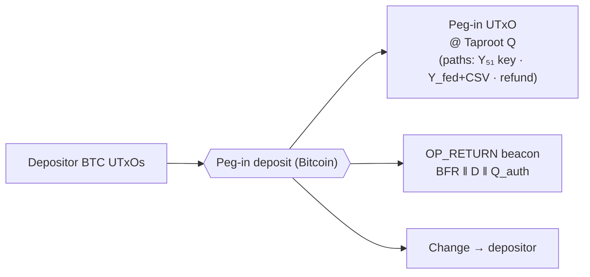
```mermaid
flowchart LR
  dep_in["Depositor BTC UTxOs"] --> tx{{"Peg-in deposit (Bitcoin)"}}
  tx --> pegin["Peg-in UTxO<br/>@ Taproot Q<br/>(paths: Y₅₁ key · Y_fed+CSV · refund)"]
  tx --> opret["OP_RETURN beacon<br/>BFR ‖ D ‖ Q_auth"]
  tx --> change["Change → depositor"]
```

**Structure**

| Role | Content |
|------|---------|
| **Inputs** | Depositor BTC UTxOs — funds the peg-in amount + BTC fees |
| **Outputs** | Peg-in UTxO at Taproot address $Q$ (holds the BTC to be bridged); OP_RETURN beacon `"BFR" ‖ D ‖ Q_auth` (67 bytes); optional change → depositor |
| **Signer** | depositor (their Bitcoin keys) |
| **Validity** | standard Bitcoin transaction |
| **Size (est.)** | ~220 vB (1 P2WPKH input + 3 outputs: P2TR peg-in ~43 B, OP_RETURN ~34 B, P2WPKH change ~31 B) |

**Taproot address $Q$** (see **Taproot address construction** for the full derivation)

`Q = lift_x(Y_51) + tagged_hash("TapTweak", Y_51 || merkle_root) · G`

where the script tree has two leaves:

* `Y_federation + CSV` — federation emergency sweep after timeout;
* depositor refund — spendable by the depositor after ~4320 blocks (~30 days).

Key path ($Y_{51}$) is the main line: it is how SPOs sweep this UTxO into the next Treasury Movement.

**What Bitcoin enforces**: standard tx validity (input signatures, fees, output scripts well-formed). Nothing Bifrost-specific.

**What the depositor must get right** (no party will save them otherwise)

* $Q$ is constructed from the **current** $Y_{51}$ published in `treasury.ak` and $Y_{federation}$. Using a stale $Y_{51}$ makes the peg-in unsweepable — the depositor must then wait out the ~30-day refund.
* The OP_RETURN beacon must be present and equal `BFR ‖ D ‖ Q_auth`, otherwise watchtowers will not detect the deposit and no PegInRequest will ever be created.
* `D` must be the key whose refund leaf is committed in the address (else the refund path is unspendable), and `Q_auth` must be a key the depositor can BIP-322-sign with (else completion is impossible).

> **Implementation status.** The deployed demo beacon is `"BFR" ‖ Q_auth` (35 bytes) — `D` is conveyed to the sweeping operator out-of-band, acceptable for a federation-run demo but not for permissionless SPO sweeping. The 67-byte dual-key beacon above is the normative target (tooling + `deposit_binding_ok` CR).

### Create PegInRequest (Cardano)

**Purpose**: publish on Cardano the claim "a Bitcoin peg-in deposit is confirmed; here is the raw BTC tx and a proof it sits in the confirmed chain", so SPOs can read it when building the next Treasury Movement.

**Who**: anyone — typically a watchtower, or the depositor themselves.
**Trigger**: the block containing the BTC peg-in deposit has passed the Binocular confirmation window (≥100 Bitcoin blocks + 200 min challenge).

A single tx may create **N PegInRequests at once** (batching). The mint redeemer carries a list; the validator checks each entry independently.

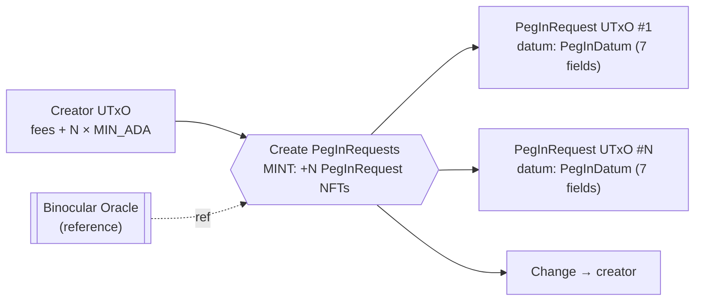
```mermaid
flowchart LR
  creator["Creator UTxO<br/>fees + N × MIN_ADA"] --> tx{{"Create PegInRequests<br/>MINT: +N PegInRequest NFTs"}}
  oracle[["Binocular Oracle<br/>(reference)"]] -. ref .-> tx
  tx --> pir1["PegInRequest UTxO #1<br/>datum: PegInDatum (7 fields)"]
  tx --> pirN["PegInRequest UTxO #N<br/>datum: PegInDatum (7 fields)"]
  tx --> change["Change → creator"]
```

**Structure**

| Role | Content |
|------|---------|
| **Inputs** | Creator UTxO — fees + N × MIN_ADA |
| **Reference inputs** | Binocular Oracle state — supplies the confirmed-chain root |
| **Mint** | +N PegInRequest NFTs (one per request; each with a unique on-chain identity) |
| **Outputs** | N × PegInRequest UTxO — each holds one NFT + MIN_ADA; datum = the 7-field `PegInDatum` below |
| **Witness data (redeemer)** | for each of the N requests: Merkle proof BTC tx ∈ block header; Merkle proof block header ∈ Binocular confirmed-chain root |
| **Validity interval** | unconstrained |
| **Size (est.)** | ~2 KB for N=1; up to ~16 KB for N=10 (batch ceiling). See **Size estimation and batch ceiling** below. |

**Checks enforced on-chain** (per minted NFT, independently)

* The supplied BTC tx is Merkle-included in the supplied BTC block header.
* That block header is included in Binocular's confirmed-chain root.
* **Deposit binding** (`deposit_binding_ok`): the datum's `peg_in_utxo_id` is an output of the
  supplied deposit tx; that output is a P2TR paying exactly `peg_in_amount`; and
  `user_source_chain_pub_key` matches the key committed in the deposit's beacon output. This is
  what pins the datum's claim fields to the real Bitcoin deposit.
* The NFT is minted uniquely and paired with exactly one output carrying the declared datum.

**Checks delegated to SPOs off-chain** (Plutus V3 cannot do secp256k1 point arithmetic, so these are verified before signing the TM)

* The BTC output pays a valid Bifrost peg-in Taproot address (reconstructed from $Y_{51}$, $Y_{federation}$, and the depositor's pubkey hash).
* The OP_RETURN beacon equals `BFR ‖ D ‖ Q_auth`.
* The claimed peg-in amount matches the BTC output amount.

If any off-chain check fails, SPOs skip this PegInRequest. No fund risk, no theft risk — griefing cost = NFT minting fee + MIN_ADA.

**PegInDatum** <!-- G9: field list matches the implemented bifrost/types/peg-in.ak (constructor
order is normative); the previous 2-field table disagreed with the fields §Complete peg-in reads. -->

| # | Field | Type | Purpose |
|---|-------|------|---------|
| 0 | `owner_auth` | `AuthorizationMethod` | authority that can later `Cancel` (close) this request |
| 1 | `source_chain_peg_in_raw_tx` | `ByteArray` | raw (witness-stripped) BTC peg-in deposit tx bytes |
| 2 | `source_chain_peg_in_raw_tx_index` | `Int` | the deposit tx's index in its block (for the Merkle proof) |
| 3 | `peg_in_utxo_id` | `ByteArray` (txid ‖ vout LE) | the deposit outpoint on Bitcoin — the UTxO the TM sweeps; key of the completed-peg-ins tree |
| 4 | `source_chain_treasury_utxo_id` | `ByteArray` | the treasury outpoint current when the request was created — identifies the key era the deposit address was derived against (used by SPO off-chain address reconstruction) |
| 5 | `peg_in_amount` | `Int` (satoshi) | the deposit amount — the fBTC quantity minted at completion |
| 6 | `user_source_chain_pub_key` | `ByteArray` (32 B x-only) | the depositor's auth key — the beacon's `Q_auth`, the key the BIP-322 completion signature verifies under |

Fields 3–6 are **bound to the real deposit at mint time** by the `deposit_binding_ok` check below —
that binding is what later makes the depositor (not a watchtower) the only party able to claim the
fBTC (see the B1 note under *Complete peg-in*).

> **Implementation status.** The deployed mint redeemer carries **one** request per transaction
> (`new_peg_in_request`, singular); the batch form (a list of up to ~10, per the size analysis
> below) is the normative target — a contract-CR item.

**Size estimation and batch ceiling**

Per-request payload:

| Part | Where | Size |
|------|-------|------|
| raw BTC peg-in tx | output datum | ~400 B |
| `owner_auth` | output datum | ~48 B |
| BTC block header | mint redeemer | 80 B |
| MPT inclusion proof (header ∈ confirmed chain) | mint redeemer | ~600 B |
| Bitcoin Merkle proof (tx ∈ block) | mint redeemer | ~320 B |
| NFT (asset name + qty, in mint + output value) | tx body | ~50 B |
| Output overhead (address + value bag wrapper) | tx body | ~60 B |
| **Per-request total** | | **~1.56 KB** |

Fixed per-tx overhead (creator input, oracle reference input, change output, signature, tx header, script integrity hash): **~400 B**.

At ~1.56 KB per request, byte size caps a batch at **~10 requests per tx** before hitting Cardano's 16 KB limit. Execution-unit memory (~14 M) is expected to converge on the same ~10-per-batch ceiling — per-request exec cost is dominated by the MPT + Merkle proof verifications and scales linearly.

Fee comparison (mainnet params: $a = 0.155$ ADA, $b = 4.4 \times 10^{-5}$ ADA/byte; exec: $7.21 \times 10^{-5}$ ADA/step, $5.77 \times 10^{-2}$ ADA/mem):

| Scenario | Byte fee | Exec fee | Total |
|----------|----------|----------|-------|
| 1 request per tx | ~0.24 ADA | ~0.09 ADA | **~0.33 ADA** |
| 10 requests batched | ~0.86 ADA | ~0.72 ADA | **~1.58 ADA** |
| 10 requests, 1 per tx | ~2.40 ADA | ~0.90 ADA | **~3.30 ADA** |

Batching 10 saves ~1.7 ADA (~50%) — meaningful at scale but not load-bearing. Watchtowers MAY batch up to 10 PegInRequests in a single tx.

### Create PegOut request (Cardano)

**Purpose**: lock fBTC on Cardano together with a Bitcoin destination, so the next Treasury Movement can pay out.

**Who**: the withdrawer.
**Trigger**: the withdrawer wants to bridge fBTC → BTC.

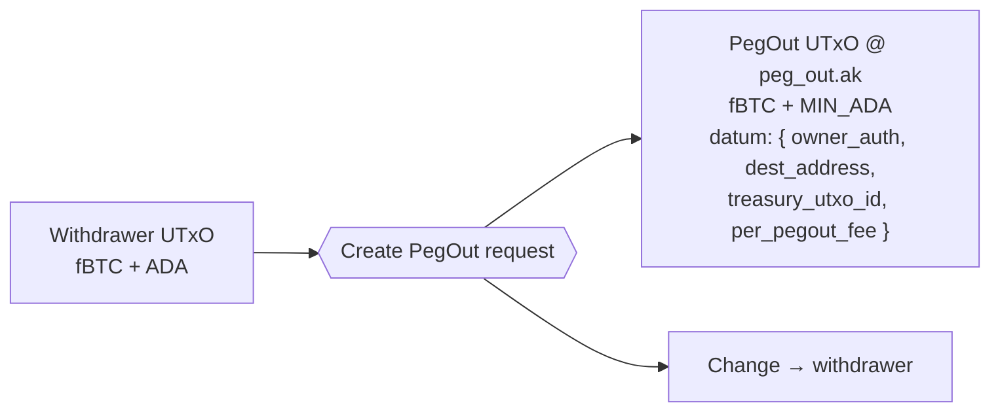
```mermaid
flowchart LR
  wdraw["Withdrawer UTxO<br/>fBTC + ADA"] --> tx{{"Create PegOut request"}}
  tx --> pout["PegOut UTxO @ peg_out.ak<br/>fBTC + MIN_ADA<br/>datum: { owner_auth, dest_address,<br/>treasury_utxo_id, per_pegout_fee }"]
  tx --> change["Change → withdrawer"]
```

**Structure**

| Role | Content |
|------|---------|
| **Inputs** | Withdrawer UTxO — holds the fBTC to lock + ADA for fees + MIN_ADA |
| **Reference inputs** | — |
| **Mint** | — |
| **Outputs** | PegOut UTxO @ `peg_out.ak` — holds the locked fBTC + MIN_ADA; datum = `{ owner_auth, source_chain_destination_address, source_chain_treasury_utxo_id, per_pegout_fee }` |
| **Witness data (redeemer)** | — (a plain payment to a script address; the validator runs only on spend) |
| **Validity interval** | unconstrained |
| **Size (est.)** | ~0.5 KB (no script execution; fee ≈ 0.18 ADA) |

<!-- G3: no on-chain creation checks by design; the security load sits on the deterministic skip
     rule (TM construction) and the completion/cancel verifiers. -->
**Checks enforced on-chain**

* None at creation — creation is a plain payment to the script address, and Cardano runs no
  validator on *receiving* outputs, so nothing *can* be checked here. This is safe for the
  bridge: a bad request can only harm its own creator — the treasury is protected by the
  **deterministic skip rule** at TM construction and by the completion/cancel verifiers at spend
  time.

**Client-side checks (normative for wallets and request-building tooling)**

A request that fails these is skippable at best and unrecoverable at worst, so software building
this transaction MUST validate before submitting:

* locked fBTC ≥ `min_peg_out_fbtc` (read from the Operational parameters UTxO) — otherwise the TM
  builder skips the request and the withdrawer must cancel;
* datum `per_pegout_fee` equals the current Operational-params value — a lower value gets the
  request skipped (it is below the floor); a higher value needlessly overpays the protocol;
* the datum encodes a well-formed `PegOutDatum` — an undecodable datum is **permanently
  unrecoverable**: even Cancel must decode `owner_auth` to authorize the refund;
* `source_chain_destination_address` is a spendable Bitcoin script (standard template) — a
  malformed script means the TM pays an unspendable output and the BTC is lost; there is no
  on-chain proof possible;
* `source_chain_treasury_utxo_id` is the **current** treasury outpoint — a stale outpoint is
  recoverable (Cancel opens once that outpoint's spender confirms), but a **nonexistent**
  outpoint is permanently unrecoverable: the cancel proof (a confirmed spender of the outpoint)
  can never be constructed.

**PegOutDatum** <!-- G28: field list matches the implemented bifrost/types/peg-out.ak (constructor order is normative) -->

| Field | Type | Purpose |
|-------|------|---------|
| `owner_auth` | `AuthorizationMethod` | authority that completes this peg-out (burn) or reclaims the fBTC if the TM excludes it |
| `source_chain_destination_address` | `ByteArray` | raw BTC output script where the TM pays (referred to as `btc_destination_scriptPubKey` elsewhere in this document) |
| `source_chain_treasury_utxo_id` | `ByteArray` | the Bitcoin treasury outpoint (txid ‖ vout) the paying TM must spend — pins this peg-out to exactly one possible TM |
| `per_pegout_fee` | `Int` (satoshi) | the protocol fee of **this** peg-out, pinned at lock time from the Operational-params value — the TM pays `amount − this fee`, and the completion/cancel verifiers compare against **this** field (never against a current on-chain value, which would race historical payments; see §Operational parameters UTxO) |

The peg-out **amount** is simply the fBTC quantity held in the UTxO's value — no separate datum field needed.

### Treasury Movement (Bitcoin)

**Purpose**: in a single Bitcoin transaction, sweep every confirmed peg-in into the treasury, pay every pending peg-out, and move the treasury to the next-epoch roster's Taproot address.

**Who**: current roster of SPOs via FROST group signing — or the federation, in emergency.
**Trigger**: end-of-epoch signing cascade.

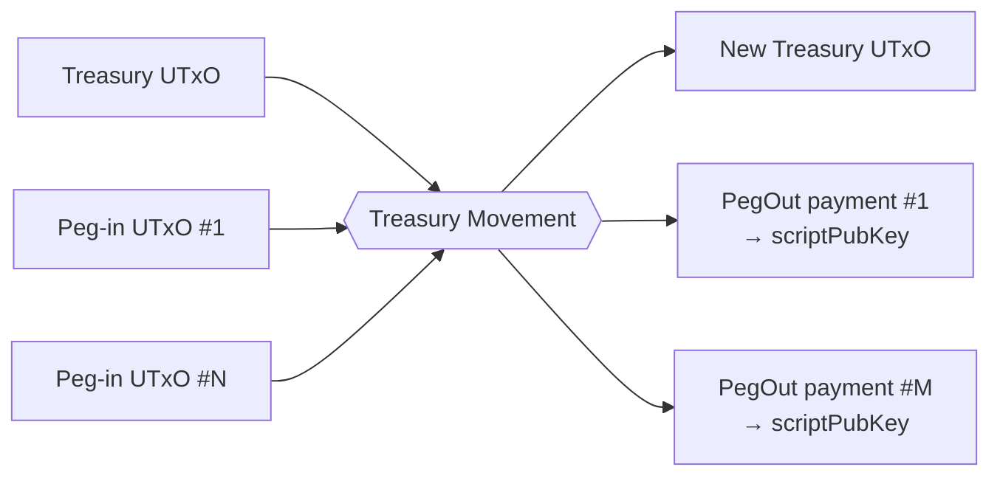
```mermaid
flowchart LR
  tres_in["Treasury UTxO"] --> tx{{"Treasury Movement"}}
  pin1["Peg-in UTxO #1"] --> tx
  pinN["Peg-in UTxO #N"] --> tx
  tx --> tres_out["New Treasury UTxO<br/>"]
  tx --> pay1["PegOut payment #1<br/>→ scriptPubKey"]
  tx --> payM["PegOut payment #M<br/>→ scriptPubKey"]
```

**Structure**

| Role | Content |
|------|---------|
| **Inputs** | Current Treasury BTC UTxO + all confirmed peg-in UTxOs (identified by `peg_in_utxo_id` in each PegInRequest) |
| **Outputs** | The **new treasury output** (output 0) — the treasury's self-payment to the address derived from the current TreasuryDatum key at the batch snapshot slot (after Update-Y this is the new roster's address: the handoff) + one payment output per PegOut (pays `btc_destination_scriptPubKey` with `amount` minus that peg-out's datum-pinned fee — see *Amounts and fees*) |
| **Witness** | FROST aggregated Schnorr signature(s) per the chosen variant |
| **Validity** | CSV timelock enforced on inputs only in the federation variant |
| **Size (est.)** | **Hard-capped at ~15 KB raw bytes** — the signed TM is carried in the Cardano Post-TM datum, which must fit the 16 KB Cardano tx limit. Per-variant max batch: ~100 peg-ins + ~100 peg-outs (51% key-path, ~107 B/input); ~57+57 (federation — script-path + CSV on every input, ~213 B/input). Beyond these, SPOs split across multiple TMs (see line above). |

**Signing-path variants** (chosen by the signing cascade; see **Spending paths and Treasury Movement variants**)

| Variant | Treasury input via | Peg-in inputs via | Chosen when |
|---------|--------------------|-------------------|-------------|
| **51% main line** | $Y_{51}$ key path | $Y_{51}$ key path | 51% quorum produced a valid aggregate signature |
| **Federation emergency** | $Y_{federation}$ script leaf + CSV | $Y_{federation}$ script leaf + CSV | 51% mode exhausted |

**What Bitcoin enforces**: standard Taproot verification per the chosen path. Nothing Bifrost-specific.

**What SPOs / federation must get right off-chain**

* The batch covers exactly the frozen set of PegInRequests and PegOuts for this epoch (determinism — every honest SPO must build the same unsigned tx).
* Each peg-in input is spendable via a path the signer actually controls.
* Each PegOut payment matches the destination in its datum and pays that `amount` minus the per-peg-out protocol fee (see *Amounts and fees*).

If the TM is malformed or omits a peg-out, recovery paths on Cardano unwind the state in the next epoch.

### Post signed TM as `Unconfirmed TM tx` (Cardano)

<!-- G15: the TM chain — Model C ratified 2026-07-15: the chain of Confirmed records IS the
     treasury pointer (no mutable on-chain register); posting is permissionless, gated by the
     linkage check instead of a roster/leader/authorized-minter gate. -->
**Purpose**: publish the signed Bitcoin TM transaction on Cardano so watchtowers can relay it to Bitcoin. This creates the TM UTxO in its initial `Unconfirmed` state — **not** yet usable by mint-fBTC, which only references `Confirmed TM tx` (produced later by the Confirm TM tx transition).

**Who**: anyone holding the fully signed TM — typically the elected leader (per the off-chain cascade, see *Cardano submission and leader reward*), but any SPO or watchtower can post for liveness. **Posting is permissionless**: validity is gated by the TM-chain linkage check below, and correctness ultimately by Bitcoin itself.
**Trigger**: the signing cascade produced a valid signed Bitcoin tx.

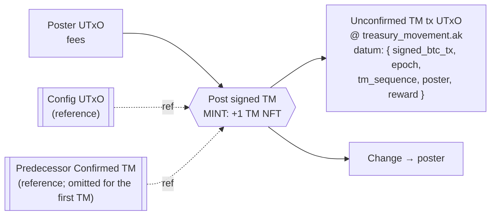
```mermaid
flowchart LR
  poster["Poster UTxO<br/>fees"] --> tx{{"Post signed TM<br/>MINT: +1 TM NFT"}}
  cfg_ref[["Config UTxO<br/>(reference)"]] -. ref .-> tx
  prev_ref[["Predecessor Confirmed TM<br/>(reference; omitted for the first TM)"]] -. ref .-> tx
  tx --> unconf["Unconfirmed TM tx UTxO<br/>@ treasury_movement.ak<br/>datum: { signed_btc_tx, epoch,<br/>tm_sequence, poster, reward }"]
  tx --> change["Change → poster"]
```

**Structure**

| Role | Content |
|------|---------|
| **Inputs** | Poster's UTxO — fees + MIN_ADA |
| **Reference inputs** | Config UTxO — supplies `genesis_treasury_utxo_id` (#18) and the TM policy identities; predecessor `Confirmed TM tx` UTxO (omitted for the first movement) |
| **Mint** | +1 TM NFT — identity carried through the Unconfirmed → Confirmed lifecycle (records are permanent, see *Confirm TM tx*); minting is permissionless, gated by the linkage check |
| **Outputs** | `Unconfirmed TM tx` UTxO @ `treasury_movement.ak`; datum = `{ signed_btc_tx, epoch, tm_sequence, poster, leader_reward }` (`poster` = the reward identity; `leader_reward` pinned from the Operational params at post — see *Leader reward*) |
| **Validity interval** | unconstrained (a stale or out-of-turn post is inert — it can never confirm) |
| **Required signers** | poster (fee spend) — permissionless |
| **Size (est.)** | ~10.5–15.5 KB depending on the signing variant and batch size (datum carries the full signed BTC tx, up to ~15 KB). The **16 KB Cardano tx limit is the binding constraint**, and it drives the per-variant max batch sizes listed under *Treasury Movement (Bitcoin)* above. Fee ≈ 0.67 ADA at ~10.5 KB; ≈ 0.9 ADA near the 15 KB ceiling. |

**Checks enforced on-chain**

* **TM-chain linkage**: input 0 (the treasury input) of `signed_btc_tx` is
  - the **genesis treasury outpoint** (`genesis_treasury_utxo_id`, Config #18) and `tm_sequence = 0` — the first movement after bridge creation; **or**
  - `(btc_txid, 0)` of the **referenced predecessor `Confirmed TM tx`** record (authenticated by its TM NFT) and `tm_sequence = predecessor.tm_sequence + 1`.
* The TM NFT is minted uniquely and paired with exactly one output carrying the declared datum.
* `leader_reward` in the datum equals the Operational-params value (params UTxO as reference input) — the pin that mints later enforce.

**Checks delegated off-chain**

* `signed_btc_tx` is a well-formed Bitcoin tx with valid signatures that sweeps the frozen PegInRequest / PegOut batch. If malformed, it fails to confirm on Bitcoin and Confirm TM tx never fires — a correct resubmission is required. The peg-in and peg-out sets are implicit in `signed_btc_tx` (Confirm TM tx parses them out).

> **The TM chain — how the treasury pointer works (G15).** There is **no mutable on-chain pointer
> register**. The Config's genesis outpoint anchors a chain: every Confirmed TM record proves (via
> the linkage check at post time + Bitcoin confirmation at confirm time) that its treasury input
> is the genesis outpoint or its predecessor's output 0. Because a Bitcoin outpoint is spendable
> exactly once, **at most one TM chaining from any given predecessor can ever confirm** — the
> Confirmed chain cannot fork; uniqueness is inherited from Bitcoin, not enforced by a register.
> SPOs and watchtowers derive the current treasury outpoint off-chain as the chain's tip (walking
> or indexing Confirmed records from the genesis value), and read the current treasury **value**
> from the tip record's parsed `outputs[0]`. Stale posts — a second genesis-linked TM, a fork from
> an already-extended predecessor — are permitted on Cardano but can never confirm on Bitcoin;
> they simply remain inert `Unconfirmed` records forever (see the permanence note under *Confirm
> TM tx*). Duplicate Confirmed records for
> the same `btc_txid` (the same signed TM posted twice) are possible and harmless — both carry
> identical content; tooling deduplicates by `btc_txid`.

### Confirm TM tx (Cardano)

**Purpose**: once the posted TM is confirmed on Bitcoin, transition the TM UTxO from `Unconfirmed` to `Confirmed`. This is where the Binocular proof is checked for the peg-in path; every downstream mint-fBTC reads `Confirmed TM tx` and skips Binocular entirely. (Peg-out completion does **not** read the Confirmed TM — it verifies the raw TM directly against Binocular; see *Complete peg-out*.) Confirm TM tx does **not** touch `treasury.ak`: key rotation is done in a separate Update-Y transaction after DKG, and the treasury pointer needs **no on-chain register at all** — the Confirmed records form the **TM chain** (see *Post signed TM*), and SPOs derive the current treasury outpoint off-chain as the chain's tip, starting from the Config's genesis outpoint.

**Who**: anyone — typically a watchtower.
**Trigger**: the TM is Binocular-confirmed (≥100 Bitcoin blocks + 200 min challenge).

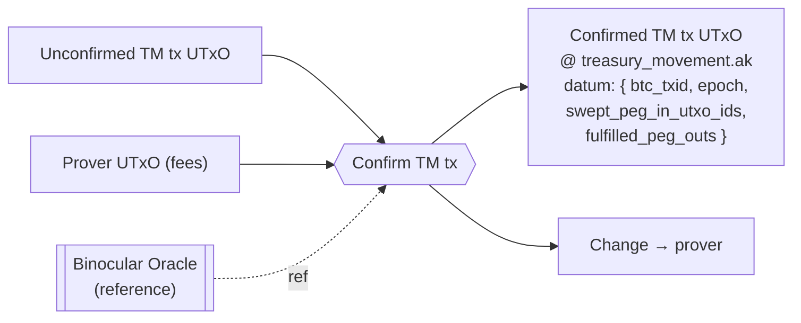
```mermaid
flowchart LR
  unconf["Unconfirmed TM tx UTxO"] --> tx{{"Confirm TM tx"}}
  prover["Prover UTxO (fees)"] --> tx
  binoc[["Binocular Oracle<br/>(reference)"]] -. ref .-> tx
  tx --> conf["Confirmed TM tx UTxO<br/>@ treasury_movement.ak<br/>datum: { btc_txid, epoch,<br/>swept_peg_in_utxo_ids,<br/>fulfilled_peg_outs }"]
  tx --> change["Change → prover"]
```

**Structure**

| Role | Content |
|------|---------|
| **Inputs** | `Unconfirmed TM tx` UTxO; Prover UTxO (fees) |
| **Reference inputs** | Binocular Oracle — supplies the confirmed-chain root |
| **Mint** | — (the TM NFT is carried over to the Confirmed output) |
| **Outputs** | `Confirmed TM tx` UTxO @ `treasury_movement.ak` — datum = `{ btc_txid, epoch, tm_sequence, poster, swept_peg_in_utxo_ids, fulfilled_peg_outs: [{scriptPubKey, amount}] }` (`epoch`, `tm_sequence`, `poster`, `leader_reward` carried from the Unconfirmed input) |
| **Witness data (redeemer)** | Merkle proof of `btc_txid` in a BTC block header; Binocular inclusion proof of that block header (the raw BTC tx itself is read from the consumed `Unconfirmed` datum, not duplicated) |
| **Validity interval** | unconstrained |
| **Required signers** | prover (fee spend) — permissionless |
| **Size (est.)** | ~9 KB at 100+100: redeemer ~1 KB (two proofs at ~500–600 B each); `Confirmed` output datum ~7 KB (100 swept peg-ins + 100 fulfilled peg-outs). **Primary constraint is exec-unit memory** for parsing the raw BTC tx on-chain, not byte size. Fee ≈ 0.7 ADA. |

**Checks enforced on-chain**

* `btc_txid == sha256d(strip_witness(Unconfirmed.signed_btc_tx))` — the Bitcoin txid is double-SHA256 over the **witness-stripped** serialization; the stored TM is witness-complete, so the validator strips witnesses before hashing (this is what makes the txid match the one committed in Bitcoin block Merkle trees; cf. the B1 note under *Complete peg-in*).
* `btc_txid` is Merkle-included in the supplied block header.
* That block header is in Binocular's confirmed-chain root.
* `Confirmed` datum fields (`swept_peg_in_utxo_ids`, `fulfilled_peg_outs`) are populated by parsing the inputs and outputs of `Unconfirmed.signed_btc_tx` respectively. The old treasury input and the new treasury output are included in these lists — they are inert, because no PegInRequest can satisfy the depositor Schnorr-sig check against the TM tx's inputs (no `BFR` OP_RETURN), and no PegOut will match the new treasury destination + amount.
* TM NFT is carried from the Unconfirmed input to the Confirmed output (preserving identity), together with the `epoch`, `tm_sequence`, and `poster` datum fields — the Confirmed record thereby becomes a link of the **TM chain** (see *Post signed TM*): its `btc_txid` is the txid of the current treasury outpoint until the next record extends the chain.

<!-- G17ii, ratified 2026-07-15: records are permanent; no GC path. -->
TM records are **permanent** — there is deliberately no garbage-collection path. Reclaiming a
record's min-ADA would require on-chain claim tracking ("has every swept peg-in been minted?")
for negligible recovery, and the Confirmed records double as the TM chain's on-chain history.
Likewise a stale `Unconfirmed` record — a dead fork, a genesis-linked repost, a superseded
fee-bump loser — simply remains inert forever; its min-ADA is the cost of posting.

### Complete peg-in / mint fBTC (Cardano)

**Purpose**: mint fBTC to the depositor's chosen Cardano address. This is the gate where the depositor's identity and non-double-mint are checked.

**Who**: the depositor (proving ownership with a Bitcoin Schnorr signature).
**Trigger**: the TM that swept this peg-in has been confirmed (a `Confirmed TM tx` UTxO exists).

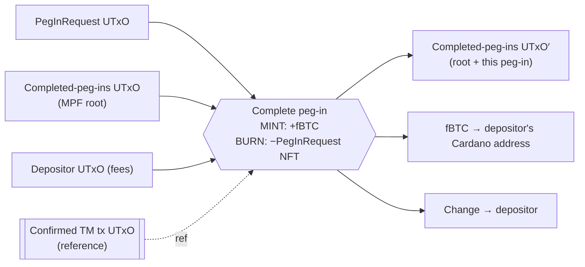
```mermaid
flowchart LR
  pir["PegInRequest UTxO"] --> tx{{"Complete peg-in<br/>MINT: +fBTC<br/>BURN: −PegInRequest NFT"}}
  cpi_in["Completed-peg-ins UTxO<br/>(MPF root)"] --> tx
  dep["Depositor UTxO (fees)"] --> tx
  conf_ref[["Confirmed TM tx UTxO<br/>(reference)"]] -. ref .-> tx
  tx --> cpi_out["Completed-peg-ins UTxO′<br/>(root + this peg-in)"]
  tx --> fbtc["fBTC → depositor's Cardano address"]
  tx --> change["Change → depositor"]
```

**Structure**

| Role | Content |
|------|---------|
| **Inputs** | PegInRequest UTxO; Completed-peg-ins tree UTxO (MPF root update); Depositor UTxO (fees) |
| **Reference inputs** | `Confirmed TM tx` UTxO — provides `swept_peg_in_utxo_ids` and `btc_txid`; authenticated by its TM NFT |
| **Mint** | +`peg_in_amount` fBTC; −1 PegInRequest NFT |
| **Outputs** | Updated Completed-peg-ins tree UTxO (new MPF root including this peg-in; same NFT, same address); fBTC → depositor-chosen address; change |
| **Witness data (redeemer)** | depositor's x-only BTC pubkey + Schnorr signature; non-inclusion proof of peg-in in the current MPT + updated-root proof |
| **Validity interval** | unconstrained |
| **Required signers** | depositor (fee spend) |
| **Size (est.)** | ~2.7 KB per mint: redeemer ~1.3 KB (Schnorr sig + pubkey + two MPT proofs at ~600 B each); input datum ~500 B (PegInRequest). Fee ≈ 0.37 ADA. Membership check against `swept_peg_in_utxo_ids` scales with list length (up to 100 entries). |

**Checks enforced on-chain**

* Referenced `Confirmed TM tx` UTxO carries a legitimate TM NFT.
* PegInRequest's `peg_in_utxo_id` appears in `Confirmed.swept_peg_in_utxo_ids`.
* Depositor's **BIP-322** signature is valid over the **per-mint signing message**, verifying under the auth key recorded in the PegInRequest datum (`user_source_chain_pub_key` = the beacon's `Q_auth`). At PegInRequest **mint** time that key — together with `peg_in_utxo_id` and `peg_in_amount` — is bound to the depositor's *actual* deposit (`bitcoin.deposit_binding_ok`). *This is what proves the depositor — not a watchtower — is claiming the fBTC.*

  The signed message is the ASCII text `BFR-mint-v1:<64-hex>`, where the hex is

  ```
  sha2_256("BFR-mint-v1" ‖ Confirmed.btc_txid ‖ peg_in_utxo_id ‖ chosen_cardano_address)
  ```

  signed as a **BIP-322 simple** signature from the Taproot address whose output key is `Q_auth`
  (tag `BIP0322-signed-message`): the validator reconstructs the virtual `to_spend`/`to_sign`
  key-path sighash on-chain and verifies the 64-byte Schnorr signature under `Q_auth`. BIP-322 —
  rather than a raw BIP340 signature over the hash — is what makes completion possible from any
  standard Taproot wallet (`signMessage(text, "bip322-simple")`); raw-key signing interfaces are
  not generally wallet-accessible.

  * `"BFR-mint-v1"` — domain-separation tag (BIP340 practice).
  * `peg_in_utxo_id` — binds the signature to **this specific peg-in**. Without it, if a depositor reused the same BTC pubkey across multiple peg-ins in the same TM, publishing the signature to claim one would let an attacker replay it to claim the others.
  * `chosen_cardano_address` — binds the signature to the **destination the depositor chose**. Prevents reorg-based front-running where an attacker replays the signature with their own Cardano address after a short chain reorganisation of the depositor's mint tx.
* Peg-in is **not yet** in the completed-peg-ins MPT (non-inclusion proof).
* Peg-in **is** in the new MPT root in the output (prevents double-mint).
* fBTC minted equals the amount parsed from the raw BTC peg-in tx.
* One output pays the referenced Confirmed record's pinned `leader_reward` to its `poster` identity (see *Leader reward*).
* PegInRequest NFT is burned.

> **Implementation note — where the TM is verified (B1).**
> `CompletePegIn` does **not** carry the raw TM tx or any Bitcoin Merkle/inclusion proof. It
> **references** the `Confirmed TM tx` UTxO (authenticated by its TM NFT) and reads `btc_txid` +
> `swept_peg_in_utxo_ids` straight from that UTxO's `Confirmed` datum. The TM's txid was recomputed
> with on-chain witness-stripping and proven oracle-confirmed *earlier*, in the **Confirm TM tx**
> step (binocular `confirm-tmtx`), so none of that is repeated at completion. Consequently the
> depositor authorization is a **BIP-322 simple** signature bound to
> `sha2_256("BFR-mint-v1" ‖ Confirmed.btc_txid ‖ peg_in_utxo_id ‖ chosen_cardano_address)`, and the depositor
> key / amount / outpoint are bound to the real deposit tx at PegInRequest **mint** time
> (`bitcoin.deposit_binding_ok`). The peg-in *deposit* tx (`source_chain_peg_in_raw_tx`) is stored
> already witness-stripped — its witnesses are never inspected.

### Complete peg-out / burn fBTC (Cardano)

<!-- G28: this section documents the implemented completion scheme (peg-out.ak + the
     legit_treasury_movement_and_peg_out_produced verifier + the completed-peg-outs tree);
     the earlier Confirmed-TM-reference + fulfilled_peg_outs-index design is superseded. -->
**Purpose**: unlock the PegOut UTxO once the TM that fulfilled it is Binocular-confirmed — burning the locked fBTC (full gross), recording the completion in the completed-peg-outs tree, and returning MIN_ADA to the withdrawer.

**Who**: the withdrawer — completion must satisfy the PegOut datum's `owner_auth`.
**Trigger**: the TM that paid this peg-out is Binocular-confirmed (≥100 Bitcoin blocks + 200 min challenge).

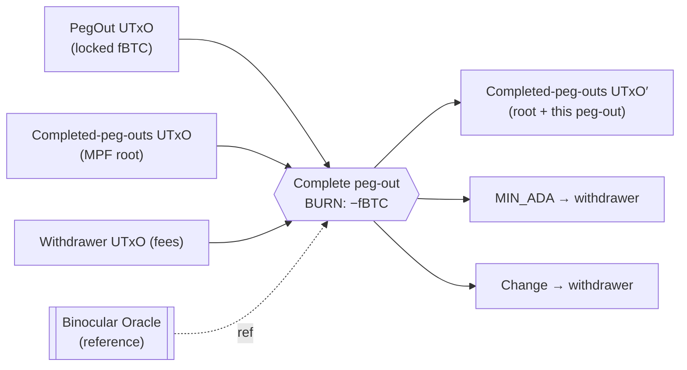
```mermaid
flowchart LR
  pout["PegOut UTxO<br/>(locked fBTC)"] --> tx{{"Complete peg-out<br/>BURN: −fBTC"}}
  cpo_in["Completed-peg-outs UTxO<br/>(MPF root)"] --> tx
  wdraw["Withdrawer UTxO (fees)"] --> tx
  binoc[["Binocular Oracle<br/>(reference)"]] -. ref .-> tx
  tx --> cpo_out["Completed-peg-outs UTxO′<br/>(root + this peg-out)"]
  tx --> minada["MIN_ADA → withdrawer"]
  tx --> change["Change → withdrawer"]
```

**Structure**

| Role | Content |
|------|---------|
| **Inputs** | PegOut UTxO (unlocks fBTC); Completed-peg-outs UTxO (MPF root update); withdrawer UTxO (fees) |
| **Reference inputs** | Binocular Oracle — supplies the confirmed-chain root; Config UTxO — supplies the verifier script hash and token policies |
| **Mint** | −fBTC (equal to the full fBTC held by the PegOut UTxO) |
| **Outputs** | Updated Completed-peg-outs UTxO (new MPF root including this peg-out; same NFT, same address, value preserved); MIN_ADA → original withdrawer (per `owner_auth`); change |
| **Witness data (redeemer)** | raw (witness-stripped) TM tx; block header + Binocular inclusion proof + tx-Merkle proof; `peg_out_utxo_id` (the PegOut's Cardano outpoint: `tx_hash(32) ‖ vout(4, LE)`); MPF non-membership proof of `peg_out_utxo_id` against the current completed-peg-outs root + updated-root proof |
| **Validity interval** | unconstrained |
| **Required signers** | per `owner_auth` |
| **Size (est.)** | dominated by the raw TM carried in the redeemer: ~1.5 KB for a small TM; ~12–13 KB near the 100+100 batch ceiling (witness-stripped TM ~10.4 KB + proofs). Exec cost scales with the on-chain TM byte-scan. |

**Checks enforced on-chain** (`peg_out.ak` spend, delegated to its withdraw script)

* The supplied block header is in Binocular's confirmed-chain root, and the TM tx is Merkle-included in that block (txid = `sha256d` of the witness-stripped TM bytes).
* Completion is authorized per the PegOut datum's `owner_auth`.
* The TM is *legit and produces the peg-out* — delegated to the `legit_treasury_movement_and_peg_out_produced` verifier (a withdraw script whose hash is read from the Config UTxO). In one forward scan of the raw TM bytes it proves the TM:
  1. **spends** `source_chain_treasury_utxo_id` — the Bitcoin treasury outpoint named in the PegOut datum; and
  2. **produces** an output paying `source_chain_destination_address` exactly
     `amount − datum.per_pegout_fee` satoshis — gross minus **the fee pinned in this PegOut's own
     datum at lock time** (see *Treasury Movement → Amounts and fees*). Comparing against the
     datum-pinned fee, never a current on-chain value, is what makes fee updates race-free (§
     Operational parameters UTxO). The current implementation runs with `per_pegout_fee = 0`, so
     the check is exact equality — forward-compatible.

  `peg_out.ak` cross-checks the verifier's redeemer fields against the spent PegOut datum, the locked fBTC quantity, `peg_out_utxo_id`, and the supplied raw TM bytes.
* `peg_out_utxo_id` is **not yet** in the completed-peg-outs tree (MPF non-membership proof), and **is** inserted into the updated root of the continuing Completed-peg-outs output — making each completion once-only.
* Burned fBTC equals the full (gross) fBTC held in the PegOut UTxO.
* MIN_ADA is returned to the original withdrawer.

> **Why this cannot pay out twice or match the wrong TM (G28).** The PegOut datum pins the Bitcoin
> treasury outpoint the paying TM must spend. A Bitcoin outpoint is spendable exactly once, so at
> most one confirmed TM can ever satisfy a given peg-out — an output of an older TM can never be
> claimed by a newer peg-out (the older TM spent a different treasury outpoint). The
> completed-peg-outs tree additionally makes each PegOut's completion once-only. Residual footgun
> (not a theft vector): the owner of a peg-out that was *not* actually paid (e.g. it named an
> already-spent treasury outpoint) can still burn their own fBTC against that TM if destination and
> amount happen to match one of its outputs — the treasury ends up in surplus, never deficit, and
> only the owner can trigger it (completion requires `owner_auth`).

> **Implementation note — peg-out completion does not use the Confirmed TM UTxO.** Unlike
> mint-fBTC (which references the `Confirmed TM tx` UTxO — see the B1 note under *Complete
> peg-in*), peg-out completion re-proves the TM's Bitcoin confirmation directly against the
> Binocular oracle and parses the raw TM bytes itself. The `fulfilled_peg_outs` list in the
> Confirmed TM datum is informational for this path.

<!-- G18: new catalog entry — the proof-based cancel; replaces the undefined "Binocular exclusion
     proof". The not-produced verifier (Config #14) is intentionally unsatisfiable in the current
     deployment — enabling it is part of the contract change request. -->
### Cancel PegOut request (Cardano)

**Purpose**: return the locked fBTC (and MIN_ADA) of a peg-out that was not — and now provably
never can be — paid by any Treasury Movement.

**Who**: the withdrawer — cancel must satisfy the PegOut datum's `owner_auth`.
**Trigger**: a Binocular-confirmed Bitcoin transaction spent the treasury outpoint named in the
PegOut datum **without** paying this peg-out.

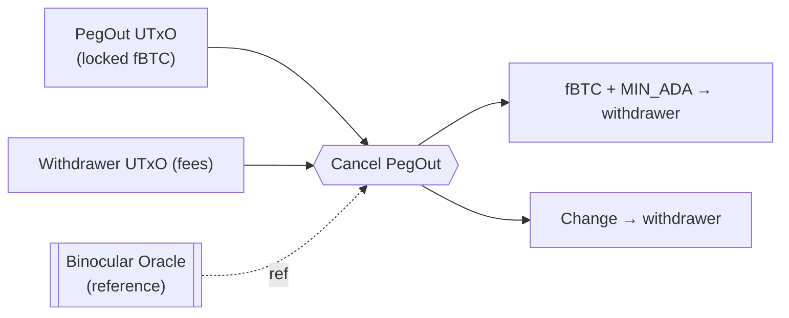
```mermaid
flowchart LR
  pout["PegOut UTxO<br/>(locked fBTC)"] --> tx{{"Cancel PegOut"}}
  wdraw["Withdrawer UTxO (fees)"] --> tx
  binoc[["Binocular Oracle<br/>(reference)"]] -. ref .-> tx
  tx --> refund["fBTC + MIN_ADA → withdrawer"]
  tx --> change["Change → withdrawer"]
```

**Structure**

| Role | Content |
|------|---------|
| **Inputs** | PegOut UTxO; withdrawer UTxO (fees) |
| **Reference inputs** | Binocular Oracle — supplies the confirmed-chain root; Config UTxO — supplies the verifier script hash |
| **Mint** | — (nothing is minted or burned; the fBTC returns to its owner) |
| **Outputs** | locked fBTC + MIN_ADA → withdrawer (per `owner_auth`); change |
| **Witness data (redeemer)** | the raw (witness-stripped) Bitcoin tx that spent the named treasury outpoint; block header + Binocular inclusion proof + tx-Merkle proof |
| **Validity interval** | unconstrained |
| **Required signers** | per `owner_auth` |

**Checks enforced on-chain** (`peg_out.ak` spend, `Cancel` action)

* The supplied block header is in Binocular's confirmed-chain root; the supplied tx is
  Merkle-included in that block.
* The tx **spends** `source_chain_treasury_utxo_id` — the outpoint named in the PegOut datum.
* The tx contains **no output** paying `source_chain_destination_address` the amount
  `locked fBTC − datum.per_pegout_fee` (the fee pinned in this PegOut's datum — the exact mirror
  of the completion check, so the two proofs stay mutually exclusive under any fee-parameter
  history) — delegated to the `legit_treasury_movement_and_peg_out_not_produced` verifier
  (Config field #14).
* Cancel is authorized per the PegOut datum's `owner_auth`.
* The locked fBTC is paid to the withdrawer — not burned.

> **Why cancel can never race a payout.** A Bitcoin outpoint is spent exactly once. Cancel
> requires a *confirmed* spender of the named outpoint that did *not* pay the peg-out; completion
> requires that same spender to *have* paid it. Exactly one of the two proofs can ever exist, and
> neither exists before the spender confirms — so "reclaim the fBTC while a signed TM pays the
> BTC" is structurally impossible, with no timing rules or lockout windows needed. A withdrawer
> whose valid peg-out was skipped waits one TM cycle (until the outpoint's spender confirms) and
> then cancels; a peg-out that named an already-spent outpoint can be cancelled immediately.

> **Implementation status.** The `Cancel` action and its `InputCancel` proof bundle exist in the
> implemented types, but the not-produced verifier is intentionally unsatisfiable (cleanly
> disabling Cancel until it is built). Enabling it is part of the standing contract change
> request.

<!-- G19: new catalog entry — the closure conditions previously existed only as flow prose. -->
### Close PegInRequest (Cardano)

**Purpose**: burn the PegInRequest NFT and reclaim its MIN_ADA for a request that can never
complete.

**Who**: the request's creator — per the datum's `owner_auth`.
**Trigger**: either **(a)** the depositor reclaimed the deposit on Bitcoin via the refund leaf, or
**(b)** the fBTC was already minted through another PegInRequest for the same deposit.

**Structure**

| Role | Content |
|------|---------|
| **Inputs** | PegInRequest UTxO; creator UTxO (fees) |
| **Reference inputs** | branch (a): Binocular Oracle; branch (b): completed-peg-ins tree UTxO |
| **Mint** | −1 PegInRequest NFT |
| **Outputs** | MIN_ADA → creator; change |
| **Witness data (redeemer)** | branch selector + the branch's proof (below) |
| **Required signers** | per `owner_auth` |

**Checks enforced on-chain**

* Closure is authorized per the datum's `owner_auth`; the PegInRequest NFT is burned.
* **Branch (a) — deposit refunded**: a Binocular-confirmed Bitcoin transaction spends
  `peg_in_utxo_id` via the **depositor refund leaf** — the witness is parsed to verify a
  script-path spend of that specific leaf (not the key path, which would be an SPO sweep, and not
  the federation leaf — both legitimate sweeps). This is what makes closure unable to grief a
  depositor whose funds were actually swept.
* **Branch (b) — duplicate**: an inclusion proof shows `peg_in_utxo_id` is already in the
  completed-peg-ins tree — fBTC was already minted via another request; this one is redundant.

> **Implementation status.** The implemented `Cancel` action checks `owner_auth` + NFT burn only;
> the branch gating above is the normative target (part of the unbuilt failure-mode milestone —
> contract CR).

<!-- G2 (revised 2026-07-15): updates spend the Operational parameters UTxO, not the Config —
     the Config is immutable and never spent. New params contract = contract-CR item. -->
### Update operational parameters (Cardano)

**Purpose**: change the tunable protocol values (fee rate, per-peg-out fee floor, minimum
peg-out, minimum stake) — without touching the Config, which is immutable and defines the
instance identity.

**Who**: submission is permissionless — the group signature is the authorization (same principle
as *Update-Y*). The values are chosen by the roster: each SPO sanity-checks the proposed datum
against its own view before contributing its partial signature, and refusal is harmless (the old
values persist).
**Trigger**: parameter drift — the Bitcoin fee market above all (see *Stuck-TM recovery*).

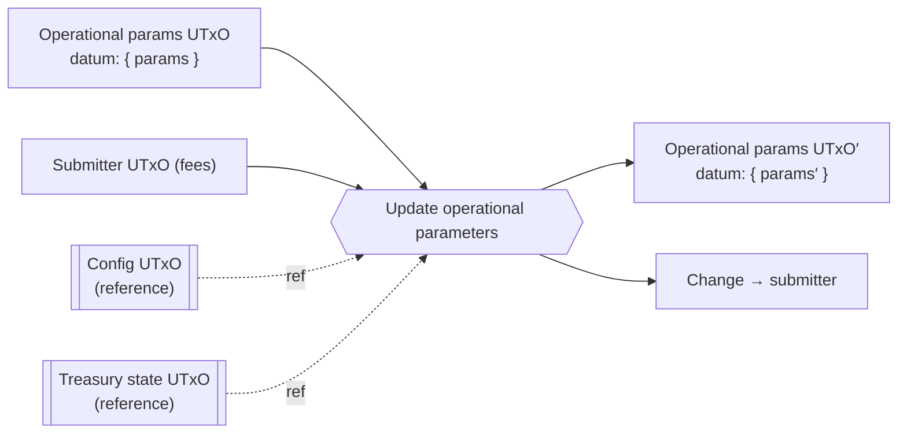
```mermaid
flowchart LR
  par["Operational params UTxO<br/>datum: { params }"] --> tx{{"Update operational parameters"}}
  sub["Submitter UTxO (fees)"] --> tx
  cfg_ref[["Config UTxO<br/>(reference)"]] -. ref .-> tx
  tres[["Treasury state UTxO<br/>(reference)"]] -. ref .-> tx
  tx --> par2["Operational params UTxO′<br/>datum: { params′ }"]
  tx --> change["Change → submitter"]
```

**Structure**

| Role | Content |
|------|---------|
| **Inputs** | Operational parameters UTxO; submitter UTxO (fees) |
| **Reference inputs** | Config UTxO (wiring — locates the treasury NFT); Treasury state UTxO — supplies the current group key |
| **Mint** | — (the params NFT is carried over) |
| **Outputs** | Operational parameters UTxO′ at the same address — same NFT, new datum |
| **Witness data (redeemer)** | new datum + BIP340 signature under the current treasury group key over `(spent params outpoint ‖ new datum)` |
| **Validity interval** | unconstrained |
| **Required signers** | submitter (fee spend) — permissionless |

**Checks enforced on-chain**

* The continuing output is at the params address and carries the params NFT.
* The BIP340 signature verifies under the group key read from the Treasury state reference input,
  over a message committing to the spent params outpoint (replay protection) and the full new
  datum.
* Parameter sanity: `min_peg_out_fbtc > per_pegout_fee + 330` (Bitcoin P2TR dust); all values
  non-negative; the schedule invariants of the constrained rows in *TM batches and the protocol
  schedule* (e.g. `stability_window` never below the host chain's `3k/f`, deadline ordering,
  `tm_recovery_window` above normal confirmation latency).

Off-chain effect: per the determinism rules, new fee values apply from the **next** TM batch
snapshot and new schedule values from the **next epoch boundary** — never to a batch already
frozen or in signing. Because no on-chain validator reads this UTxO, the update invalidates
**no** in-flight transaction.

<!-- G5: new catalog entry — the Update-Y transaction existed only as narrative (epoch phase,
     DKG finalization step 5, "Key publication"). Requires the key-rotation spend branch in
     treasury.ak (contract change request; heimdall K2 is gated on it). -->
### Update-Y — rotate the treasury group key (Cardano)

**Purpose**: publish the epoch's DKG result — swap `current_spos_frost_key` in the Treasury state
UTxO from the outgoing roster's key to the incoming roster's $Y_{51}'$ — so depositors and
validators derive the new Treasury and peg-in Taproot addresses from on-chain state.

**Who**: submission is **permissionless** — the group signature carried in the redeemer is the
authorization (see the note below). By convention, the leader selected with
`tm_sequence = "dkg"` submits first (see *Cardano submission and leader reward*).
**Trigger**: the incoming roster's DKG finalized; before the final TM of the epoch (whose change
output pays the address derived from the new key).

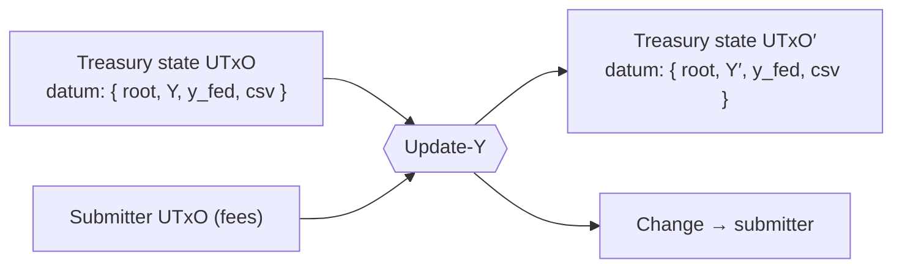
```mermaid
flowchart LR
  tstate["Treasury state UTxO<br/>datum: { root, Y, y_fed, csv }"] --> tx{{"Update-Y"}}
  sub["Submitter UTxO (fees)"] --> tx
  tx --> tstate2["Treasury state UTxO′<br/>datum: { root, Y′, y_fed, csv }"]
  tx --> change["Change → submitter"]
```

**Structure**

| Role | Content |
|------|---------|
| **Inputs** | Treasury state UTxO; submitter UTxO (fees) |
| **Reference inputs** | — (the authorizing key is in the spent datum) |
| **Mint** | — (the Treasury state NFT is carried over) |
| **Outputs** | Treasury state UTxO′ at the same `treasury.ak` address — same NFT, same `bifrost_identity_root`, same federation fields; only `current_spos_frost_key` changes |
| **Witness data (redeemer)** | `new_key` (32 B x-only) + 64-byte BIP340 signature under the **spent datum's** `current_spos_frost_key` |
| **Validity interval** | unconstrained |
| **Required signers** | submitter (fee spend) — permissionless |

**Signed message**

```
sig_msg = sha2_256("bifrost-update-y" ‖ spent_treasury_outpoint (36 B: txid ‖ index LE)
                    ‖ epoch (8 B BE) ‖ new_key (32 B))
```

**Checks enforced on-chain**

* The continuing output is at `treasury.ak` and carries the Treasury state NFT.
* Datum transition per the field-permission matrix (§Treasury state UTxO): only
  `current_spos_frost_key` changes; `bifrost_identity_root` and the federation fields are
  byte-identical.
* `verifySchnorrSecp256k1Signature(spent_datum.current_spos_frost_key, sig_msg, signature)` —
  the *outgoing* key authorizes its own succession. In Phase 1 the spent datum holds
  $Y_{federation}$, so the federation signs the first rotation; thereafter each outgoing roster
  hands off to the next.
* `new_key` is 32 bytes (a valid x-only point).

> **Why submission is permissionless.** The transaction is valid because of *what* it carries,
> not *who* submits it: the BIP340 group signature can only exist if the threshold (51% of stake
> — or the federation, in Phase 1) actually agreed, and the signed message pins the new key, the
> epoch, and the spent outpoint — a submitter can neither forge nor alter the payload, only
> deliver it or not. Replay is structurally impossible: the message commits to the very outpoint
> this transaction consumes, so no second transaction can ever reuse the signature. A submitter
> gate would therefore add no security — but it would add a censorship/liveness dependency on the
> gated party, for a transaction the whole bridge waits on (deposit addresses derive from this
> key). Same principle as the TM chain: oracle- or signature-backed payloads need no submitter
> authorization. The leader convention exists only to avoid duplicate fee spending.

<!-- G25 (d), ratified 2026-07-15: the guarded recovery from a permanently dead roster. -->
**Federation reset (Update-Y variant).** Ordinary Update-Y requires the *current* key's
signature — so a permanently dead roster would deadlock the datum key forever. The reset branch
breaks the deadlock with two guards:

* it is authorized by a BIP340 signature under **`y_federation`** (datum field #2) — but may set
  `current_spos_frost_key` **only to `y_federation` itself**, never to an arbitrary key; and
* it requires a **Binocular-confirmed proof that the treasury tip was spent via the federation
  CSV leaf** (witness-parsed script-path check, the same machinery as PegInRequest closure).

The second guard is the objective deadness evidence: the CSV leaf only becomes spendable after
the tip sat unmoved for `federation_csv_blocks` — a live roster's coins never age that far, so
the proof **cannot exist for a live bridge** (see §Federation). Effect: the bridge returns to
Phase 1 (federation as key-path signer), the roster rebuilds, and the federation signs a fresh
first-handoff per §Rollout Phases. The signed message is the Update-Y layout with the domain tag
`"bifrost-update-y-reset"`.

> **Implementation status.** The implemented `treasury.ak` has no spend branch that changes
> `current_spos_frost_key` (every registry branch preserves it) — this entry is the normative
> target; adding the branch (and the reset variant) is part of the standing contract change
> request and gates heimdall's K2 (`PublishKeys`). If the epoch's DKG fails, no Update-Y is
> posted: the old key remains and the roster carries over (degraded-epoch handling: see the
> consensus-change flow).

## Guaranteeing censor-resistant peg-ins and peg-outs

The main axiom is: When the user uses any bridge, he is already fully trusting the source (ex. Bitcoin) and the destination (ex. Cardano). Every additional component that the bridge uses and that it can't be under direct control of the user is an additional trust assumption.

Bifrost is truly trustless only if it doesn't necessarily add new trust assumptions.
As long as the Cardano SPOs and the watchtowers are collaborative, each peg-in or peg-out is permissionless: no actor exists who can decide if the user is permitted to move his assets between the blockchains.

Therefore, the potential additional trust assumptions in Bifrost are the Cardano SPOs and the watchtowers:

* Even if the user becomes a Cardano SPO, he would be just a small part of the total weight-based set of SPOs. Luckily, the strong majority of the SPOs are always incentivized in behaving correctly and on time, like they do when they participate in block-production consensus on Cardano. In fact, the security of Bifrost directly impacts their revenue model: more assets moved with Bifrost imply more Cardano transactions and an increase of the ADA price caused by the bigger demand to execute these transactions. Cardano SPOs want the bridge to work well because their revenue stream strongly depends on it.
* Watchtowers are an "always open" set of nodes that challenge each other to post on Cardano the best chain of blocks from the source blockchains (ex. from Bitcoin), and also detect and post peg-in requests on Cardano. While the watchtowers earn rewards for doing this job, they could potentially collude and stop posting blocks or peg-in requests, halting the bridge for an unbounded timeframe. In this case the user who wants to peg-in or peg-out can spin up a watchtower himself and post the source blockchain blocks starting from the latest confirmed ones, and create their own PegInRequest UTxOs on Cardano. Because every user is able to become a watchtower at any time, there will be a safe challenge among them to post the correct chain of blocks, resuming the Bifrost operations even in case of collusion. The completion of peg-outs (burning fBTC) is the withdrawer's own action (authorized by `owner_auth`) — and no completion is needed for the withdrawer to be paid: the BTC payout is final once the TM confirms on Bitcoin. For peg-ins, the depositor completes the minting themselves by providing a Binocular inclusion proof and a Schnorr signature with their Bitcoin key, choosing their Cardano destination address at mint time. No third party can censor or redirect a depositor's fBTC.

## Rollout Phases

Bifrost supports a phased rollout from federated to fully decentralized operation:

**Phase 1 — Federation Launch**: The bridge launches with the federation as the only signing
entity; SPOs begin registering. The K1 bootstrap seeds the Treasury state's
`current_spos_frost_key` with $Y_{federation}$, so in Phase 1 the federation is the **key-path**
signer — TMs are signed exactly like Phase-2 TMs, cheaply, with no CSV wait; the federation
script leaf (with timelock) exists in the trees but is redundant while the key path is the same
key. Address derivation, batches, and all flows work with no special cases.

**Phase 2 — 51% SPO Participation**: There is **no phase flag anywhere** — the transition *is*
the first **Update-Y**: once enough SPOs have registered and completed a DKG, the federation
(holding the current datum key) signs the rotation to $Y_{51}$. Whether the roster is strong
enough to hand control to is therefore explicitly the federation's accountable judgment, made
once, in public, on-chain. After that signature the roster is the key-path signer, the federation
becomes the emergency-only CSV fallback, and it cannot reclaim control (subsequent rotations
require the roster's key) — except through the guarded *federation reset* (see *Update-Y* in the
Transaction catalog), which can only fire on a provably dead roster. This is the "main line"
operating mode — the protocol's terminal steady-state.

<!-- G23, ratified 2026-07-15: interface normative here; trust parameters in the required
     per-instance federation charter; internal ceremony owned by federation ops docs. -->
## Federation

**Interface (normative).** On-chain and on Bitcoin, the federation is exactly one thing: an
x-only public key, $Y_{federation}$, whose signatures verify as plain BIP340. It is set at the K1
bootstrap (Treasury state datum field #2, together with `federation_csv_blocks`, #3) and appears
as the timelock-gated script leaf of both Taproot trees. How the federation produces signatures
internally — a single custodian, MuSig2, FROST among its members — is indistinguishable on-chain
and is owned by the federation's operational documentation (see §Scope and normativity).
Recommended practice: a threshold scheme among independent entities with no single point of
custody.

**Charter (required per-instance data).** The bridge's advertised trust model depends on what
"a federation of trusted entities" means for a given instance, so every instance MUST publish a
federation charter: the number of entities, the internal signing threshold, and the
custody/accountability claims. Without it, the fallback path's trust assumption is unverifiable.

**CSV timing (the exclusivity window).** The federation leaf requires the spent UTxO to be at
least `federation_csv_blocks` old (see the *CSV* acronym and the leaf scripts under *Taproot
address construction*). Consequences, all deliberate:

* a functioning roster can never be raced by the federation — every TM re-creates the treasury as
  a fresh output, resetting the federation's clock;
* the federation's emergency latency is bounded: it can act on any treasury or peg-in UTxO that
  has sat unmoved for `federation_csv_blocks`;
* a federation-leaf spend is therefore an **unforgeable, Bitcoin-enforced proof that the roster
  failed to act** for that long — which is what the *federation reset* (see *Update-Y*) uses as
  its deadness evidence.

Constraint (spec-owned): `0 < federation_csv_blocks < 4320` — the federation must be able to
sweep a peg-in before the depositor refund leaf opens (~30 days). Example (non-normative):
144 blocks ≈ 1 day.

**Signing in emergencies.** Under exact reconstruction (Model A′) the federation computes the
same frozen batch as everyone else — the federation variant differs only in sequence numbers
(CSV-enabling) and witness structure. Its internal coordination is off-protocol; posting the
signed TM on Cardano is permissionless like any other post. In Phase 1 the federation is the
key-path signer and none of this machinery is exercised (see §Rollout Phases).

## Flow of Bitcoin over epochs, ceremonies


The diagram above shows two consecutive Cardano epochs with roster handoff from Roster A to Roster B. SPO registration and deregistration is continuous — a registry snapshot is taken at each epoch boundary along with the stake distribution from epoch N−1 (which will become N−2 when the new roster operates). Within each epoch the following phases occur:

1. **Registry Snapshot + Stake Distribution** — at the epoch boundary, the candidate set is locked and stake weights are read from the previous epoch's distribution.
2. **Peg-in / peg-out requests open** — users submit bridging requests during the first ~36 hours of the epoch.
3. **DKG** (new roster, off-chain) — the incoming roster runs distributed key generation to produce the group key $Y_{51}$, running concurrently with the request window.
4. **Previous-epoch peg-in completion** — peg-ins from the prior epoch's Treasury Movement complete as Bitcoin confirmations arrive (17–40 hours after epoch start).
5. **Per-batch pegs cutoffs** — there is no single epoch-wide snapshot: each TM batch `B_i` freezes the requests created at least one stability window (3k/f) before it (see *TM batches and the protocol schedule*).
6. **Update Y** — the current roster publishes the new roster's group public keys to `treasury.ak`.
7. **Build Treasury Movement Tx** — the current roster constructs the Bitcoin transaction that sweeps peg-in UTxOs, fulfils peg-out payments, and moves the treasury to the new Taproot address.
8. **Threshold signing cascade** — the current roster attempts 51% threshold signing. The federation path opens immediately once 51% setup/signing has finished unsuccessfully. The first mode to succeed wins.
9. **TM submission deadline** — the last batch opportunity is `final_tm_cutoff`, leaving signing, posting, Bitcoin confirmation, and recovery margin before the boundary (see *TM batches and the protocol schedule*).
10. **New peg requests** — after the pegs snapshot, new requests accumulate for the next epoch's batch.

### Realistic epoch timeline (happy path)


The epoch lifecycle above shows generous time windows for the signing cascade (51% → federation). In the happy path, when 51% quorum is available, the epoch proceeds much faster:

- **DKG**: ~5 minutes (off-chain, SPOs communicate via `bifrost_url` endpoints).
- **FROST 51% signing**: ~1 minute per Treasury Movement transaction.
- **Multiple TM batches**: the roster processes peg requests in multiple batches throughout the epoch, each cycling through build → sign → broadcast → Bitcoin confirmation.

The bottleneck is Bitcoin confirmation: each Treasury Movement requires ~100 Bitcoin blocks (~16.7 hours) for Binocular to promote the containing block to `confirmed` state. With a 5-day Cardano epoch, 4–5 TM batches fit sequentially, each handling its own set of peg-in sweeps and peg-out fulfillments. The final TM of the epoch moves the treasury to the new roster's Taproot address.

<!-- G26/G20: new section — the batch-assignment rules and the protocol schedule. Supersedes the
     single epoch-wide "Pegs Snapshot": each batch has its own stability cutoff. Schedule values
     are formulas/constraints; concrete numbers are non-normative examples. -->
### TM batches and the protocol schedule

**Batch grid.** TM batch opportunities occur on a fixed slot grid:

```
B_i = epoch_start + i × tm_batch_interval        (i = 1, 2, …; B_i ≤ final_tm_cutoff)
```

At each `B_i`, every SPO evaluates the same gate: if the TM-chain tip is Binocular-confirmed and
no TM is currently in flight, the batch is frozen and built; otherwise the opportunity passes
unused (or, if the in-flight TM has exceeded `tm_recovery_window`, the *Stuck-TM recovery*
procedure runs instead). The grid — rather than event-driven triggering ("freeze when the
previous TM confirms") — is deliberate: slot numbers are absolute and rollback-immune, whereas a
Confirm-transaction's inclusion slot can waver during Cardano rollbacks, and any wobble in the
freeze anchor flips boundary items in or out of the batch, breaking byte-determinism.

**Batch membership (deterministic).** Each batch has its own stability cutoff
`C_i = B_i − stability_window`:

* **Peg-ins**: every PegInRequest created at or before `C_i`, whose deposit is
  Binocular-confirmed, not yet swept, and passing SPO off-chain validation. Peg-ins **roll over**
  freely — one not taken by batch `i` is a candidate for batch `i+1`.
* **Peg-outs**: every PegOut UTxO created at or before `C_i`, **naming this TM's treasury input**
  (`source_chain_treasury_utxo_id` = the current tip), and passing the deterministic skip rule.
  The outpoint pinning makes peg-out membership self-selecting.

Note `C_1 = epoch_start − stability_window + tm_batch_interval` reaches back into the previous
epoch: the first batch naturally includes the prior epoch's unswept leftovers — rollover needs no
special case.

**Ordering, capacity, and the split rule.** Within a batch, items are ordered FIFO by the total
order `(creation slot, creating txid, output index)`. The batch takes the first at most
`max_pegins_per_tm` peg-ins and `max_pegouts_per_tm` peg-outs (derived from the ~15 KB raw-TM
ceiling: ≈100 + 100 in the 51% key-path variant, ≈57 + 57 in the federation variant). Overflow
**peg-ins** wait for the next batch. Overflow **peg-outs are dead**: once this TM spends their
named tip, no future TM can ever pay them — they recover their fBTC via the race-free *Cancel
PegOut request*. This asymmetry is the honest price of outpoint pinning.

**Wallet guidance (peg-out targeting).** Before locking, request-building software SHOULD check
the pending peg-out queue depth against the remaining batch capacity, and choose the treasury
outpoint to name as follows: the confirmed tip if no TM is in flight; the **posted** TM's
`out[0]` (readable from its `Unconfirmed` record — the tip-to-be) while one is. A peg-out created
against an about-to-be-spent tip lands in the dead-on-arrival case above.

**The schedule.** All protocol deadlines are slot arithmetic from the epoch boundary `E`. The
normative content is each parameter's **kind and constraint** — concrete values are non-normative
examples for a mainnet-parameter instance:

| Parameter | Kind | Normative definition / constraint | Example |
|---|---|---|---|
| `stability_window` | **derived** | `= 3k/f` of the host Cardano network (see *Cardano stability window*); the params-update validator MUST reject smaller values — it is fund-safety-critical, tunable only upward | 129 600 slots (36 h) |
| `dkg_r1_deadline`, `dkg_r2_deadline` | free | E-relative; `0 < r1 < r2 < update_y_deadline` | E + 1 h / E + 2 h |
| `update_y_deadline` | constrained | `> dkg_r2_deadline`; early enough that depositors get the new key before meaningful deposit traffic | E + 3 h |
| `tm_batch_interval` | free | `> sign_r1_window + sign_r2_window +` posting margin | 6 h |
| `sign_r1_window`, `sign_r2_window` | free | per-TM FROST round deadlines, measured from `B_i` | 30 min each |
| `leader_slot_T` | free | cascade hop for posting/submission conventions | 60 slots |
| `tm_recovery_window` | **constrained** | **must exceed the normal Binocular confirmation latency** (~100 BTC blocks + challenge ≈ 17–20 h), or healthy TMs are spuriously "recovered"; recommended ≥ 2× expected latency | 36 h |
| `final_tm_cutoff` | constrained | `≤ epoch_length − (sign windows + posting + tm_recovery_window + handoff margin)` | E + 4 d |

The free and constrained parameters live in the **Operational parameters UTxO** with a second
effect rule: **schedule parameters take effect from the next epoch boundary** (fee parameters:
from the next batch) — the schedule can never change under a running epoch. The constraints
marked MUST are enforced by the params-update validator itself.

<!-- G37: end-to-end roster-rotation narrative; all placeholders resolved (2026-07 gap review). -->
### Periodic consensus change flow (epoch roster rotation)

The phases above, told once as a single end-to-end flow. Actors: the **current roster** (controls
the treasury), the **candidates** (registered SPOs for the next epoch), **watchtowers** (relay).

1. **Continuous: registration.** SPOs register (and voluntarily deregister) at
   `spos_registry.ak` — a one-time cold-key ceremony per pool (see §SPO Registration). Requests
   land at any time; all effects are snapshot-based (snapshot semantics, §SPO Registration).
2. **Epoch boundary — snapshots.** The candidate set is frozen: the registration linked-list minus
   the active ban list, with the stake distribution read from the previous epoch. The `min_stake`
   filter is applied off-chain at candidate enumeration — registration itself is stake-blind.
3. **Candidate ordering and threshold.** Candidates are ordered lexicographically by
   `bifrost_id_pk` and indexed $1..n$; the threshold $t$ is computed by the bottom-$k$ stake rule
   (§Threshold Calculation) and frozen for the epoch's DKG instance.
4. **DKG (off-chain, incoming roster).** Round 1 (commitments + proofs of knowledge), Round 2
   (encrypted share distribution), finalization — producing $Y_{51}'$ and per-participant shares.
   Non-participation shrinks the qualified subset deterministically; cryptographic faults are
   punishable via the fault-verifier/ban path (§Misbehavior Handling). Deadlines:
   `dkg_r1_deadline` / `dkg_r2_deadline` per the protocol schedule (see *TM batches and the
   protocol schedule*).
5. **Update-Y (on-chain).** The current roster publishes $Y_{51}'$ to `treasury.ak`, authorized by
   a FROST group signature under the *current* group key; the posting SPO is selected by the
   leader rule with `tm_sequence = "dkg"`. From this point depositors derive peg-in addresses from
   $Y_{51}'$. (See *Update-Y* in the Transaction catalog; the implemented `treasury.ak` does not
   yet have the rotation branch — contract change request.)
6. **Final batch.** The last batch opportunity before `final_tm_cutoff` freezes the epoch's final
   TM batch, under the per-batch stability cutoff (see *TM batches and the protocol schedule*).
7. **Final Treasury Movement.** The current roster deterministically builds the final TM: sweeps
   the frozen peg-ins, pays the frozen peg-outs, and pays the new treasury output to the **new**
   roster's Taproot address (derived from $Y_{51}'$ + $Y_{federation}$). The signing cascade runs
   (51% key path, federation script path as fallback); the leader posts the signed TM to
   `treasury_movement.ak`; watchtowers relay it to Bitcoin.
8. **Handoff complete.** Once the final TM is Binocular-confirmed, the new roster controls the
   treasury; the old roster's duties end. The next epoch's cycle begins at step 2.
9. **Failure branches (the degraded-epoch state machine).** <!-- G25, ratified 2026-07-15 -->
   - **DKG fails** (qualified subset below $t$): no Update-Y is posted; the old key stays in the
     Treasury state and the **old roster simply carries over** — batches continue under it, and
     the next epoch boundary takes fresh snapshots and retries the DKG. No halt, no special
     state.
   - **Late Update-Y or late final TM**: nothing breaks at the boundary — the output-0 address
     rule is state-derived, so the handoff is simply whichever batch first runs after Update-Y
     lands; the TM chain crosses epochs, and batches resume at the first grid slot after the tip
     confirms (stuck TMs: *Stuck-TM recovery*).
   - **Roster loses signing liveness**: per-batch 51% signing fails at its bounded deadlines;
     deposits and peg-outs keep accumulating (delayed, not lost). Once the treasury tip ages past
     `federation_csv_blocks`, the **federation services the same frozen batches** via the CSV
     leaf (see §Federation) — the bridge limps but liveness is preserved.
   - **Permanent roster death**: the datum key would be locked forever (Update-Y needs the dead
     roster's signature) — recovered by the guarded **federation reset** (see *Update-Y*): reset
     to `y_federation` only, gated on a Binocular proof of a federation-leaf spend of the tip
     (the CSV aging is the unforgeable deadness evidence). The bridge returns to Phase 1 and the
     roster rebuilds.

### Cardano stability window and peg finality

**Asymmetry between Bitcoin and Cardano finality.** Bitcoin PoW and Cardano Ouroboros Praos [6] both provide probabilistic finality, but Bifrost treats them asymmetrically. Binocular requires ~100 Bitcoin blocks (~17 h) before promoting a TM to `confirmed`, a depth at which Bitcoin reorgs are negligible for practical purposes. Cardano's common-prefix parameter $k = 2160$ is deliberately shallow (~12 h of expected block time) and reorgs shorter than $k$ are routine. The roster therefore has to be careful about what Cardano state it freezes into a Bitcoin-signed TM: a Cardano rollback *after* TM signing is a normal protocol event, whereas a Bitcoin reorg past Binocular confirmation is not.

**Why PegOuts need finality.** A PegOut lock is a Cardano-native action — fBTC is locked at `peg_out.ak` when the PegOut UTxO is created, and the TM pays treasury BTC to match. If the PegOut UTxO rolls back on Cardano *after* the TM is signed, the fBTC lock disappears from the canonical Cardano chain while the TM on Bitcoin still pays out. The withdrawer keeps their fBTC **and** collects BTC — a net loss to the treasury. Once signed and broadcast, a TM cannot un-pay a PegOut. Every PegOut must therefore be past any possible Cardano reorg before it enters the Pegs Snapshot.

**Why PegInRequests do not.** A PegInRequest is a Cardano-side *registration* of a Bitcoin deposit that already exists on Bitcoin and is already Binocular-confirmed. Three properties make its rollback recoverable:

- **Permissionless creation.** Anyone can create a PegInRequest with a valid Binocular inclusion proof; the proof's validity depends only on Bitcoin state.
- **BTC-side-bound mint authorization.** The depositor's fBTC-mint BIP-322 signature commits to `"BFR-mint-v1" ‖ btc_txid ‖ peg_in_utxo_id ‖ chosen_cardano_address`, so it is bound to the Bitcoin UTxO, not to the specific Cardano PegInRequest NFT. The same signature verifies against any re-created PegInRequest for the same deposit.
- **BTC-side-bound double-mint protection.** The completed-peg-ins MPT (its own singleton UTxO) is keyed by `peg_in_utxo_id`, not by the NFT.

If a PegInRequest rolls back after the TM is broadcast, the BTC sweep still succeeds on Bitcoin, and any watchtower (or the depositor) can re-create the PegInRequest; the depositor then claims fBTC with the original Schnorr signature. **Net impact: a delayed fBTC mint, never a fund loss.** Strict pre-snapshot finality is therefore *not required* for PegInRequests — only for PegOuts. In practice the protocol treats both uniformly at the same snapshot boundary for operational simplicity and for SPO determinism under restart/partition scenarios, not for fund-safety reasons.

**The Cardano stability window ($3k/f$).** Under Ouroboros Praos with honest-majority stake, any transaction buried under $k$ blocks is final with probability $1 - e^{-\Omega(k)}$ by the common-prefix property [6]. $k$ blocks arrive on average in $k/f$ slots, and the Chernoff analysis reaches overwhelming probability at $3k/f$ slots. On Cardano mainnet with $k = 2160$, $f = 0.05$ and one-second slots:

$$\tfrac{3k}{f} = \tfrac{3 \cdot 2160}{0.05} = 129{,}600 \text{ slots} = 36 \text{ hours.}$$

**Why $3k/f$ and not "just 2160 blocks".** Block-depth alone gives common-prefix finality only *relative to the chain an observer has already chosen*. An SPO or watchtower that restarts, loses peers, or is briefly partitioned must first re-select the canonical chain, and Cardano's Genesis rule [7] does so by comparing chain density inside a $3k/f$-slot window after the fork point — so $3k/f$ is a structural parameter of chain selection, not a safety margin bolted on top of $k$. It also provides ~3× wallclock headroom for peer-diversity and out-of-band cross-checks against eclipse scenarios, and aligns with the "settled state" notion used inside `cardano-node`.

**Consequence for the protocol.** Every TM batch applies this window individually: batch `B_i` freezes only requests created at or before `C_i = B_i − 3k/f` (see *TM batches and the protocol schedule*). The roster signs each BTC Treasury Movement only against such a post-stability-window set, so no Cardano rollback can retroactively invalidate a PegOut committed on Bitcoin; requests newer than a batch's cutoff simply wait for a later batch. PegInRequests use the same boundary for determinism, even though their rollback is recoverable by re-creation.

## SPO Program

It's the program that Cardano SPOs must run and it allows signature aggregation. Being based on the FROST protocol requires:
1. registration of SPOs to participate in the protocol
2. formation of a roster of Cardano SPOs and distributed key generation (every epoch)
3. group signing.
We describe each in detail.

### SPO Bootstrap Flow

Before the first SPO registration, the protocol bootstrap creates the SPO-related on-chain state in production:

1. The treasury bootstrap policy mints the **Treasury state NFT** and creates the Treasury state UTxO at `treasury.ak`, with the initial treasury parameters and an empty `bifrost_identity_root`.
2. The `spos_registry.ak` minting policy has a one-shot bootstrap branch that consumes a fixed bootstrap nonce UTxO, mints the **registration-list root NFT** (`reg-root`), and creates the empty registration-list root UTxO at `spos_registry.ak`.
3. The `spo_bans.ak` policy has a one-shot bootstrap branch that consumes a fixed bootstrap nonce UTxO, mints the **ban-list root NFT** (`ban-root`), and creates the empty ban-list root UTxO at `spo_bans.ak`.

These three authenticated UTxOs are the starting point for all later SPO-related transactions. The runtime protocol never creates replacement roots. Instead:

- `register` consumes the current registration-list anchor element and the Treasury state UTxO, and produces the updated anchor element, the new registration node, and the updated Treasury state UTxO;
- `deregister` consumes the current registration node, its anchor element, and the Treasury state UTxO, and produces the updated anchor element and the updated Treasury state UTxO;
- `ban` inserts or updates a ban node: if the `pool_id` is not yet in the ban list, it consumes the current ban-list anchor element and produces the updated anchor element plus a new ban node; if the `pool_id` already has a ban node, it consumes that ban node and produces the updated ban node with the incremented `ban_counter`, extended `ban_until_time`, and recorded `evidence_hash`.

When the registration or ban list is otherwise empty, its bootstrap-created root UTxO is the anchor for the first insertion.

### SPO Registration

#### 1. Overview

Before participating in Bifrost, each SPO must complete a **one-time registration** that binds their Cardano pool identity to a long-term Bifrost identity key. This registration uses the SPO's cold key exactly once, after which all protocol operations use the Bifrost identity key. This design keeps cold keys offline except for initial registration and revocation.

Concretely, an SPO registers by submitting a Cardano `register_spo` transaction to `spos_registry.ak`. The transaction consumes the current registration-list anchor UTxO and the Treasury state UTxO, mints exactly one Bifrost Membership Token named by `pool_id`, and creates a registration-node UTxO whose value is that membership token plus min ADA and whose datum contains `bifrost_id_pk`, `bifrost_url`, and the ordered linked-list pointers. The redeemer carries `cold_vkey`, `cold_sig`, `bifrost_sig`, `registration_anchor_output_index`, and the non-membership witness proving that `bifrost_id_pk` is not already present in the Treasury state's `bifrost_identity_root`. The SPO program CLI is the intended operator interface for building this transaction; the protocol-level transaction shape is specified in Section 5 below.

<!-- G12, ratified 2026-07-15: requests continuous, effects snapshot-based. -->
**Snapshot semantics (normative).** Registration and revocation transactions may land **at any
time** — no validity-interval restriction. All protocol *effects* are snapshot-based: each epoch
operates on the boundary snapshot of the registration and ban lists (candidate set, roster, peer
URLs, `bifrost_id_pk` bindings, threshold $t$), so a mid-epoch change to the live list takes
effect only at the next boundary. In particular, a current-roster member who deregisters
mid-epoch **remains bound to the epoch's roster duties** — deregistration is not an exit from
in-flight participation (going silent instead is ordinary non-participation, which the protocol
already tolerates). One consequence made explicit: applying a ban requires referencing the
accused's registration node, so fault evidence against a *deregistered* pool waits until — and
applies upon — re-registration (the `FaultProof` token and the ban list are `pool_id`-scoped and
survive the gap).

#### 2. Keys

##### 2.1 SPO Identity (Cardano Layer)

- **`pool_id`**: unique stake pool identifier, derived as `pool_id = blake2b_224(cold_vkey)`.
- **`cold_vkey` / `cold_skey`**: long-term Ed25519 keypair. Used **only** for initial Bifrost registration and revocation. Must be kept on an air-gapped offline machine per Cardano security guidelines.

##### 2.2 Bifrost Identity

- **`bifrost_id_pk` / `bifrost_id_sk`**: long-term Secp256k1 identity keypair for Bifrost protocol operations.
- Self-generated by the SPO.
- Used for roster participation, DKG coordination, and encryption of DKG shares (via ECDH).

##### 2.3 Bifrost URL

- **`bifrost_url`**: endpoint URL where the SPO publishes DKG data and receives protocol messages.

#### 3. On-Chain Objects

##### 3.1 Bifrost Membership Token

- **Minting Policy**: `spos_registry.ak`
- **TokenName**: `pool_id`
- Exactly **one token per SPO** (enforced by minting policy).
- The token serves as the on-chain badge of Bifrost participation.
- The same minting policy also mints the registration-list root NFT during protocol bootstrap.

##### 3.2 Registration Linked-List

All registered SPOs are tracked using an **on-chain ordered linked-list**. Each node in the list represents a registered SPO and is stored as an individual UTxO at the registry script address. The list is ordered by `pool_id`, ensuring uniqueness and enabling efficient insertion and removal.

- **Node Value**: Bifrost Membership Token + the minimum ADA required to hold the token and datum.
- **Element key**: the ordering key is **not stored in the datum** — it is the **asset name of the registry-policy NFT** held in the UTxO. The list root carries the constant asset name `reg-root`; each registration node carries its `pool_id` (`blake2b_224(cold_vkey)`) as the asset name. The key is therefore minted under, and authenticated by, the `spos_registry.ak` policy: immutable across spends, unique, and indexable.
- **Element Datum** (`aiken_design_patterns/linked_list` `Element`):
```text
Element     = Constr(0, [ ElementData, Link ])
ElementData = Constr(0, [ Constr(0, []) ])                             -- Root  (ListRootData, empty)
            | Constr(1, [ Constr(0, [ bifrost_id_pk, bifrost_url ]) ]) -- Node  (RegistrationNodeData)
Link        = Constr(0, [ next_key ])  -- Some: asset name (pool_id) of the next node, ascending
            | Constr(1, [])            -- None: tail
```
where `RegistrationNodeData` is `{ bifrost_id_pk :: ByteArray, bifrost_url :: ByteArray }` — the Bifrost identity key and URL used later by the off-chain DKG and signing protocol.

The registration list is keyed by `pool_id`, not `bifrost_id_pk`: registration, revocation, and banning are all pool-scoped operations, so the compact cold-key-derived identifier `pool_id = blake2b_224(cold_vkey)` is the canonical on-chain key. It is carried as the **NFT asset name** (not a datum field), so it is authenticated by the minting policy and immutable across spends; the authorized `bifrost_id_pk` lives in the node datum because it is the key actually used later by the off-chain protocol.

The ADA locked in the registration node is only the minimum lovelace required by Cardano to hold the membership token and datum. It is not protocol collateral and is fully returned on voluntary revocation.

**Operations:**
- **Insert (ascending)**: A new node is inserted in ascending key order by verifying it sits between its neighbours — the spent **anchor** (the element with the greatest key strictly below the new node, or the root) keeps its data and is relinked to point at the new key, and the new node takes over the anchor's old link. Corresponds to `linked_list.insert_ascending` in the on-chain code.
- **Remove**: A node is removed by relinking its neighbours. Corresponds to `linked_list.remove` in the on-chain code.

**Spending Conditions**: Each registration node UTxO can be spent only by **voluntary revocation** via the cold-key-signed `bifrost-revoke` message — at any time (snapshot semantics, see §1: the removal takes effect at the next boundary snapshot).

Fault-based banning does not spend the registration node. Instead, it updates the separate ban linked-list while the registration node remains in place.

The on-chain linked-list implementation uses the `aiken_design_patterns/linked_list` module [5].

##### 3.3 Bifrost Identity Root In Treasury State

Active Bifrost identity bindings are tracked in the Treasury state UTxO at `treasury.ak`. The Treasury state stores a Merkle Patricia Trie root over the map:

`bifrost_id_pk -> pool_id`

This root exists solely to enforce that no two active registrations can bind the same Bifrost identity key.

**Semantics:**
- At most one active mapping exists per `bifrost_id_pk`.
- Every active registration node must have a matching trie entry, and every trie entry must point to an active registration.
- Registration inserts a new `bifrost_id_pk -> pool_id` mapping.
- Revocation removes the existing mapping.
- Uniqueness is enforced by non-membership / membership proofs against the Treasury state's `bifrost_identity_root`.

This preserves `pool_id` as the canonical on-chain membership identity while ensuring that active `bifrost_id_pk` values remain globally unique.

##### 3.4 Ban Linked-List

Temporary and permanent bans are tracked in a **separate on-chain ordered linked-list** at `spo_bans.ak`. A ban entry does not replace or burn the Bifrost Membership Token; instead, off-chain roster derivation subtracts the active ban list from the registration list.

- **Node Value**: ban node auth token `ban/ || pool_id` + the minimum ADA required to hold the token and datum.
- **Element key**: as in the registration list (§3.2), the ordering key is **not stored in the datum** — it is the **asset name of the ban-policy NFT** held in the UTxO. The list root carries the asset name `ban-root`; each ban node carries `ban/ || pool_id`. Keys are authenticated by the `spo_bans.ak` policy.
- **Element Datum** (`aiken_design_patterns/linked_list` `Element`):
```text
Element     = Constr(0, [ ElementData, Link ])
ElementData = Constr(0, [ Constr(0, []) ])  -- Root (BanListRootData, empty)
            | Constr(1, [ Constr(0, [ ban_counter, ban_until_time, permanent, evidence_hashes ]) ])  -- Node (BanNodeData)
Link        = Constr(0, [ next_key ])  -- Some: asset name of the next node, ascending
            | Constr(1, [])            -- None: tail
```
where `BanNodeData` is `{ ban_counter :: Int, ban_until_time :: Int (POSIX ms), permanent :: Bool, evidence_hashes :: List<ByteArray> }`.

**Semantics:**
- At most one ban entry exists per `pool_id`.
- A ban is considered **active** at POSIX time `T` iff `permanent == True` or `ban_until_time > T`.
- Expired temporary ban entries may remain on-chain; off-chain roster derivation must ignore them once `permanent == False` and `ban_until_time <= T`.
- `ban_counter` is monotonically increasing for each `pool_id` and determines the exponential timeout duration.
- `evidence_hashes` records the already-punished fault evidence hashes for the pool. `spo_bans.ak` rejects repeated punishment for the same evidence hash.

#### 4. Registration Message and Signatures

Registration must prove both:
- the pool's cold key authorizes the binding; and
- the registrant actually controls `bifrost_id_sk`.

Both the cold key and the Bifrost identity key sign the same message:

```
"bifrost-spo" || pool_id || bifrost_id_pk || bifrost_url
```

Where:
- `"bifrost-spo"` is a 10-byte ASCII domain separator.
- `pool_id` is the 28-byte stake pool identifier derived from `cold_vkey`.
- `bifrost_id_pk` is the 33-byte compressed Secp256k1 public key.
- `bifrost_url` is the variable-length URL encoded as UTF-8 bytes.

The registration transaction therefore carries:
- `cold_sig`: Ed25519 signature by `cold_skey` over the message above.
- `bifrost_sig`: BIP340 Schnorr signature by `bifrost_id_sk` over the same message.

#### 5. Registration Transaction

A **registration tx** performs the following:

1. **Redeemer**: contains `cold_vkey`, `cold_sig`, `bifrost_sig`, `registration_anchor_output_index`, and the Merkle Patricia Trie witness needed to prove that `bifrost_id_pk` is currently absent from the Treasury state identity map.
2. **Inputs**:
   - Anchor element UTxO from the registration linked-list (either the root UTxO or an existing registration node, depending on where the new node is inserted).
   - Treasury state UTxO from `treasury.ak`, carrying the current `bifrost_identity_root`.
3. **Mint**: exactly one Bifrost Membership Token with `TokenName = pool_id` under `spos_registry.ak`.
4. **Outputs**:
   - New registration linked-list node UTxO at registry script address with:
     - Bifrost Membership Token + the minimum ADA required to hold the token and datum
     - Datum containing `bifrost_id_pk`, `bifrost_url`, and linked-list pointers (correctly ordered between neighbors)
   - Updated registration anchor node UTxO with its `next` pointer updated to reference the new registration node
   - Updated Treasury state UTxO whose `bifrost_identity_root` commits to the newly inserted mapping `bifrost_id_pk -> pool_id`

**Prototype transaction skeleton**:

```text
Transaction: register_spo

Inputs:
- registration anchor input at `spos_registry.ak`
- treasury state input at `treasury.ak`

Reference Inputs:
- none

Withdrawals:
- none

Mint:
- under `spos_registry.ak`:
  - `pool_id` => +1

Burn:
- none

Outputs:
- continued registration anchor output at `spos_registry.ak`
- new registration node output at `spos_registry.ak`
  value:
  - membership token `pool_id`
  - min ADA
  datum:
  - `bifrost_id_pk`
  - `bifrost_url`
  - linked-list pointers
- continued treasury state output at `treasury.ak`
  datum:
  - same treasury fields
  - updated `bifrost_identity_root`

Required witnesses:
- `cold_sig`
- `bifrost_sig`

Required validity interval:
- unconstrained (snapshot semantics — see §1)
```

#### 6. On-Chain Verification

The minting policy verifies:

1. `pool_id == blake2b_224(cold_vkey)` — proves the cold key owns this pool.
2. `verifyEd25519Signature(cold_vkey, "bifrost-spo" || pool_id || bifrost_id_pk || bifrost_url, cold_sig)` — proves the cold key authorized this Bifrost identity binding.
3. `verifySchnorrSecp256k1Signature(bifrost_id_pk, SHA256("bifrost-spo" || pool_id || bifrost_id_pk || bifrost_url), bifrost_sig)` — proves the registrant actually controls `bifrost_id_sk`.
4. Exactly one token minted with `TokenName = pool_id`.
5. Registration output datum matches the signed message content.
6. **Registration linked-list ordering**: verifies the new registration node is correctly positioned between its neighbors, preventing duplicate `pool_id` registration.
7. **Registration linked-list state transition**: verifies the registration anchor node's `next` pointer is correctly updated to reference the new registration node.
8. **Bifrost identity non-membership**: verifies, against the Treasury state's `bifrost_identity_root`, that no active entry already exists for `bifrost_id_pk`.
9. **Bifrost identity root update**: verifies the updated Treasury state UTxO inserts the mapping `bifrost_id_pk -> pool_id` into the identity trie.

#### 7. Revocation

An SPO's membership can end through voluntary revocation or fault-based banning.

##### 7.1 Voluntary Revocation

The SPO's cold key signs an explicit revocation message:

```
"bifrost-revoke" || pool_id
```

Where:
- `"bifrost-revoke"` is a 14-byte ASCII domain separator.
- `pool_id` is the 28-byte pool identifier.

**Transaction**:
1. **Redeemer**: contains `cold_vkey`, `cold_sig`, `removed_node_input_index`, and `anchor_node_input_index`.
2. **Validity interval**: unconstrained (snapshot semantics — see §1).
3. Spends the registration node and the Treasury state UTxO.
4. Burns the Bifrost Membership Token under `spos_registry.ak` and returns the registration node's ADA to an SPO-controlled output.
5. Removes the registration node from the registration linked-list by updating the anchor node's `next` pointer to skip the removed node.
6. Updates the Treasury state UTxO by removing the matching `bifrost_id_pk -> pool_id` mapping from the identity trie.

**Prototype transaction skeleton**:

```text
Transaction: deregister_spo

Inputs:
- registration node input at `spos_registry.ak`
- registration anchor input at `spos_registry.ak`
- treasury state input at `treasury.ak`

Reference Inputs:
- none

Withdrawals:
- none

Mint:
- none

Burn:
- under `spos_registry.ak`:
  - `pool_id` => -1

Outputs:
- continued registration anchor output at `spos_registry.ak`
- continued treasury state output at `treasury.ak`
  datum:
  - same treasury fields
  - updated `bifrost_identity_root`
- SPO-controlled output returning the deregistered node's ADA

Required witnesses:
- `cold_sig`

Required validity interval:
- unconstrained (snapshot semantics — see §1)
```

**On-chain verification**:
1. `pool_id == blake2b_224(cold_vkey)` — proves the cold key owns this pool.
2. `verifyEd25519Signature(cold_vkey, "bifrost-revoke" || pool_id, cold_sig)` — proves cold key authorized revocation.
3. Exactly one token burned with `TokenName = pool_id`.
4. **Registration linked-list removal**: verifies the anchor node's `next` pointer is correctly updated to skip the removed registration node, maintaining list ordering.
5. **Bifrost identity removal**: verifies, against the Treasury state's `bifrost_identity_root`, that the matching `bifrost_id_pk -> pool_id` mapping existed and is removed in the updated Treasury state UTxO.

After exit, the SPO may re-register with a new Bifrost identity.

##### 7.2 Banning

The protocol supports **temporary and permanent banning** of SPOs who misbehave during DKG or signing rounds. A banned SPO retains their Membership Token and stays in the registration linked-list, but is excluded from participating in roster formation through the separate ban linked-list.

**Exponential timeout**: Each temporary ban doubles the exclusion duration. If the new `ban_counter` is `n`, the new timeout duration is:

`base_ban_duration_ms * 2^(n - 1)`

The timeout is applied from the transaction validity interval's upper POSIX-time bound. For repeated temporary bans, the new expiry is:

`max(old_ban_until_time, ban_start_time) + duration`

When `ban_counter >= max_faults_before_permanent`, the ban node sets `permanent = True`. A permanent ban has no expiry.

**Active roster derivation**: At POSIX time `T`, the off-chain SPO program computes:

`eligible_roster(T) = registration_list(T) \ active_ban_list(T)`

where `active_ban_list(T)` contains all `pool_id`s whose ban entry satisfies `permanent == True || ban_until_time > T`.

**Fault verification is separated from banning**: fault verifier policies verify raw misbehavior evidence and mint singleton `FaultProof` tokens. The ban validator receives an allow-list containing three distinct policies: the DKG Round 1 fault policy, DKG Round 2 fault policy, and equivocation fault policy.

The consensus-critical token name is:

```
blake2b_256(pool_id || evidence_hash)
```

`evidence_hash` is the unique public input or evidence commitment for the fault. Datum attached to a fault UTxO may be used as metadata for off-chain indexing, but `spo_bans.ak` does not trust it for consensus. Instead, the ban redeemer carries `accused_pool_id` and `evidence_hash`; `spo_bans.ak` recomputes the token name and checks that exactly one authorized fault policy has minted and burned that token.

**Ban transaction format**: the ban transaction is permissionless and:
1. Spends a `FaultProof` token UTxO under one of the authorized fault policies.
2. Carries `accused_pool_id` and `evidence_hash` in the ban withdrawal redeemer.
3. References the accused SPO's registration node to bind the fault to an existing `pool_id`.
4. Spends the appropriate anchor element of the ban linked-list (the root UTxO for the first ban on a branch, otherwise an existing node), plus the existing ban node for this `pool_id` if one already exists.
5. Burns exactly the token `blake2b_256(accused_pool_id || evidence_hash)` under the same authorized fault policy found in the fault input.
6. Inserts or updates the ban node with the incremented `ban_counter`, updated `ban_until_time`, `permanent` flag, and new `evidence_hash`.
7. Rejects a repeated ban if `evidence_hash` is already present in the ban node's `evidence_hashes`.
8. Leaves the Membership Token and registration node untouched while recording the updated ban state in the ban linked-list.

**Prototype transaction skeletons**:

```text
Transaction: apply_first_ban

Inputs:
- fault-proof input carrying the fault-proof token
- ban-list anchor input

Reference Inputs:
- accused registration node at `spos_registry.ak`

Withdrawals:
- coordinating ban withdrawal carrying:
  - `fault_input_index`
  - `registration_ref_input_index`
  - `accused_pool_id`
  - `evidence_hash`
  - `ban_anchor_input_index`
  - `ban_anchor_output_index`
  - `existing_ban_input_index = None`
  - `ban_node_output_index`

Mint:
- under the ban-list policy:
  - `ban/ || pool_id` => +1

Burn:
- under the matching authorized fault policy:
  - `blake2b_256(pool_id || evidence_hash)` => -1

Outputs:
- continued ban anchor output
- new ban node output
  value:
  - `ban/ || pool_id`
  - min ADA
  datum:
  - `ban_counter = 1`
  - `ban_until_time = ban_start_time + base_ban_duration_ms`
  - `permanent = 1 >= max_faults_before_permanent`
  - `evidence_hashes = [evidence_hash]`

Required witnesses:
- normal tx witnesses only

Required validity interval:
- finite POSIX-time interval with width at most `max_validity_window_ms`
```

```text
Transaction: apply_repeated_ban

Inputs:
- fault-proof input carrying the fault-proof token
- existing ban node input for the accused `pool_id`

Reference Inputs:
- accused registration node at `spos_registry.ak`

Withdrawals:
- coordinating ban withdrawal carrying:
  - `fault_input_index`
  - `registration_ref_input_index`
  - `accused_pool_id`
  - `evidence_hash`
  - `ban_anchor_input_index`
  - `ban_anchor_output_index`
  - `existing_ban_input_index = Some(...)`
  - `ban_node_output_index`

Mint:
- none under the ban-list policy

Burn:
- under the matching authorized fault policy:
  - `blake2b_256(pool_id || evidence_hash)` => -1

Outputs:
- continued ban node output
  value:
  - same `ban/ || pool_id` token
  - min ADA
  datum:
  - `ban_counter = old_ban_counter + 1`
  - `ban_until_time = max(old_ban_until_time, ban_start_time) + base_ban_duration_ms * 2^(ban_counter - 1)`
  - `permanent = ban_counter >= max_faults_before_permanent`
  - `evidence_hashes = evidence_hash :: old_evidence_hashes`

Required witnesses:
- normal tx witnesses only

Required validity interval:
- finite POSIX-time interval with width at most `max_validity_window_ms`
```

**Ban expiry**: Once a temporary ban period elapses, the SPO automatically becomes eligible for roster participation again without needing to re-register. A permanent ban never expires.

#### 8. Security Properties

- **Cold key minimization**: The cold key is used only twice—once for registration, once for revocation (if needed). All other protocol operations use `bifrost_id_sk`.
- **Bifrost key proof-of-possession**: Registration proves that the registrant actually controls `bifrost_id_sk`, not just that the pool authorized the public key.
- **Air-gapped signing**: Both registration and revocation messages can be constructed offline and signed on an air-gapped machine.
- **Sybil resistance**: One membership token per `pool_id` enforced by minting policy.
- **Unique active Bifrost identities**: the Treasury state's `bifrost_identity_root` prevents two active registrations from sharing the same `bifrost_id_pk`.
- **Separated fault verification**: authorized fault verifier policies check raw evidence once and mint reusable `FaultProof` tokens; `spo_bans.ak` only applies ban updates.
- **No expiration**: Membership tokens remain valid indefinitely until explicitly revoked.


### Distributed Key Generation (DKG)

#### 1. Overview

The FROST Distributed Key Generation (DKG) process runs **entirely off-chain** using SPOs' `bifrost_url` endpoints. One DKG is run each epoch, producing the group public key $Y_{51}$ with a threshold ensuring any signing subset controls more than 51% of delegated stake. The DKG also produces individual signing shares $s_i$ for each participant. Upon successful completion, the **current roster** constructs and signs a Treasury Movement transaction that moves the treasury to the new Taproot address derived from $Y_{51}$ and $Y_{federation}$ (see **Taproot address construction**), and posts the signed transaction to Cardano at `treasury_movement.ak` for watchtowers to relay to the source blockchain. No DKG result is posted on Cardano.

**Prerequisite**: SPOs must complete SPO Registration (see previous section) before participating in DKG.

#### 2. Epoch Binding

Each DKG instance is bound to a Cardano epoch. The candidate set is determined by the on-chain registration and ban linked-lists at the end of the previous epoch, ensuring all SPOs have the same view of registered and temporarily excluded participants.

#### 3. Threshold Calculation

The threshold `t` is computed to guarantee that **any** subset of `t` signers controls stake above the security threshold. Since the worst case is the `t` SPOs with the smallest stakes, we define:

```
t = min { k : combined_stake(bottom k SPOs by stake) > security_threshold }
```

Where:
- `security_threshold` is a protocol parameter (e.g., 51% of total delegated stake among Bifrost SPOs).
- SPOs are ranked by their delegated stake at the epoch boundary.
- `t` is the minimum number of SPOs such that even the weakest `t` SPOs exceed the threshold.

This ensures that **any** subset of `t` signers collectively controls sufficient stake to authorize bridge operations, regardless of which specific SPOs participate in a signing session.

For a fixed `(epoch, threshold-mode)` DKG instance, the resulting threshold `t` is **frozen for all attempts**. Retries may exclude or ban participants, but they do not recompute `t`; the instance simply fails once fewer than `t` eligible participants remain.

#### 4. Candidate Set and Ordering

##### 4.1 Candidate Enumeration

All SPOs with valid Bifrost Membership Tokens that are present in the registration linked-list (boundary snapshot), not present in the active ban linked-list, and whose delegated stake at the snapshot is at least `min_stake` (Operational parameters UTxO) are candidates for the DKG.

##### 4.2 Canonical Ordering

Candidates are ordered **lexicographically by `bifrost_id_pk`** (32-byte comparison). Each participant is assigned an index $i = 1..n$ based on their position in this ordering.

This is separate from the on-chain registration linked-list ordering. The linked-list is keyed by `pool_id` because membership and bans are pool-scoped; once the active registrations are read from Cardano, the off-chain SPO protocol re-sorts them by the bound `bifrost_id_pk` values to obtain the canonical FROST participant ordering.

##### 4.3 Candidate Information

For each candidate $P_i$, the following information is retrieved:
- `pool_id` — from Membership UTxO.
- `bifrost_id_pk` — from Membership UTxO datum.
- `bifrost_url` — from Membership UTxO datum.
- `delegated_stake` — queried from Cardano ledger state.
- `ban_until_time` and `permanent` — from the ban linked-list, if a matching ban entry exists.

#### 5. Round 0: Initialization

Each SPO $P_i$ performs the following initialization steps:

1. Determine the current epoch.
2. Retrieve the registration and ban linked-list states from the end of the previous epoch.
3. Enumerate all registered SPOs from the registration list and subtract the active ban list.
4. Query delegated stake for each candidate; drop candidates below `min_stake` (Operational parameters UTxO, boundary snapshot).
5. Compute threshold $t$ as described in Section 3.
6. Order candidates lexicographically by `bifrost_id_pk` and assign indices.
7. Verify own participation (own `pool_id` is in the candidate set).

Ordinary non-participation does not create a new DKG attempt. All honest parties stay in the same `(epoch, threshold, attempt)` namespace and deterministically shrink the qualified subset as the Round 1 and Round 2 deadlines expire. The `attempt` field is therefore reserved for exceptional full reruns after direct cryptographic faults or epoch-level resets; in the normal protocol flow it remains `0`.

#### 6. Round 1: Commitments and Proofs of Knowledge

Each SPO $P_i$ performs the following steps per FROST specification [2]:

1. Construct a random polynomial $f_i(x)$ of degree $t-1$ over the Secp256k1 scalar field.
2. Compute proof of knowledge $σ_i$ of the degree-zero coefficient $a_{i0}$.
3. Compute public commitment $C_i = [φ_{i0}, ..., φ_{i(t-1)}]$ where $φ_{ij} = a_{ij} · G$.

##### 6.1 Round 1 Payload

Each $P_i$ publishes their Round 1 data at:

```
<bifrost_url>/dkg/<epoch>/<threshold>/<attempt>/round1/<pool_id>.json
```

Where `<threshold>` is `51` (one DKG per epoch), and `<attempt>` is the DKG namespace field in the current epoch. In the normal protocol flow it remains `0`.

**Payload structure**:

```json
{
  "commitment": ["<hex, 33 bytes>", ...],
  "sigma_i": "<hex, 64 bytes>",
  "poseidon_commit": "<hex, 32 bytes>",
  "signature": "<hex, 64 bytes>"
}
```

Where:
- `commitment` is an array of $t$ compressed Secp256k1 points (33 bytes each).
- `sigma_i` is the Schnorr proof of knowledge (challenge || response, 64 bytes).
- `poseidon_commit` is the payload's **self-commitment**: `Poseidon(structured_fields)` computed
  by the publisher over the same fields (see *Authentication* — self-committing payloads).
- `signature` is a BIP340 Schnorr signature over `SHA256(canonical_bytes)` using `bifrost_id_sk`.

**Canonical byte layout** (for authentication and on-chain misbehavior proofs):

```
"bifrost-dkg-r1" || epoch (8B BE) || threshold (8B BE, 51) || attempt (8B BE) || pool_id (28B)
  || φ_{i0} (33B) || ... || φ_{i(t-1)} (33B) || σ_i (64B) || poseidon_commit (32B)
```

JSON is for transport; the signature covers `SHA256(canonical_bytes)`; `poseidon_commit` is the
final 32 bytes of the layout (a fixed-offset trailer, slicable on-chain).

##### 6.2 Round 1 Verification

Each $P_i$ fetches every Round 1 payload that was published before the common Round 1 deadline and verifies that $σ_i$ is a valid proof of knowledge for $φ_{l0}$.

If an SPO does not publish Round 1 before the deadline, it simply does not enter the attempt's provisional subset and is not punished for that fact alone.

If a published Round 1 payload is invalid, or if two distinct signed Round 1 payloads for the same sender and namespace are observed, the process proceeds to **Misbehavior Handling** (Section 9).

#### 7. Round 2: Secret Share Distribution

Each SPO $P_i$ computes and distributes secret shares to all other participants.

##### 7.1 Share Computation

For each participant $P_l$ (where $l ≠ i$), compute the secret share $(l, f_i(l))$.

##### 7.2 Share Encryption

For each recipient $P_l$:

1. Generate ephemeral Secp256k1 keypair $(e_i, E_i)$.
2. Compute shared secret: `ss = ECDH(e_i, bifrost_id_pk_l)`.
3. Derive symmetric key: `k = Poseidon("bifrost-dkg-share" ‖ ss.x ‖ recipient_pool_id)` — a
   **ZK-friendly KDF**, chosen so the Round-2 fault circuit can prove the
   ciphertext↔plaintext relation in-circuit at negligible cost (see §9.2); an HMAC-based KDF
   would force SHA256 chains into the circuit.
4. Encrypt share: `ciphertext = f_i(l) XOR k` (32 bytes).

The share is a 32-byte Secp256k1 scalar, encrypted with the derived key.

##### 7.3 Round 2 Payload

Each $P_i$ publishes their Round 2 data at:

```
<bifrost_url>/dkg/<epoch>/<threshold>/<attempt>/round2/<pool_id>.json
```

Where `<threshold>` is `51` (one DKG per epoch), and `<attempt>` is the same namespace field as in Round 1.

**Payload structure**:

```json
{
  "shares": [
    {
      "recipient_pool_id": "<hex, 28 bytes>",
      "ephemeral_pk": "<hex, 33 bytes>",
      "ciphertext": "<hex, 32 bytes>"
    }
  ],
  "poseidon_commit": "<hex, 32 bytes>",
  "signature": "<hex, 64 bytes>"
}
```

Where:
- `recipient_pool_id` identifies the intended recipient.
- `ephemeral_pk` is the compressed Secp256k1 ephemeral public key $E_i$.
- `ciphertext` is the XOR-encrypted share.
- The `shares` array contains one entry per other participant in the current attempt's provisional Round 1 subset.
- `signature` is a BIP340 Schnorr signature over `SHA256(canonical_bytes)` using `bifrost_id_sk`.

**Canonical byte layout** (for authentication and on-chain misbehavior proofs):

```
"bifrost-dkg-r2" || epoch (8B BE) || threshold (8B BE, 51) || attempt (8B BE) || pool_id (28B)
  || [recipient_pool_id (28B) || ephemeral_pk (33B) || ciphertext (32B)] × m
  || poseidon_commit (32B)
```

Shares are ordered by `recipient_pool_id` (lexicographic) for determinism. Here `m` is the number of other participants in the current attempt's provisional Round 1 subset. JSON is for transport; the signature covers `SHA256(canonical_bytes)`. Because the full encrypted-share vector is published as one public payload, publishing Round 2 at all makes the sender's whole Round 2 state retrievable by every SPO.

##### 7.4 Round 2 Decryption and Verification

Each recipient $P_l$:

1. Fetch Round 2 payload from each sender $P_i$.
2. Find the entry where `recipient_pool_id == pool_id_l`.
3. Compute shared secret: `ss = ECDH(bifrost_id_sk_l, ephemeral_pk)`.
4. Derive key `k = Poseidon("bifrost-dkg-share" ‖ ss.x ‖ recipient_pool_id)` and decrypt: `f_i(l) = ciphertext XOR k`.
5. Verify the share against sender's Round 1 commitment:

   $f_i(l) · G = \sum_{j=0}^{t-1} (l^j · φ_{ij})$

If a sender that was present in the provisional Round 1 subset fails to publish any Round 2 payload by the Round 2 deadline, that sender is removed from the final qualified subset. Honest parties ignore that sender's commitments and shares in the final share sum and public key derivation.

If verification fails for any share from $P_i$, or if two distinct signed Round 2 payloads for the same sender and namespace are observed, the process proceeds to **Misbehavior Handling** (Section 9).

#### 8. Finalization

Upon successful verification of all shares from the final qualified subset $Q$, each $P_i$:

1. Computes their long-lived private signing share by summing the shares received from every sender in the final qualified subset: $s_i = \sum_{l \in Q} f_l(i)$

2. Computes their public verification share: $Y_i = s_i · G$

3. Computes the group public key from the same qualified subset: $Y = \sum_{l \in Q} φ_{l0}$

All participants arrive at the same group public key $Y$. Ordinary non-participation therefore shrinks $Q$ in-place rather than forcing a DKG restart.

The above steps are run once per epoch with threshold $t_{51}$, producing $Y_{51}$.

4. Derives the Bitcoin Treasury Taproot address from $Y_{51}$ together with $Y_{federation}$ (see **Taproot address construction**).

5. The **current roster** publishes the successfully derived group public key on Cardano at `treasury.ak`, authenticated by a FROST group signature from the current roster (the **Update-Y** transaction — see the Transaction catalog). If the DKG did not complete, the SPO threshold mode is unavailable for the epoch and the federation path remains as the emergency fallback. This makes the new Treasury address publicly verifiable on-chain, allowing depositors to look up the correct Treasury key and derive the Treasury and peg-in Taproot addresses.

#### 9. Misbehavior Handling

Fault handling is split by round and evidence type:

- **Round 1 non-publication** is not punishable; the SPO simply does not join that attempt's provisional subset.
- **Round 2 non-publication** is not punishable; the SPO is dropped from the final qualified subset.
- **Round 1 invalidity** and **Round 1 equivocation** are directly punishable.
- **Round 2 invalidity** and **Round 2 equivocation** are directly punishable.

##### 9.1 Fault Verifier Policies And `FaultProof` Tokens

Misbehavior verification is separated from ban-list updates. Production uses separate authorized verifier policies for DKG Round 1 faults, DKG Round 2 faults, and equivocation faults. When a fault is established, the corresponding policy mints exactly one singleton `FaultProof` token and may create a verifier UTxO carrying metadata:

```json
{ kind               :: InvalidPayload | Equivocation
, accused_pool_id    :: ByteArray
, namespace_hash     :: ByteArray
, evidence_hash      :: ByteArray
}
```

The `FaultProof` token name is:

```
blake2b_256(pool_id || evidence_hash)
```

`namespace_hash = blake2b_256(phase || epoch || threshold_or_mode || attempt || txid?)`, where `txid` is omitted for DKG namespaces. `spo_bans.ak` does not trust the metadata datum; it authenticates the fault by checking the token name and the fault verifier policy id against its allow-list.

**Prototype transaction skeleton**:

```text
Transaction: publish_fault_proof

Inputs:
- one arbitrary claimant-controlled nonce input

Reference Inputs:
- none

Withdrawals:
- none

Mint:
- under the matching fault verifier policy:
  - `blake2b_256(pool_id || evidence_hash)` => +1

Burn:
- none

Outputs:
- claimant-controlled output containing:
  - fault-proof token
  - min ADA
  datum:
  - `kind`
  - `accused_pool_id`
  - `namespace_hash`
  - `evidence_hash`

Required witnesses:
- normal tx witnesses only

Required validity interval:
- none
```

##### 9.2 Direct fault proofs

Direct proofs are permissionless and do not require roster consensus.

**Invalid payload proofs** use Halo2 ZK proofs. The sign-the-hash scheme (see **Authentication**) enables this: the accused SPO's signed `message_hash` binds them to specific protocol data, and a ZK circuit proves that data is cryptographically invalid without revealing the full payload on-chain.

**Invalid payload types and what the ZK circuit proves:**

- **DKG Round 1 — invalid proof of knowledge**: the circuit verifies that $σ_i$ is not a valid Schnorr proof for $φ_{i0}$.
- **DKG Round 2 — share inconsistent with commitment**: the circuit verifies that $f_i(l) · G ≠ \sum l^j · φ_{ij}$, i.e., the decrypted share does not match the Round 1 commitment polynomial.
- **FROST signing — invalid partial signature**: the circuit verifies that $z_i$ is inconsistent with the nonce commitment and group parameters.

<!-- G6, ratified 2026-07-15 (Option B): the proof↔signature binding via payload
     self-commitments. On-chain uses only existing builtins; Poseidon runs in-circuit and in
     peers' fetch-time validation, never on-chain. -->
**Invalid payload proof structure:**

1. The prover submits the accused's **full canonical payload bytes** + the accused's signature
   (64 B) + the Halo2 proof + public inputs.
2. The fault verifier policy recomputes `message_hash = sha2_256(canonical_bytes)` (builtin) and
   verifies `verifySchnorrSecp256k1Signature(bifrost_id_pk, message_hash, signature)` — the
   accused vouched for exactly these bytes.
3. It slices `poseidon_commit` — the **final 32 bytes** of the canonical bytes — and requires the
   ZK proof's public input to equal it.
4. It verifies the Halo2 proof, whose statement is: *"I know fields `F` with `Poseidon(F) =
   public_input`, and `F` exhibits the claimed invalidity."*
5. On success, the verifier policy mints a `FaultProof` token for `kind = InvalidPayload`.

> **Why this binds (and why framing is impossible).** The signature pins the commitment to the
> accused; the circuit pins the invalidity to the commitment's preimage; Poseidon's collision
> resistance welds the two — whatever fields the prover reasoned about *are* the fields the
> accused committed to, because exhibiting different ones would require a second preimage. To
> frame an honest SPO one would need a valid invalidity proof about their *actual honest
> fields* — which does not exist. The one residual freedom — publishing a commitment that does
> not match the plaintext fields — is neutralized at transport level (fetch-time rule, see
> *Authentication*): such a payload never enters the protocol and its publisher is excluded
> exactly as if silent (non-publication was never bannable anyway). The on-chain verifier never
> computes Poseidon — it only slices bytes and compares 32-byte strings.

For the **Round 2 (invalid share)** circuit, the prover is the recipient, and the statement
additionally binds decryption to the published ciphertext: witness `sk_l` with
`pk_l = sk_l · G` (the recipient's registered `bifrost_id_pk`), `ss = sk_l · E_i`,
`k = Poseidon("bifrost-dkg-share" ‖ ss.x ‖ recipient_pool_id)`, `f_i(l) = ciphertext XOR k`, and
`f_i(l) · G ≠ Σ l^j · φ_{ij}` — where `ciphertext`, `E_i`, and the `φ_{ij}` are bound through the
accused's `poseidon_commit` (Round 2 and Round 1 payloads respectively). The Poseidon KDF
(§7.2) is what keeps this affordable: the only heavy in-circuit operations are the two secp256k1
scalar multiplications.

**Size**: the on-chain transaction carries the full canonical payload (up to ~10 KB for a
large-roster Round 2), the signature, the Halo2 proof, and public inputs. Fault proofs are rare,
so the byte cost is acceptable; the verifier cost depends on the configured proof system and
generated verifier.

**Equivocation proofs** are direct and do not use ZK. The prover submits two distinct signed payloads from the same accused SPO for the same namespace. The equivocation verifier policy verifies:

1. both payloads belong to the same `namespace_hash`;
2. both signatures verify under the accused SPO's `bifrost_id_pk`; and
3. the two canonical payload hashes are different.

Namespace equality is checked by **fixed-offset prefix comparison**: every canonical layout begins `tag ‖ namespace fields ‖ pool_id`, and the tag determines the message type and hence the exact byte range of the namespace fields — the verifier compares those ranges of the two payloads (this is how the implemented equivocation verifier works).

On success, the equivocation verifier policy mints a `FaultProof` token for `kind = Equivocation`.

##### 9.3 Exclusion Of Non-Participants

Ordinary non-participation is handled by deterministic exclusion, not by any separate publication-challenge mechanism.

For DKG:

1. The Round 1 deadline fixes the provisional subset `L1` of participants that published valid Round 1 payloads.
2. The Round 2 deadline fixes the final qualified subset `Q` of participants in `L1` that also published complete Round 2 payloads.
3. Honest parties compute their long-lived shares and the group public key using `Q` only.
4. If `Q` contains fewer than `t` participants, or if its total delegated stake is below the target threshold for that DKG, that threshold-mode DKG is simply unavailable for the epoch.

For signing:

1. The Round 1 deadline fixes the provisional signing subset `S1`.
2. The Round 2 deadline fixes the final signing subset `S2` of members of `S1` that published valid partial signatures.
3. Aggregation uses `S2` only.
4. If `S2` does not meet the active threshold, the current signing mode fails immediately and the next lower mode may start.

This is the ordinary non-participation path. Only cryptographically invalid or equivocated payloads go through the direct-fault ban flow.

##### 9.4 Direct Fault Consequences

Direct cryptographic faults remain punishable:

1. An invalid or equivocated Round 1/2 payload is proven at the appropriate authorized fault verifier policy.
2. The verifier policy mints a `FaultProof` token named `blake2b_256(pool_id || evidence_hash)`.
3. `spo_bans.ak` may then ban the accused SPO via the time-based ban list.

Non-participation alone does not mint a `FaultProof` token and does not create a separate restart loop.

#### 10. Treasury Handoff

Upon successful DKG completion and publication of the new Treasury public key $Y_{51}$ to `treasury.ak`:

1. The **new roster** derives the Bitcoin Treasury Taproot address from $Y_{51}$ and $Y_{federation}$ (see **Taproot address construction**).
2. The **current roster** reads all confirmed PegInRequest UTxOs and pending PegOut UTxOs from Cardano.
3. The **current roster** attempts to construct and sign a full Treasury Movement transaction (peg-ins + peg-outs + treasury move to new address) using the cascade signing process (see **Spending paths and Treasury Movement variants**):
   - First, attempt to collect 51% partial signatures ($Y_{51}$) — main line, cheapest (key path on all inputs).
   - If the 51% mode does not yield a usable signature within its bounded setup and signing phases, the federation signs using $Y_{federation}$ (script path with timelock).
   - If the resulting transaction would be too large, it is split into multiple transactions.
4. The signed transaction is posted to Cardano at `treasury_movement.ak`.
5. Watchtowers pick up the signed transaction from Cardano and broadcast it to the Bitcoin network.

Once the Treasury Movement transaction is confirmed on Bitcoin, the epoch transition is complete. The new roster now controls the treasury. Anyone can then complete pending peg-outs on Cardano using Binocular inclusion proofs. Pending peg-ins can also be completed — both signing modes sweep peg-in UTxOs.

#### 11. Security Properties

- **Off-chain execution**: No DKG data is posted on Cardano; only the signed Treasury Movement transaction (posted to `treasury_movement.ak`) and the resulting source blockchain transaction are publicly visible.
- **Threshold security**: Any $t$ signers control stake above the security threshold.
- **Misbehavior accountability**: Fraudulent SPOs can be identified and excluded.
- **Objective exclusions**: bans are applied only by consuming verified `FaultProof` token records, so exclusions are driven by objective evidence rather than discretionary roster approval.
- **Replay resistance**: Each DKG is bound to a unique epoch number.
- **Single curve**: Using Secp256k1 throughout eliminates curve conversion complexity.

### Group signing

In what follows we summarize the *preprocess* and signing stages according to the FROST documentation [2], closely following their notation, and emphasizing special considerations relevant to SPO-based FROST groups.

#### Per-input signing

A Treasury Movement transaction has multiple inputs — one treasury UTxO plus $k$ peg-in UTxOs — and **each input requires a separate FROST signing round**. This is because:

- **Different sighash per input**: BIP341 sighash commits to the input index, so each input has a distinct 32-byte message to sign.
- **Different tweaked key per input**: each input has a different Taproot tree (the treasury tree differs from peg-in trees, and each peg-in tree differs because the refund key `D` varies), producing a different tweak and therefore a different effective signing key.

With `SIGHASH_ALL` (default for Taproot), each signature commits to all inputs and all outputs, but a per-input signature is still required. For a TM transaction with $k+1$ inputs, SPOs run $k+1$ parallel FROST signing rounds.

All SPOs agree on input ordering deterministically (treasury input first, then peg-in inputs ordered by txid+vout lexicographically), so nonce commitments and partial signatures are published as arrays indexed by input position.

#### Deterministic TM construction

All SPOs independently construct the same Treasury Movement (TM) transaction from shared state, with no coordinator. If any field differs between SPOs, signing will fail (different `txid` → mismatched nonce commitments). The rules below fully determine every byte of the unsigned transaction.

<!-- G4: signing model ratified 2026-07-15 — Model A′ (exact reconstruction + roster-updatable
     Config fee). The leader-proposed-fee hybrid was considered and rejected (see the note). -->
> **Signing model (normative).** Bifrost deliberately uses **exact reconstruction** — every byte
> of the unsigned TM is forced by public state (the frozen batch + the operational parameters at the
> batch snapshot slot), so **the transaction's content is never any participant's choice**. A
> signer's entire correctness check is byte-equality between its own build and its peers'; no
> leader can inject content or choose parameters. (A rejected alternative — a leader-chosen fee
> rate within a Config bound — was struck down because a low-ball proposal is valid-looking,
> unpunishable, deniable, and detected only after wasting a full signing ceremony and hours of
> Bitcoin-confirmation ambiguity.) Fee-market agility comes from governance instead: the roster
> updates `fee_rate_sat_per_vb` via the group-signed *Update operational parameters* transaction — an
> explicit collective act in which each signer sanity-checks the proposed rate against its own
> market view before signing, and refusal is harmless (the old rate persists; nothing mid-flight
> stalls).

**Shared state reference.** Every SPO reads the same Cardano confirmed state:

- Confirmed **PegInRequest** UTxOs — each contains the raw Bitcoin peg-in transaction from which the SPO extracts the Bitcoin txid+vout being swept.
- Pending **PegOut** UTxOs — each specifies a destination Bitcoin address (as `scriptPubKey` bytes), an amount, and the treasury outpoint it expects the TM to spend (`source_chain_treasury_utxo_id`). Peg-outs whose named outpoint differs from this TM's treasury input are excluded from the batch — they could never be validly completed against it.
- The current **treasury Bitcoin UTxO** (txid+vout), known from the previous TM's new treasury output (output 0) or, for the first movement, the Config's genesis outpoint.

**Transaction version and locktime.**

- Version: **2** (required for `OP_CHECKSEQUENCEVERIFY` in Taproot scripts).
- Locktime: **0**.

**Inputs (deterministic ordering).**

- Input 0: the current treasury UTxO (txid+vout from shared state).
- Inputs 1..$k$: peg-in UTxOs, ordered lexicographically by (txid ‖ vout). Comparison is byte-by-byte, left-to-right; txid is 32 bytes, vout is encoded as 4 bytes little-endian.
- Sequence numbers (per spending mode):
  - **51% mode**: `0xFFFFFFFD` for every input. Bit 31 is set, so BIP68 relative timelocks are disabled; the value is below `0xFFFFFFFE`, so RBF is signaled. No CSV is evaluated in this path.
  - **Federation mode**: `timeout_federation` (the protocol parameter, encoded as a BIP68 block-based value with bit 31 clear) for every input. Bit 31 clear enables BIP68, satisfying `OP_CHECKSEQUENCEVERIFY <timeout_federation>` in the federation script leaves. Any value with bit 31 clear is automatically below `0xFFFFFFFE`, so RBF is also signaled.

**Outputs (deterministic ordering).**

- Output 0: the **new treasury output** — the treasury's self-payment to its own next address:
  the Treasury Taproot address derived from the **current TreasuryDatum key at the batch snapshot
  slot**. (Not "change": the treasury's continuation is the purpose of the transaction, and this
  output is the next TM-chain tip.) The rule is state-derived, not positional: before the epoch's
  Update-Y lands, batches pay the old key's address; the first batch after Update-Y pays the new
  roster's address — that self-payment **is** the treasury handoff, with no "final TM"
  bookkeeping.
- Outputs 1..$m$: peg-out payments, ordered lexicographically by raw `scriptPubKey` bytes. Each output pays the requested amount minus **that peg-out's datum-pinned `per_pegout_fee`** (see below).

<!-- G3: the deterministic skip rule is the actual griefing defense — no creation-time check exists. -->
**Deterministic skip rule (peg-outs).**

A peg-out in the frozen batch is **skipped** — excluded from the outputs, never aborting the
TM — iff any of the following holds: its datum does not decode as `PegOutDatum`; its
`source_chain_treasury_utxo_id` differs from this TM's treasury input; its destination
`scriptPubKey` is unparseable; its datum `per_pegout_fee` is **below the Operational-params
floor** at the batch snapshot slot; or its net payout `amount − datum.per_pegout_fee` is below
Bitcoin dust (330 sat). The floor and `min_peg_out_fbtc` come from the Operational parameters
UTxO at the batch snapshot slot, so every SPO computes the identical skip set. Skipped peg-outs
remain on-chain; their owners recover via *Cancel PegOut request* once this TM confirms. Without
this rule a single 1-satoshi peg-out would make the whole TM unbuildable — the skip rule, not any
creation-time check, is the bridge's defense against that.

**Amounts and fees.**

- Fee rate: `fee_rate_sat_per_vb` is read from the Operational parameters UTxO (see that section), taken **as of this batch's snapshot slot** so every SPO uses the identical value; a roster update takes effect from the next batch.
- Bitcoin miner fee: `fee = tx_vsize × fee_rate_sat_per_vb` (integer division, rounded up). The transaction vsize is deterministic since all SPOs build the same transaction.
- Per-peg-out protocol fee: pinned in each `PegOutDatum` at lock time (covering the miner fee share and protocol operating costs); the Operational-params `per_pegout_fee` is only the **floor** the skip rule enforces.
- Each peg-out output: the fBTC amount locked in the PegOut UTxO minus that peg-out's datum `per_pegout_fee`.
- New treasury output (output 0): sum of all input values − sum of peg-out output values − Bitcoin miner fee.

**Witness (empty at construction time).**

The transaction is constructed unsigned — every input carries an empty witness. The `txid` is computed from the non-witness serialization (per BIP141). Witnesses are populated after FROST signing completes.

**Multiple TMs per epoch.**

The roster may process **multiple TM transactions** within an epoch, each cycling through build → sign → broadcast → Bitcoin confirmation (see **Realistic epoch timeline**). The batch grid, membership rules, FIFO order, and capacity/split rules are normative in **TM batches and the protocol schedule**. Each TM's treasury input is the previous TM's new treasury output (the TM-chain tip); the output-0 address rule above makes the first batch after Update-Y the treasury handoff.

The signing namespace is identified by the tuple `(epoch, txid, mode, attempt)` where:
- `mode ∈ {51}` selects the active SPO threshold path — a single value today; the field is kept in the namespace and the canonical layouts so that adding a future threshold mode does not change any byte layout. The **federation mode has no signing namespace at all**: it uses no SPO endpoints and no FROST rounds;
- `attempt` is reserved for exceptional reruns of the same mode for the same TM; in the normal protocol flow it remains `0`; and
- every namespace requires **fresh nonce commitments**. A signer must never reuse FROST nonces across different `(epoch, txid, mode, attempt)` tuples, even if the unsigned Bitcoin transaction is unchanged.

Each SPO publishes its constructed TM at:

```
<bifrost_url>/sign/<epoch>/<tm_sequence>/tm.json
```

```json
{
  "raw_tx": "<hex>",
  "txid": "<hex, 32 bytes>",
  "signature": "<hex, 64 bytes>"
}
```

**Canonical byte layout** (for authentication and on-chain misbehavior proofs — this payload was
previously the protocol's only unauthenticated message):

```
"bifrost-tm" || epoch (8B BE) || tm_sequence (8B BE) || pool_id (28B) || txid (32B)
```

`signature` is a BIP340 Schnorr signature over `SHA256(canonical_bytes)` using `bifrost_id_sk`
(the raw tx bytes are covered transitively through `txid`). The `txid` (computed from the unsigned
transaction's non-witness data) uniquely identifies the TM being signed and is used as the key in
FROST signing URLs. Other SPOs fetch this endpoint to verify they agree on the transaction before
signing — under exact reconstruction any disagreement is a red flag: either a state-view
divergence to diagnose, or (two different signed payloads for the same namespace) a provable
equivocation fault like any other.

**Stuck-TM recovery (fee bump).** <!-- G29 --> If a posted TM is not Binocular-confirmed within
the recovery window `tm_recovery_window` (see *TM batches and the protocol schedule* — it must
exceed the normal Binocular confirmation latency, else healthy TMs would be spuriously
"recovered"), the frozen fee rate has fallen behind the Bitcoin fee market. Recovery is
a collective act with no special roles:

1. the roster raises `fee_rate_sat_per_vb` via the group-signed *Update operational parameters*
   transaction;
2. every SPO rebuilds the **same frozen batch** deterministically at the new rate — a new `txid`,
   hence a new signing namespace (fresh nonces are mandatory, per the nonce-freshness rule);
3. the roster re-signs and anyone posts the replacement (permissionless).

The replacement and the stuck original both chain from the same predecessor and spend the same
treasury outpoint; RBF is signaled on all inputs, and Bitcoin confirms exactly one — the loser
remains an inert `Unconfirmed` record forever (see *The TM chain*). No un-freezing or batch reshuffling is
allowed during recovery: only the fee rate may differ between the two builds.

#### Preprocess

Each SPO $P_i$ in the roster performs this stage prior to signing.
1. For each input $j = 0..k$, samples random single-use nonces $(d_{ij}, e_{ij})$.
2. Derives commitment shares $(D_{ij}, E_{ij})$ for each input.
3. Stores $((d_{ij}, D_{ij}), (e_{ij}, E_{ij}))$ for later use in signing operations.
4. Publishes nonce commitments at `<bifrost_url>/sign/<epoch>/<txid>/<mode>/<attempt>/round1/<pool_id>.json`.

**Payload structure**:

```json
{
  "nonce_commitments": [
    { "D": "<hex, 33 bytes>", "E": "<hex, 33 bytes>" }
  ],
  "signature": "<hex, 64 bytes>"
}
```

Where:
- `nonce_commitments` is an array of $(D_{ij}, E_{ij})$ pairs (compressed Secp256k1 points), one per input, ordered by input index.
- `signature` is a BIP340 Schnorr signature over `SHA256(canonical_bytes)` using `bifrost_id_sk`.

**Canonical byte layout**:

```
"bifrost-sign-r1" || epoch (8B BE) || txid (32B) || mode (8B BE, 51) || attempt (8B BE) || pool_id (28B)
  || D_{i,0} (33B) || E_{i,0} (33B) || D_{i,1} (33B) || E_{i,1} (33B) || ...
```

Nonce pairs are concatenated in input-index order. JSON is for transport; the signature covers `SHA256(canonical_bytes)`.

### Signing mechanism

Each SPO $P_i$ in the subset participating in signing performs these steps **for each input** $j = 0..k$:
1. Fetches nonce commitments from peers' HTTP endpoints (`<bifrost_url>/sign/<epoch>/<txid>/<mode>/<attempt>/round1/<pool_id>.json`) to assemble the list $B_j$ of triads $(i, D_{i,j}, E_{i,j})$ corresponding to SPOs in the subset.
2. Computes the BIP341 sighash $m_j$ for input $j$ (which commits to all inputs and outputs via `SIGHASH_ALL`, but is unique per input due to the input index).
3. Computes the set of binding values, the group commitment $R_j$ and the challenge for input $j$.
4. Computes their response (signing share) $z_{i,j}$ using their long-lived secret share $s_i$ and the per-input tweaked key.

After computing all $z_{i,j}$:
5. Each $P_i$ publishes their partial signatures at `<bifrost_url>/sign/<epoch>/<txid>/<mode>/<attempt>/round2/<pool_id>.json`.
6. Each $P_i$ fetches partial signatures from peers and classifies any observed fault:
   - missing Round 2 payload from a member of the provisional subset -> exclude that signer from the final signing subset;
   - two different signed Round 2 payloads for the same peer and namespace -> submit an equivocation proof;
   - cryptographically invalid partial signature -> submit an invalid-payload proof.
7. If the remaining valid partial signatures still satisfy the active threshold, continue.
8. Each $P_i$ can compute the group's response for each input (the sum of $z_{i,j}$'s), arriving to the same per-input signature $σ_j = (R_j, z_j)$, completing the fully signed transaction.

**Round 2 payload structure**:

```json
{
  "partial_signatures": [
    { "sighash": "<hex, 32 bytes>", "z_i": "<hex, 32 bytes>" }
  ],
  "poseidon_commit": "<hex, 32 bytes>",
  "signature": "<hex, 64 bytes>"
}
```

Where:
- `partial_signatures` is an array ordered by input index, one entry per TM transaction input.
- `sighash` is the BIP341 sighash for this input.
- `z_i` is the partial signature for this input (32-byte scalar).
- `signature` is a BIP340 Schnorr signature over `SHA256(canonical_bytes)` using `bifrost_id_sk`.

**Canonical byte layout**:

```
"bifrost-sign-r2" || epoch (8B BE) || txid (32B) || mode (8B BE, 51) || attempt (8B BE) || pool_id (28B)
  || [sighash_j (32B) || z_{i,j} (32B)] × (k+1) || poseidon_commit (32B)
```

Entries are concatenated in input-index order. JSON is for transport; the signature covers `SHA256(canonical_bytes)`.

### Threshold failover

There is no separate timeout for the transition `51 -> federation`. Instead, each DKG and signing round has its own bounded submission deadline, and a lower-threshold mode becomes eligible immediately once the higher mode's bounded setup/signing phases finish unsuccessfully.

For a given TM in the `51` mode, all honest SPOs derive the same signing state:

1. Start from the **current roster** stored on-chain for the active treasury.
2. Remove any SPOs with an active on-chain ban entry.
3. Wait until the Round 1 deadline and collect every valid Round 1 payload published in the current `(epoch, txid, mode, attempt)` namespace.
4. Define the provisional signing subset `S1` as the SPOs that published valid Round 1 payloads before the deadline.
5. If the delegated stake of `S1` is below the active mode threshold, the mode fails immediately when Round 1 closes.
6. Otherwise continue with exactly `S1` into Round 2.
7. Wait until the Round 2 deadline and collect every valid Round 2 payload published by members of `S1`.
8. Define the final signing subset `S2` as the members of `S1` that published valid Round 2 payloads before the deadline.
9. Invalid or equivocating Round 2 payloads may be proven at the appropriate authorized fault verifier policy and are excluded from aggregation.
10. If `S2` provides enough valid partial signatures to satisfy the active threshold, the mode succeeds.
11. Otherwise the mode fails immediately when Round 2 closes.

**Mode transition rules:**
- **51% mode** opens first and uses the $Y_{51}$ treasury key path if the DKG completed during setup.
- **Federation mode** opens immediately once 51% mode has finished unsuccessfully, or immediately if the DKG did not produce a usable key during setup.
- The overall bound for the cascade is therefore implicit: it is the sum of the bounded DKG and signing step deadlines, with no extra inter-mode timer.

Federation mode does not use the SPO HTTP endpoints. It is an on-chain and Bitcoin-level emergency fallback after the 51% mode has either failed or never become available.

### Cardano submission and leader reward

After FROST signing completes, a single SPO must submit the result on Cardano — posting the signed TM to `treasury_movement.ak` and updating keys in the Treasury UTxO after DKG. The submitting SPO (the **leader**) is rewarded for this service. A deterministic leader election with timeout cascade ensures fairness, unpredictability, and liveness.

**Leader selection.** The roster is sorted by `pool_id` (lexicographic). The primary leader is selected using the previous TM's Bitcoin txid as entropy (unpredictable before the previous TM is mined, available to all SPOs from the TM chain):

`leader_index = hash("bifrost-leader" || prev_tm_txid || tm_sequence) mod roster_size`

where `prev_tm_txid` is the `btc_txid` of the predecessor `Confirmed TM tx` record — the TM-chain tip, equivalently the txid of the current treasury outpoint (the genesis outpoint's txid for the first movement) — and `tm_sequence` is the sequence number of the current TM within the epoch (0-indexed, carried in the TM record datum and enforced by the linkage check). For key publication after DKG, `tm_sequence` is replaced by the literal `"dkg"`.

**Timeout cascade.** If the primary leader does not submit within $T$ slots (protocol parameter, e.g. 60 slots ≈ 1 minute), the next SPO in roster order becomes eligible. After another $T$ slots the next one, and so on (wrapping around). Concretely, SPO at roster index $i$ becomes eligible at slot:

`eligible_slot[i] = signing_complete_slot + ((i - leader_index) mod roster_size) × T`

where `signing_complete_slot` is the slot at which FROST signing finished (deterministic: the slot when the last required round-2 payload became available). Each SPO monitors the chain — if a predecessor has already submitted, it does nothing.

**On-chain enforcement.** None — posting is **permissionless** (see *Post signed TM*): the
TM-chain linkage check gates record validity and Bitcoin gates correctness, so an out-of-turn or
duplicate post is at worst inert garbage. The cascade above is the **off-chain coordination
convention** that determines who posts first — and therefore who earns the leader reward: the
poster records their reward identity in the `poster` field of the TM record datum, and the reward
is enforced downstream (see *Leader reward*). This replaces the earlier design in which
`treasury_movement.ak` verified roster membership and leader eligibility on-chain — checks that
depended on an off-chain quantity (`signing_complete_slot`) no Cardano validator can observe.

**Leader reward (mints only).** When a depositor mints fBTC (spending a PegInRequest UTxO and referencing the Confirmed TM record), `bridged_asset.ak` enforces one output paying the record's pinned `leader_reward` to its `poster` identity — distributing the posting cost across the mints that benefit from the TM and incentivizing timely submission. **Burns pay nothing**: the peg-out side already contributes through the datum-pinned `per_pegout_fee` (deducted from the BTC payout), so a burn-side reward would double-charge withdrawers — the model is *each side pays exactly once, through the channel where it receives value* — and taxing completion (a cleanup we want to happen) would discourage it. The Update-Y submitter is likewise uncompensated: one transaction per epoch, in the roster's own interest, permissionless.

**Example.** A roster of 5 SPOs (sorted by pool_id: $A, B, C, D, E$). The previous TM's Bitcoin txid hashes to leader index 3, so $D$ is the primary submitter. With $T = 60$ slots and signing completing at slot 1000:

- Slot 1000: $D$ submits, posts TM to `treasury_movement.ak` with `leader = D`.
- Slot 1060: if $D$ hasn't submitted, $E$ becomes eligible.
- Slot 1120: $A$, then slot 1180: $B$, then slot 1240: $C$.

Later, when depositors mint fBTC referencing this TM, each minting transaction includes an output paying the reward to $D$.

**Applies to both:**
- **TM submission**: posting the signed Bitcoin transaction to `treasury_movement.ak`.
- **Key publication**: posting the new DKG group key $Y_{51}$ to `treasury.ak` after DKG completes.

## SPOs communication

SPO programs communicate peer-to-peer over HTTP. Each SPO runs a lightweight HTTP server at the `bifrost_url` registered in the on-chain linked-list. Since every SPO's URL is publicly readable on Cardano, no separate discovery mechanism is needed — each SPO enumerates the registry to obtain the full set of peer endpoints.

### On-chain state used by the SPO program

Every honest SPO derives its local protocol state from Cardano first, then uses HTTP only to exchange the off-chain payloads for the current attempt. The required on-chain reads are:

* the **registration linked-list**, to determine all registered Bifrost SPOs;
* the **ban linked-list**, to determine which `pool_id`s are temporarily or permanently excluded;
* the **active `FaultProof` UTxOs**, to observe already-minted direct-fault token records;
* the **Treasury state** in `treasury.ak`, to learn the current treasury keys, the current roster authority, and the latest accepted handoff state;
* the **pending PegInRequest and PegOut UTxOs**, to deterministically build the next Treasury Movement transaction; and
* the **latest `treasury_movement.ak` outputs**, to determine whether a TM has already been posted by another eligible leader.

The SPO program must classify peers as:

* **registered**: present in the registration linked-list;
* **banned**: present in the registration linked-list and with an active temporary or permanent ban entry;
* **eligible**: registered and not currently banned; and
* **current roster member**: part of the on-chain roster that currently controls the treasury for signing and treasury handoff.

### Pull model

Communication follows a **replicated pull model**: each namespace defines one public payload per sender at a well-known URL path, and every SPO polls every other SPO's endpoint to fetch the same bytes. There is no coordinator, no push notifications, and no peer-specific delivery path. In particular, DKG Round 2 publishes the full encrypted-share vector as one public blob, so if a sender publishes Round 2 at all, any SPO can retrieve the same payload.

URL path conventions (`<threshold>` is `51` — one DKG per epoch):

* **DKG Round 1**: `<bifrost_url>/dkg/<epoch>/<threshold>/<attempt>/round1/<pool_id>.json`
* **DKG Round 2**: `<bifrost_url>/dkg/<epoch>/<threshold>/<attempt>/round2/<pool_id>.json`
* **TM proposal**: `<bifrost_url>/sign/<epoch>/<tm_sequence>/tm.json` (current TM transaction and txid, signed)
* **FROST signing**: `<bifrost_url>/sign/<epoch>/<txid>/<mode>/<attempt>/round1/<pool_id>.json` (nonce commitments), `.../round2/<pool_id>.json` (partial signatures)

Each SPO writes its own payload locally, then polls all other SPOs' endpoints until the relevant round deadline is reached. Any signed payload fetched from HTTP can later be reused on-chain as direct fault evidence.

### Authentication

Every payload published by an SPO is authenticated with a **sign-the-hash** scheme: each message type defines a deterministic **canonical byte layout** (a fixed concatenation of the message fields), and the SPO signs `SHA256(canonical_bytes)` with `bifrost_id_sk` using BIP340 Schnorr [3].

**JSON is transport only.** JSON carries the structured fields plus the 64-byte signature. The receiver reconstructs the canonical bytes from the JSON fields, computes `SHA256(canonical_bytes)`, and verifies the signature via `bifrost_id_pk` (read from the on-chain registry).

**Why sign-the-hash instead of signing JSON?** The signature must be verifiable both off-chain (SPO-to-SPO) and on-chain (misbehavior proofs via Cardano validators). Cardano validators cannot parse JSON but can verify `verifySchnorrSecp256k1Signature(bifrost_id_pk, message_hash, signature)` where `message_hash = SHA256(canonical_bytes)`. The canonical byte layout for each message type is defined in the DKG and signing sections below.

This prevents impersonation — an attacker who compromises a `bifrost_url` DNS record or HTTP server cannot produce valid payloads without the corresponding `bifrost_id_sk`.

**Self-committing payloads.** <!-- G6 --> Every payload subject to InvalidPayload fault proofs
(DKG Round 1, DKG Round 2, signing Round 2) additionally carries `poseidon_commit =
Poseidon(structured_fields)` as the final 32 bytes of its canonical layout — computed by the
publisher over its own fields, and covered by the payload signature like everything else. The
commitment is what welds the ZK fault circuits to the signed bytes (see §9.2). **Fetch-time
rule**: on fetching a payload, a peer recomputes `Poseidon(fields)` and compares it with the
embedded commitment; on mismatch the payload is **malformed transport — treated exactly as if
never published** (deterministic exclusion, like silence). Consequently every payload that
actually enters the protocol has a matching commitment, and is therefore bindable by a fault
proof.

### Failure handling

Failures are handled deterministically so that all honest SPOs converge on the same provisional and final qualified subsets.

**Round 1 non-publication**:
- If an SPO fails to publish a valid signed Round 1 payload before the deadline, that SPO is excluded from the **current attempt's provisional subset**.
- Missing Round 1 publication does **not** create a challenge and does **not** immediately create an on-chain ban.

**Round 2 missing publication**:
- If an SPO that is already in the provisional subset fails to publish a valid signed Round 2 payload before the deadline, that SPO is excluded from the final qualified subset for the current DKG/signing run.
- Missing Round 2 publication does **not** create a challenge and does **not** immediately create an on-chain ban.

**Direct faults**:
- If an SPO publishes a payload with a valid transport signature but invalid cryptographic contents, or publishes two distinct signed payloads for the same namespace, any eligible SPO may submit direct fault evidence to the appropriate authorized fault verifier policy.
- Once the resulting `FaultProof` token is consumed by `spo_bans.ak` and the ban is confirmed, future protocol runs exclude that SPO via the updated active ban list.

**Deterministic subset selection**:
- For DKG, the eligible set comes from `registration_list \ active_ban_list` at the relevant roster snapshot time.
- For TM signing, the eligible set comes from the current on-chain roster minus any active ban entries.
- In every attempt, the provisional subset is the set of SPOs that published valid Round 1 payloads before the common deadline, and the final qualified subset is the subset of those participants that also published valid Round 2 payloads.
- For a fixed DKG `(epoch, threshold-mode)`, the threshold `t` is constant across attempts.
- If the final qualified subset does not meet the active threshold, the current DKG/signing mode fails immediately when the bounded phase deadlines close, and the next lower mode starts immediately if available.

## Watchtowers

### Watchtower Architecture

Watchtowers are permissionless participants who maintain Bitcoin blockchain state on Cardano. They serve as the critical link between the Bitcoin and Cardano networks, ensuring that Bifrost has accurate, up-to-date information about the Bitcoin blockchain.
Watchtowers use Binocular, a technology stack previously created and now improved on Bifrost.

**Key Design Principles:**

* **Permissionless Participation**: Anyone can become a watchtower at any time without registration, bonding, or approval. This ensures the system cannot be censored or controlled by a small group.
* **Competitive Model**: Multiple watchtowers compete to submit the most accurate chain of blocks. If one watchtower submits invalid or stale data, others can immediately challenge with the correct chain.
* **Economic Incentives**: Watchtowers are rewarded for posting valid blocks, creating a natural incentive for honest and timely participation.

### Core Watchtower Responsibilities

1. **Monitor Bitcoin Network**: Watchtowers continuously track the Bitcoin blockchain for new blocks as they are mined.

2. **Submit Block Headers**: When new Bitcoin blocks are found, watchtowers submit the 80-byte block headers to Binocular Oracle smart contract on Cardano. These headers contain all information needed to verify Bitcoin consensus rules.

3. **Compete for Accuracy**: Multiple watchtowers naturally compete to submit the most accurate chain. If a watchtower submits headers from an invalid or weaker fork, other watchtowers can challenge by submitting the correct chain with higher cumulative proof-of-work.

4. **Maintain Oracle Liveness**: Watchtowers ensure the Oracle never becomes stale by continuously updating it with the latest Bitcoin state. This is essential for timely peg-in and peg-out processing.

### Bifrost-Specific Watchtower Duties

Beyond maintaining general Bitcoin state, watchtowers perform specialized duties for the Bifrost bridge. The architecture has the following key constraints: SPO programs have access to Cardano chain state but not to Bitcoin chain state; watchtowers have access to Bitcoin chain state but not to SPO programs or SPO private keys. Cardano serves as the shared data layer between both parties.

**Peg-in Detection and Posting**

* Monitor the Bitcoin network for peg-in transactions by scanning for OP_RETURN outputs with the `"BFR"` prefix.
* Each peg-in transaction sends BTC to a unique Taproot address ($Y_{51}$ key path for SPO sweep, $Y_{federation}$ script leaf for federation emergency sweep, or a depositor timeout script leaf for self-refund; see **Taproot address construction**) and includes the OP_RETURN beacon `"BFR" ‖ D ‖ Q_auth` (67 bytes): `D` lets SPOs reconstruct the refund leaf and the key-path sweep tweak; `Q_auth` is the BIP-322 completion key. Because each peg-in goes to a unique Taproot address (derived from the depositor's refund key), watchtowers cannot track peg-ins by address alone — the beacon is what makes them identifiable.
* Once a peg-in transaction reaches the required confirmation threshold (100 Bitcoin blocks plus 200 minutes of Binocular challenge period), watchtowers create a PegInRequest UTxO on Cardano (peg_in.ak) by:
  * Minting a PegInRequest NFT.
  * Providing a transaction inclusion proof consisting of: the raw Bitcoin transaction data, a Merkle proof linking the transaction to the block's Merkle root, and an inclusion proof of the confirmed block in the Binocular Oracle.
  * Setting the datum with: the creator's `owner_auth` (for PegInRequest closure authorization), the raw Bitcoin peg-in transaction bytes, and the deposit-binding fields — the deposit outpoint, amount, depositor key, and the current treasury outpoint (the full `PegInDatum`, see the Transaction catalog).
* The on-chain `peg_in.ak` validator verifies the Binocular inclusion proof and confirmation depth (100 Bitcoin blocks + challenge period) but does not parse the Bitcoin transaction. SPO programs parse the raw transaction off-chain to extract deposit data (txid, vout, amount, the beacon keys, Taproot output key $Q$) and validate it before including the peg-in in the Treasury Movement transaction. The raw peg-in transaction is parsed on-chain only at mint time to bind the beacon keys, outpoint, and amount (`deposit_binding_ok`). Taproot address correctness is **not** verified on-chain (Plutus V3 lacks secp256k1 point arithmetic builtins); instead, SPOs verify off-chain (see **Taproot address verification**).

**Treasury Movement Relay**

* Monitor Cardano's treasury_movement.ak for new signed Bitcoin transactions posted by SPOs.
* Pick up the serialized signed Bitcoin transaction from the UTxO datum.
* Broadcast the transaction to the Bitcoin network.
* This is a permissionless action: any watchtower (or any user) can relay the transaction.

**Peg-out Completion**

* Peg-out completion (burning the locked fBTC) is performed by the withdrawer — it must satisfy the PegOut datum's `owner_auth`. Watchtowers' role in a peg-out ends at relaying the signed TM; the withdrawer is paid on Bitcoin as soon as the TM confirms, with no Cardano-side completion required for the payout.
* At completion the withdrawer provides the raw TM transaction with a Binocular inclusion proof that it is confirmed and a non-membership proof against the completed-peg-outs tree; the validator verifies the TM spends the treasury outpoint named in the PegOut datum and paid the destination, burns the locked fBTC, and returns the MIN_ADA.
* Peg-in completion (minting fBTC) is performed by the depositor directly, not by watchtowers — the depositor must provide their Bitcoin x-only public key and a Schnorr signature to authorize minting to their chosen Cardano address (see **bridged_asset.ak**).

**Anomaly Detection**

* Continuously verify that Treasury BTC balance matches or exceeds circulating fBTC supply.
* Alert the system if invariants are violated.
* Trigger failover mechanisms if SPO signing stalls or quorum is lost.

### Binocular Oracle

The Binocular Oracle is the on-chain component that stores and validates Bitcoin blockchain state on Cardano. It provides trustless verification without requiring trust in any external party. For complete technical details, see the [Binocular Whitepaper](https://github.com/lantr-io/binocular/blob/main/pdfs/Whitepaper.pdf) [1].

**Bitcoin Consensus Validation**
The Oracle validates all Bitcoin consensus rules directly on-chain:

* Proof-of-Work verification (block hash meets difficulty target)
* Difficulty adjustment validation (every 2016 blocks)
* Timestamp constraints (greater than median-time-past, less than 2 hours in future)
* Chain continuity (each block references valid parent)

**Fork Management**
The Oracle maintains a tree of competing Bitcoin forks and automatically selects the canonical chain based on cumulative chainwork (total proof-of-work). This mirrors exactly how Bitcoin Core selects the best chain, ensuring the Oracle always reflects Bitcoin's true state.

**Confirmation Tracking**
Blocks progress through multiple stages:

* Initially added to the forks tree when submitted
* Tracked for confirmation depth (distance from chain tip)
* Only blocks with 100+ confirmations are considered for finality

**Transaction Inclusion Proofs**
For Bifrost operations, the Oracle provides data for Watchtowers to construct proofs that:

* Prove a specific transaction exists within a confirmed block
* Prove the block is part of the confirmed chain
* Enable trustless verification of peg-in deposits and peg-out completions

### Challenge Period Mechanism

To prevent pre-computed attacks and ensure security, blocks are not immediately finalized when submitted:

1. **Submission**: A watchtower submits new Bitcoin block headers to the Oracle
2. **Challenge Window**: A 200-minute window opens during which any other watchtower can submit a competing fork with higher chainwork
3. **Resolution**: The Oracle automatically selects the chain with the highest cumulative proof-of-work
4. **Finalization**: After the challenge period expires and the block has 100+ confirmations, it becomes "confirmed" and can be used for peg-in proofs

This mechanism ensures that even if a malicious watchtower pre-computes a short fork, honest watchtowers have ample time to submit the correct chain.

### Security: 1-Honest-Watchtower Assumption

Bifrost's watchtower design relies on a minimal trust assumption: only one honest watchtower needs to exist for the system to function correctly.

**Why This Works:**

* If all active watchtowers collude to censor or submit invalid data, any user can spin up their own watchtower
* The permissionless design means no one can prevent new watchtowers from joining
* Honest watchtowers are economically incentivized to challenge invalid submissions

**Censorship Resistance:**

* A user wanting to peg-in or peg-out can always become a watchtower themselves
* They can then submit the necessary Bitcoin blocks and proofs for their own transactions
* This ensures Bifrost remains operational even in adversarial conditions

<!-- G31: the consolidated parameter registry — every named parameter and where it lives. -->
## Parameter registry

| Parameter(s) | Home | Kind | Consumers |
|---|---|---|---|
| wiring #0–16, `genesis_treasury_utxo_id` (#18), params NFT identity (#19–20) | Config datum | immutable (instance identity) | all validators, as reference input |
| `min_stake` | Operational params #0 | updatable | off-chain candidate enumeration |
| `fee_rate_sat_per_vb` | Operational params #1 | updatable (effect: next batch) | TM builders |
| `per_pegout_fee` (floor) | Operational params #2 | updatable (effect: next batch) | skip rule; pinned copies in PegOutDatums |
| `min_peg_out_fbtc` | Operational params #3 | updatable (effect: next batch) | client checks + skip rule |
| `leader_reward` | Operational params #4 | updatable | pinned into TM records at post; mint-side enforcement |
| schedule (`dkg_r1/r2_deadline`, `update_y_deadline`, `tm_batch_interval`, `sign_r1/r2_window`, `leader_slot_T`, `tm_recovery_window`, `final_tm_cutoff`, `stability_window`) | Operational params #5… | derived / constrained / free (see the schedule table; effect: next epoch) | every SPO's scheduler |
| `per_pegout_fee` (effective) | each `PegOutDatum` | pinned at lock time | TM builder; completion + cancel verifiers |
| `leader_reward` (effective) | each TM record datum | pinned at post time | `bridged_asset.ak` mint check |
| `y_federation`, `federation_csv_blocks` | Treasury state datum #2–3 | per-instance constants (rotatable via the Update-Y federation variant) | address derivation; CSV leaves; federation reset |
| `refund_timeout` | baked into each deposit's refund leaf | per-instance constant, `> federation_csv_blocks` | depositors; SPO address reconstruction |
| ban parameters (`base_ban_duration_ms`, `max_faults_before_permanent`, `max_validity_window_ms`) | compile-time parameters of `spo_bans.ak` | per-instance constants | ban validator |
| protocol constants (Bitcoin dust 330 sat; Binocular depth 100 blocks + challenge; `security_threshold` 51%) | this specification / Binocular [1] | fixed | various |

## References

[1] Nemish, Alexander. "Binocular: A Trustless Bitcoin Oracle for Cardano." 2025. <https://github.com/lantr-io/binocular/blob/main/pdfs/Whitepaper.pdf>

[2] Komlo, C. and Goldberg, I. "FROST: Flexible Round-Optimized Schnorr Threshold Signatures." RFC 9591, IETF, 2024. <https://datatracker.ietf.org/doc/rfc9591/>

[3] Wuille, P. et al. "BIP340: Schnorr Signatures for secp256k1." Bitcoin Improvement Proposal, 2020. <https://github.com/bitcoin/bips/blob/master/bip-0340.mediawiki>

[4] Wuille, P. et al. "BIP341: Taproot: SegWit version 1 spending rules." Bitcoin Improvement Proposal, 2020. <https://github.com/bitcoin/bips/blob/master/bip-0341.mediawiki>

[5] *Bifrost On-Chain Validators* (Aiken): https://github.com/FluidTokens/ft-bifrost-bridge/tree/main/onchain/validators

[6] David, B., Gaži, P., Kiayias, A., Russell, A. "Ouroboros Praos: An Adaptively-Secure, Semi-synchronous Proof-of-Stake Blockchain." EUROCRYPT 2018. <https://eprint.iacr.org/2017/573>

[7] Badertscher, C., Gaži, P., Kiayias, A., Russell, A., Zikas, V. "Ouroboros Genesis: Composable Proof-of-Stake Blockchains with Dynamic Availability." ACM CCS 2018. <https://eprint.iacr.org/2018/378>
